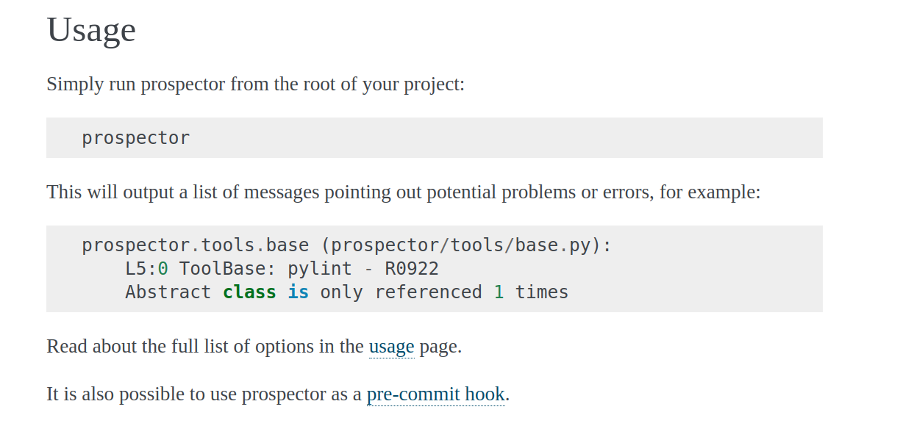
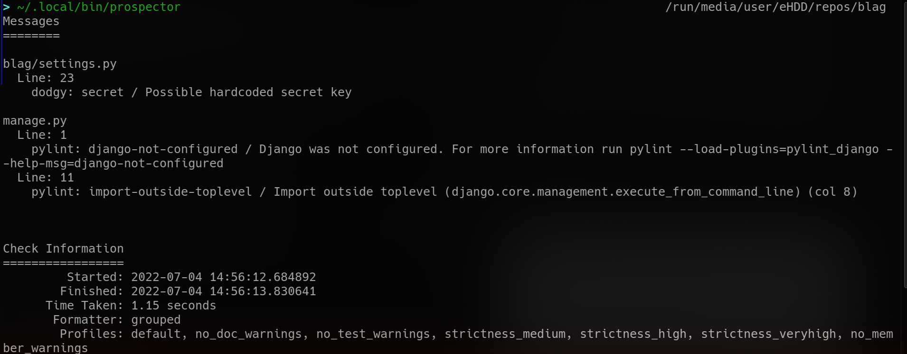
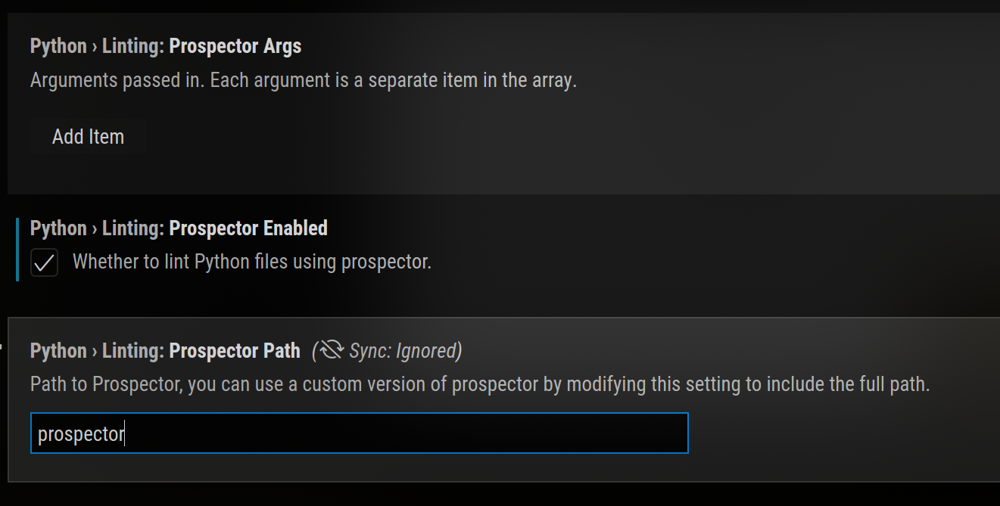

## Prospector

from their [website](https://prospector.landscape.io),

> Prospector is a tool to analyse Python code and output information about errors, potential problems, convention violations and complexity.

> It brings together the functionality of other Python analysis tools such as Pylint, pycodestyle, and McCabe complexity.

Install with `pip install prospector`

_usage instructions from the project's website_

#### Running from the command line

_running prospector against a Django project_

Recommended usage-
On projects with a lower rate of commits, increase the strictness after every pass

`prospector --strictness <level>`

_Valid levels are verylow, low, medium, high and veryhigh_

This will ensure that the highest priority issues are addressed first, and AppSec moves down a list of warnings and errors, from high priority to low priority

Instead of running it on the commandline, you could integrate it into your development or CI/CD pipelines

For example, you can enable prospector linting in Visual Studio Code, and have it run on open files, project files, or all workspace files

_pass in your prospector args in Visual Studio Code_

## Bandit

## PEP-8

## mypy

## flake8

## pylance

## pycodestyle

## pydocstyle

## pylama

## pylint

_wip_
