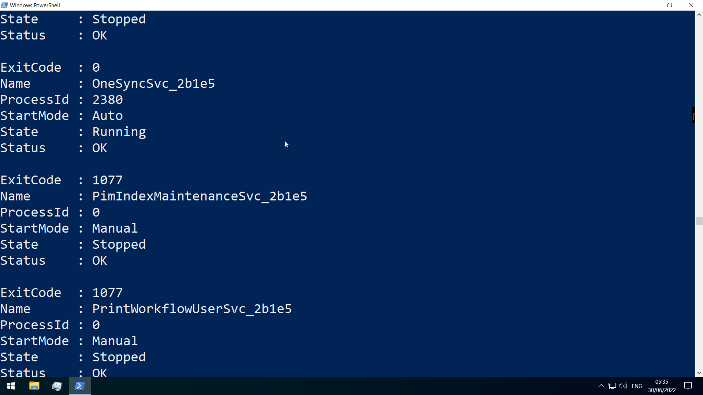
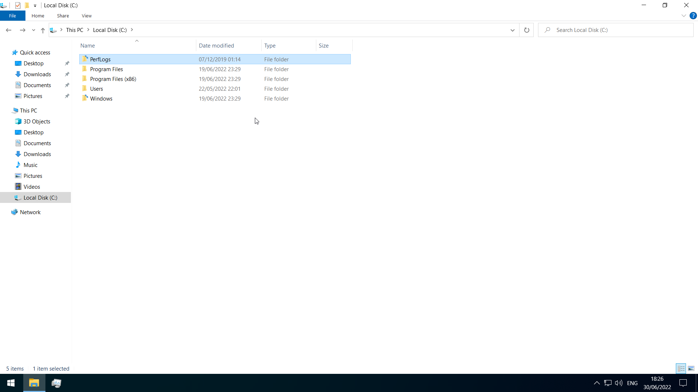
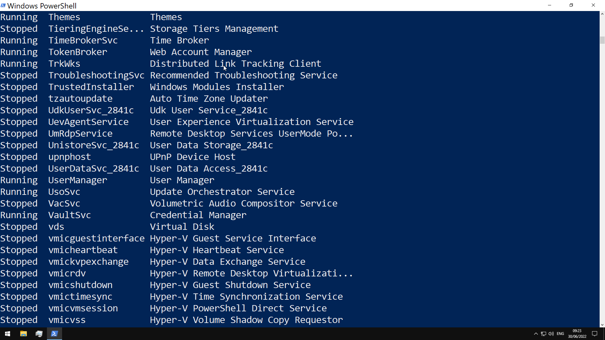

# Microsoft Windows Operating System and Windows Security

In any organization, non-technical employees are likely using Microsoft Windows. In fact, the overwhelming majority of desktop and laptop systems run Windows.

Because of this, it becomes a prime target for malware(phishing, botnets, ransomware) introduced through these regular users. In rare cases, [spear phishing attacks](https://www.kaspersky.com/resource-center/definitions/spear-phishing) are carried out against administrators because they hold the keys to the kingdom.

Understanding the fundamentals of Microsoft Windows security is essential for any security professional.

[microsoft.com- Windows Security](https://docs.microsoft.com/en-us/windows/security/)

or [pdf Version](microsoft_windows_security_manual.pdf)

## General System Information

Querying of system information for troubleshooting

use the `Get-WmiObject` cmdlet to get general information

`-Class win32_OperatingSystem`(general information on the OS)


`Win32_Process`


`Win32_Service`


`Win32_BIOS`


## General Boot Drive Structure

The boot drive(C) is divided into the following on a bare Windows install
(some folders may be hidden and not shown, which is the default)

- PerfLogs-empty by default, can hold performance logs
- Program Files-64bit programs are installed here
- Program Files(x86)-32bit programs for a 64bit edition would be installed here
- ProgramData-hidden folder that contains...program data
- Users-contains user profiles, with the following within-

  - Default-default profile template
  - Public-files accessible to all users
  - AppData- for a particular user, can be accessed with %appdata% in the Windows Explorer address bar
    contains per user application data and settings

    

    1. Local- specific to the computer, never shared across network
    2. LocalLow- like Local, but lower data integrity level
    3. Roaming-data that follows the user's profile

- Windows-operating system files
  - System,System32-contains DLL files Windows and the Windows API requires
  - WinSxS-the Component Store contains a copy of all windows components, service packs,and updates

## NTFS Permissions

key permission types for NTFS-

- full control
- modify
- list folder contents
- read+exec
- write
- read
- traverse folder

list permissions for a directory by using `icacls`


- (CI)- container inherit
- (OI)- object inherit
- (IO)- inherit only
- (NP)- do not propagate inherit
- (I)- permission inherited from parent container

## Share Permissions

- full control
- change
- read

## Windows Defender/Windows Security Center


- pre-installed antivirus solution for desktop systems
- sane defaults OOTB
- configure antivirus, account protection, firewall, application security, device security features from one UI
- real-time protection settings can be tweaked to add files, folders, and memory areas to controlled folder access to prevent unauthorized changes
- modify exclusion lists

use the `Get-MpComputerStatus` cmdlet to check protection settings


## Microsoft Management Console (MMC)

- group snap-ins, or administrative tools, to manage hardware, software, and network components within a Windows host(local computer or other computer)

_run_ `mmc`


Since MMC is centered around the concept of snap-ins, we must add a snap-in first

## The Windows Command Line

although GUI tools can be easier to use, the command line offers

- automation
- scalability

[Windows Command Reference](https://download.microsoft.com/download/5/8/9/58911986-D4AD-4695-BF63-F734CD4DF8F2/ws-commands.pdf)

### PowerShell


to become proficient at administering windows systems with security in mind, it is **essential** to learn at least the basics of Windows PowerShell and PowerShell scripting

PowerShell utilizes cmdlets, which are small single-function tools built into the shell

Cmdlets are in the form of `Verb-Noun`

### Execution Policy

if not able to run your new script, be sure to check the PowerShell execution policy with

`Get-ExecutionPolicy -List`

Set to bypass for the current session

`Set-ExecutionPolicy Bypass -Scope Process`

### Windows Management Instrumentation (WMI)

used for-

- Status information for local/remote systems
- Configuring security settings on remote machines/applications
- Setting and changing user and group permissions
- Setting/modifying system properties
- Code execution
- Scheduling processes
- Setting up logging

`wmic` in PowerShell-


or with the the `Get-WmiObject` module


the `Invoke-WmiMethod` module, can be used to call the methods of WMI objects

## Services

Windows services can be started automatically at system boot without user intervention, and can continue to run in the background even after user log-out

managed via the Service Control Manager (SCM) system, accessible via the `services.msc` MMC add-in.


_OR_

using `Get-Service`


## Processes

Can be viewed in Task Manager or in Powershell with `ps`(`Get-Process`)


### Task Manager

can be opened with `taskmgr` from cmd/powershell, or with a Ctrl+Shift+Esc sequence


- Processes-list of running applications and background processes
- Performance- shows resource utilization graphs
- App History-resource usage for user for each applicatino
- Startup- startup applications
- Users- logged in users, and their resource usage
- Details- shows detailed information for running applications
- Services- details on services

## [Security Identifier (SID)](https://docs.microsoft.com/en-us/windows/security/identity-protection/access-control/security-identifiers#what-are-security-identifiers)

- security principals on system have unique SID
- identify user rights
- string values with different lengths
- comprises Identifier Authority, Relative ID, and (in AD env) domain SID
- stored in security database


`(SID)-(revision level)-(identifier-authority)-(subauthority1)-(subauthority2)-(etc)`

1. SID-identifies this string as an SID
2. revision level- always 1
3. identifier authority-48bit string identifying authority that created SID
4. subauthority1-order the authority created this account
5. subauthority2- which computer or domain created the number
6. subauthority3-RID, whether user is normal user, guest, administrator, etc.

get SID of a user with

`Get-LocalUser <user> | select sid`

get SID of a security group with

`Get-LocalGroup <user> | select sid`

## [SAM](<https://docs.microsoft.com/en-us/previous-versions/windows/it-pro/windows-server-2003/cc756748(v=ws.10)>)

> Security Account Manager(SAM)...stores user accounts and security descriptors for users on the local computer
> grants rights to a network to execute specific processes

The access rights themselves are managed by Access Control Entries(ACE) in Access Control Lists(ACL)

_security descriptor can be_

1. Discretionary ACL
2. System ACL

Local Security Authority validates access tokens

## User Account Control(UAC)


The working is detailed [here](https://docs.microsoft.com/en-us/windows/security/identity-protection/user-account-control/how-user-account-control-works)


the consent prompt interrupts the execution of scripts or binaries until the user enters the password or confirms execution

## Windows Registry

_run_ `regedit`


- hierarchical database in Windows critical for the operating system
- stores low level settings

- divided into computer and user-specific data
  

#### Hierarchy

```
-root keys
  |
  ----subkeys
         |
         ----values
```

the 11 value types that can be entered in a subkey-

1. REG_BINARY
2. REG_DWORD(32bit number)
3. REG_DWORD_LITTLE_ENDIAN(little-endian computer architectures)
4. REG_DWORD_BIG_ENDIAN(big-endian architectures)
5. REG_EXPAND_SZ(unexpanded references to environment variables)
6. REG_LINK(target path of a symbolic link)
7. REG_MULTI_SZ(sequence of null-terminated strings)
8. REG_NONE
9. REG_QWORD(64bit number)
10. REG_QWORD_LITTLE_ENDIAN(64-bit number in little-endian format)
11. REG_SZ(null-terminated string)

root keys all start with HKEY

## Application Whitelisting

_Related: [zero trust principle](https://www.crowdstrike.com/cybersecurity-101/zero-trust-security/)_

### AppLocker for whitelisting

- rules based on file attributes such as the publisher's name (which can be derived from the digital signature), product name, file name, and version
- rules can also be set up based on file paths and hashes
- rules can be applied to either security groups or individual users, based on the business need

## Add a User

_run_ `netplwiz` and it will open up the User Accounts manager

## Group Policy


- tweak certain graphical and network settings that are otherwise not accessible via the Control Panel
- enable security features
  

##
