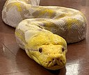
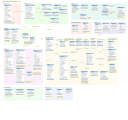

#### [~](../README.md)

---

# Elvin deSouza

{:width="150px"}

## Undergraduate Computer Engineer at Vishwakarma University Pune, majoring in Information Security

I like programming, cybersecurity, and linux. With a keen eye for learning new things and exploring.

## My Skills

I have experience with networking, operating systems, and security fundamentals.

{:width="100px"}

I also have experience with the modern web with **Angular**, **NodeJs**: **express**, ejs, pug, etc, though i feel more comfortable with the back-end

{:width="100px"}

**Python** web development with Django-SQLite,
scripting and automation using a plethora of amazing libraries,
experience with AI/ML-data visualization libraries like
openCV, seaborn, matplotlib, numpy, pandas, keras, etc.

{:width="100px"}

**Java** application development with AWT and Swing, and JDBC

{:width="100px"}

(Relational) Database management using **SQL**, with MySQL and SQLite. Also limited experience with mongoDB as part of a MEAN stack webproject

I also have experience in setting up and maintaining **webservers** like apache and nginx. Related skills here include setting up services in accodance with available benchmarks (www/ permissions, symlinks, configuration files, managing and rotating logs).

I have a couple of years of experience using **GNU/Linux** and I am familiar with layout, permissions, popular software, good practices, and **bash** scripting. I am also familiar with low-level GNU/Linux utilities(particularly core GNU)- Unix-style programming, services, disks and encryption, IO, networking, security etc.

**C++** object-oriented programming and web development(CGI scripting), and **C** programming for Linux

<!-- I am a proponent of free and open source software that adheres to the Unix philosophy. Software that adheres at least in part to this that i use or keep an eye on is listed here -->

_Aside from technology and programming related interests, my hobbies include playing the guitar and writing about things I am fascinated by._

## Experience

### Tech Assistant at the Revolution Software Development Club

_June 2021-Now_

### Tech Assistant at the Genesis ML/AI Club

_June 2021-Now_

You can check out my GitHub [here](https://github.com/elvindsouza/)

You can check out my LinkedIn [here](https://www.linkedin.com/in/elvindesouza/)

---

_Implemented with GitHub Pages, and raw HTML_
