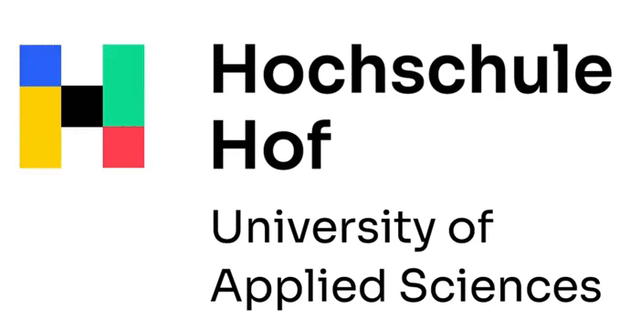
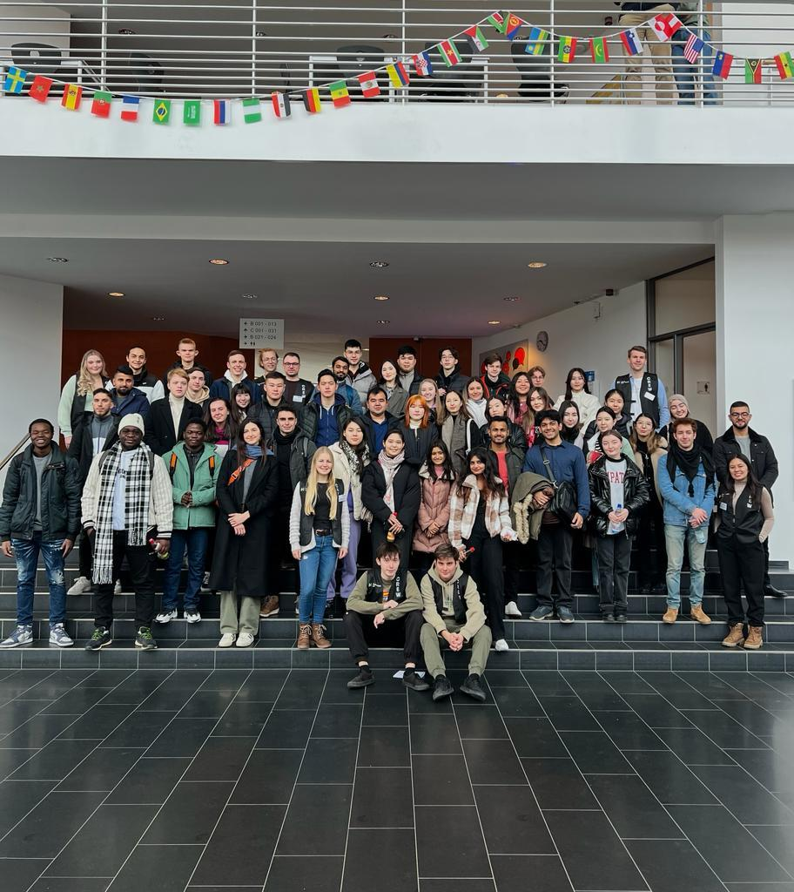
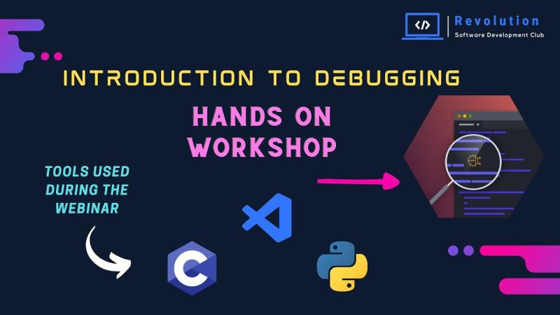

**[~](../../README.md)**

---

* TOC
{:toc}

---

**A brief, one-page resume is available in .pdf format [here](https://elvindesouza.github.io/resume)**

# Elvin deSouza - A Summary

{:width="500px"}

**Research Assistant in the Research Group for System and Network Security(SNS) of the Institute for Information Systems at Hof University of Applied Sciences**

<!-- from linkedin description -->

I like programming, cybersecurity, and linux.

I have a strong work ethic, with good teamwork and exceptional communication skills

I am also an avid programmer, with extensive problem solving skills and using programming patterns.
Passionate computer engineer with a focus on application security and secure coding. Leveraging a solid foundation in GNU/Linux system administration and internals. Adept at crafting elegant solutions through programming skills and keen problem-solving acumen. Experienced in collaborating within dynamic team environments, driven by exceptional communication and teamwork abilities. 

Proven track record of contributing to research projects under professors, and student clubs. Diligent, enthusiastic, and committed to upholding the highest work ethic.

---

# Work Experience

{:width="900px"; }

## Research Assistant in the Research Group for System and Network Security (SNS) of the Institute for Information Systems at Hochschule Hof

_October 2023-Now_

_Hof, Germany_

*The "Multi-modal Human-machine Interface with AI" project aims to develop such new interfaces with AI. In order to solve the data protection problems, novel onion routing methods are being researched to obscure the metadata and thus ensure maximum data protection. This project will further investigate some of the issues with Tor, particularly how end-to-end congestion control techniques affect the speed of onion routing.*

- Investigating the implications of the cross-circuit interference (CCI) problem in the latest version of the Tor client, which includes end-to-end congestion control integration
- Comparing various proposed solutions to mitigate the CCI problem in Shadow.

Work performed under Prof. Dr. Florian Adamsky and professionally supervised by Mr. Sebastian Pahl.

{:width="200px"}
{:width="200px"}

## Web Engineer at Converge-Collegepond

_July-Oct 2022_

_Mumbai, India_

- Created and maintained web pages for the website built with WordPress
- Designed forms, implemented them on the website, parsed form responses, and aggregated data
- Increased traffic by monitoring SEO and making changes to SEO-related parameters
- Optimizing pages for load time, mobile viewing, and accessibility
- Revamping the website's frontend CSS and other styling
- Worked on various frontend and backend projects, including Linux server troubleshooting and administration

[Letter of Recommendation](resources/Collegepond-Converge-Recommendation.pdf)

[Offer Letter](resources/Collegepond-Converge-Offer.pdf)

[Letter of Experience](resources/Collegepond-Converge-Experience.pdf)

---

# Certifications and Accreditations

## CompTIA Security+ Certification

Ensures that I have the security problem-solving skills required to:

- Assess the security posture of an enterprise environment and recommend and implement appropriate security solutions
- Monitor and secure hybrid environments, including cloud, mobile, and IoT
- Operate with an awareness of applicable laws and policies, including principles of governance, risk, and compliance
- Identify, analyze, and respond to security events and incidents

[Certificate and Verification Code](resources/ComptiaSecurity.pdf)

## AWS Academy Cloud Foundations

AWS Academy Cloud Foundations is provides an overall understanding of cloud computing concepts, independent of specific technical roles. It provides a detailed overview of cloud concepts, AWS core services, security, architecture, pricing, and support.

[Certificate](https://www.credly.com/badges/152d8dfe-17fc-4dfe-9394-21ed0d521a49/public_url)

## CCNA: Introduction to Networking

This course introduces the architecture, structure, functions, components, and models of the Internet and other computer networks. 

[Certificate](https://www.credly.com/badges/3cc3f44e-13ac-457e-8f64-3b80da56de92/public_url)

## CyberOps Associate

CyberOps Associate v1.0 covers knowledge and skills needed to successfully handle the tasks, duties, and responsibilities of an associate-level Security Analyst working in a Security Operations Center (SOC).

[Certificate](https://www.credly.com/badges/9f4ad9de-455b-40bd-be69-d00c0f853926/public_url)

{:width="1000px"}

## LinkedIn Learning Certifications

You can view them on my [LinkedIn profile](https://www.linkedin.com/in/elvindesouza/)

List of certificates [here](https://github.com/elvindesouza/elvindesouza.github.io/tree/master/src/about/resources/LinkedInCertificates)

---

# Education

{:width="400px"}

{:width="400px"}

## Computer Science/Informatik - International Exchange Student

[Transcript](resources/HofUniversity-Transcript.pdf)

_Hochschule Hof University of Applied Sciences_

_Hof, Bavaria, Germany_

_Feb 2023-Oct 2023_

Took up the following courses-

- 11.1.1.1 CCNA - Introduction to Networks
- 11.1.2 CCNA - CyberSecurity Operations
- 11.5 Cloud Computing
- 11.3.5 Information System Security
- Project Work
- Deutsch als Fremdsprache: A2.1
- Deutsch als Fremdsprache: B1.1

{:width="700px"}

## Bachelor of Technology in Computer Engineering in association with IBM ( BTech. CE )

[Transcript of Marks](resources/VishwakarmaUniversity-Transcript.pdf)

[Merit/Rank Certificate](resources/VishwakarmaUniversity-RankCertificate.jpg)

_Vishwakarma University_

_Pune, India_

_Aug 2020-Jul 2024_

_Final CGPA 8.86/10, 83.28%, A+ grade - Rank 33 in merit list_

### Relevant Courses 

**Degree Specialization** : Cybersecurity

- Application Security  CS03SG01
- Computer networking BTECHCS18503
- Database Management Systems BTECHCS18403
- Information Security Fundamentals-IBM COD0001392
- Information Technology Systems Security and Physical Security BTECHCS18410
- Operating Systems BTECHCS18501
- Project Management BTECHCS18514
- Technological Skill Development-III (Python) BTECHCS18407
- Web Technologies BTECHCS18508

## Higher Secondary School Certificate

**Maharashtra State Board of Secondary & Higher Secondary Education**

_Rasiklal M. Dhariwal Junior College_

_Pune, India_

_FEB 2020_

_79.85%_

- Stream : Science
- Selection : Physics+Chemistry+Maths

{:width="700px"}

## Secondary School Certificate

**Maharashtra State Board of Secondary & Higher Secondary Education**

_St. Vincent’s High School_

_Pune, India_

_MAR 2018_

_89.80%_

---

# Projects

## Can Johnny Encrypt E-Mails on Smartphones?

Research under Prof. Dr. Florian Adamsky of the Institute for Information Systems at Hof University – Encryption and signing of e-mails using S/MIME and OpenPGP on smartphones

## Lost In Translation

Project under Prof. Dr. Florian Adamsky of the Institute for Information Systems at Hof University- Exploiting automatic website translations (through phishing websites) using homoglyph attacks

## AutOSINT

_Done as part of major project during Bachelors degree_

A graphical user interface to automate OSINT/information gathering and reconnaissance

Made use of APIs to generate results

Documentation generated using Sphinx

## [Small Network Hardening](https://elvindesouza.github.io/hardening)

Hardened a small network by installing network security measures, and setting them up keeping in mind the services available on the network. Removed unnecessary services and applications, and audited user and service accounts on the systems. Reserved IP addresses manually, set up whitelists, and made other configurations to make the network more secure.

## [Small Network Penetration Testing](https://elvindesouza.github.io/NetworkPenetrationTesting)

Conducting a Network Penetration Test on a Small Network. Followed all the standard steps of a penetration test in accordance with applicable standards and guidelines, and documented the process.

## [GPG-GUI](https://elvindesouza.github.io/GPG-GUI/)

Simple graphical front-end to GnuPG, making encryption accessible to everyone!

## [Utility of the kexec Linux system call.](https://elvindesouza.github.io/security/kexec)

Documenting how a physical attack can be carried out by (mis)using the kexec system call to boot into another kernel(operating system) from a kernel, and perform an attack with scripting in a more familiar environment

---

# Community and Leadership

## Tech Department and Project Department Lead at the Revolution Software Development Club

_June 2021-Jan 2023_

[letter of appreciation](resources/RevolutionLead.pdf)

- Spread knowledge of industry-standard technology by organizing hackathons, workshops, projects and webinars
- Conducted research on bleeding edge tooling, and worked on projects involving the same
- Increased community outreach as a Content Strategist by writing in-depth technical pieces

**Webinar - Introduction to Debugging by Revolution SDC**

[Youtube](https://www.youtube.com/watch?v=FSbX6KquPnA)

[LinkedIn](https://www.linkedin.com/posts/revolution-software-club_on-30th-nov-2022-introduction-to-debugging-activity-7004085249617858560-fvSC?utm_source=share&utm_medium=member_desktop)

- Session on how to resolve bugs using the scientific method and using the VSCode debugger.
- I came up with the idea, conceptualized and designed the structure of the webinar and composed the speaking points covered in each chapter and live demonstrations performed by the other participants.
- I was the main presenter for the webinar and was the driving force behind its execution.

**Previous position**: Tech Assistant, [letter of appreciation](resources/RevolutionTechAssistant.pdf)

---

# My Technical Skills and Proficiencies

I have experience in **application programming** and **application security**.

## Python

{:width="100px"}

- scripting and automation, using the standard library(with **re**
  , **shutil**, **os**, **pathlib**,etc.) along with the plethora of amazing libraries available like **pytest**,**selenium**,**requests**
- web development with **Django**, **database APIs**(MySQL,SQLite)
- [secure Python development ](../security/AppSec/secure_coding_python.md) using unit tests, running code linters, type checkers on projects to check for undetected issues, security tools like [Prospector](../security/AppSec/secure_coding_python.md#Prospector) and [Bandit](../security/AppSec/secure_coding_python.md#Bandit) to find vulnerabilities and possible flaws
- extensible module/library development following the PEP8 python style guide, conforming to the guidelines on project structure and layout, naming conventions, docstrings, type hints, commit messages, etc.

## GNU/Linux

{:width="100px"}

- Scripting/command-line, security, architecture, administration, etc. and have gained expertise of the fundamentals like filesystem layout, permissions, conventions, etc. along with experience with popular software, good practices, and **bash** scripting.
- I am also familiar with the coreutils/Unix-style(philisophy) programming, and have learnt the skills of **system management**, **security**, **scripting**, **containers**, **automation**, and **troubleshooting**
- I also have experience in setting up and maintaining **webservers** like apache and nginx. Related skills here include setting up services in accodance with [available benchmarks](https://www.cisecurity.org/cis-benchmarks/) (www/ permissions, symlinks, updates-patches-maintenance, configuration files, managing and rotating logs)

## Information Security

I hold the [Comptia Security+](#comptia-security-certification) 

I have experience with the following vulnerability assessment and penetration testing tools/frameworks-

- Burp Suite, Nessus, OWASP ZAP, nikto, openVAS
- Metasploit
- sqlmap
- lynis
- wfuzz
- theharvester
- nmap
- hping3
- Wireshark
- john, hydra, hashcat

*Please explore the [Security section](https://elvindesouza.github.io/security/) of the website to see what topics/tooling I have experience/interest in.*

## Other Technical Skills

- Git
- LaTeX, Markdown
- SSH
- virtualization, Docker
- Applying Data Structures and Algorithms

# Soft Skills and Language Skills

- communication skills
- strong work ethic
- problem solving
- enthusiastic learner
- analytical thinking
- teamwork skills
- critical thinking

## English

- Level C2(fluent/advanced) on the CEFR

- **IELTS** Band 8.5 overall (8.5 Listening, 8.5 Reading, 8.0 Writing, 8.0 Speaking)

- [IELTS Test Report Form](resources/IELTS.pdf)

## German

- Level B1 on the CEFR

# Awards and Recognition

- Received recognition from RVDP, NCIIPC for reporting several vulnerabilities in government infrastructure
- 'Code Wars 2023' IBM-ICE National Hackathon- Shortlisted: Low-level design document for firewall to detect ARP spoofing

---

_I am a proponent of free and open source software that adheres to the Unix philosophy. Software that adheres at least in part to this that I use, donate to development of, or keep an eye on is listed [here](../pages/software.md)_

_Aside from technology and programming related interests, my hobbies include playing the guitar and writing about things I am fascinated by._

---

# View my Work

You can check out my GitHub [here](https://github.com/elvindesouza/)

You can check out my LinkedIn [here](https://www.linkedin.com/in/elvindesouza/)

You can check out my Leetcode [here](https://leetcode.com/elvindesouza/)
              
<!---->
<!-- You can check out my TryHackMe [here](https://tryhackme.com/p/elvindesouza) -->
<!---->
<!-- You can check out my Hackerrank [here](https://www.hackerrank.com/elvindesouza) -->
<!---->
<!-- You can check out my HackTheBox [here](https://app.hackthebox.com/profile/elvindesouza) -->
<!---->
<!-- You can check out my GitLab [here](https://gitlab.com/elvindesouza) -->

You can find my contact details [here](https://elvindesouza.github.io/about/contact/)
