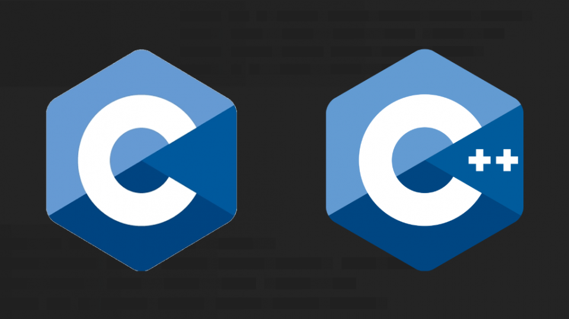

**[~](../../README.md)**

---

* TOC
{:toc}

---

# Elvin deSouza - A Summary

{:width="300px"}

**Undergraduate Computer Engineer at Vishwakarma University Pune, majoring in Information Security in association with IBM**

I like programming, cybersecurity, and linux.

I have a strong work ethic, with good teamwork and
communication skills

I am also an avid programmer, with extensive problem solving skills and using programming patterns.

# My Skills

I have experience with programming, networking, operating systems, and security fundamentals.

## Python

{:width="100px"}

_3 years of experience_

- scripting and automation, using the standard library(with **re**
  , **shutil**, **os**, **pathlib**,etc.) along with the plethora of amazing libraries available like **selenium**, and **requests**
- web development with **Django**, **database APIs**(MySQL,SQLite)
- [secure Python development ](../security/AppSec/secure_coding_python.md) using unit tests, running code linters, type checkers on projects to check for undetected issues, security tools like [Prospector](../security/AppSec/secure_coding_python.md#Prospector) and [Bandit](../security/AppSec/secure_coding_python.md#Bandit) to find vulnerabilities and possible flaws
- extensible module/library development following the PEP8 python style guide, conforming to the guidelines on project structure and layout, naming conventions, docstrings, type hints, commit messages, etc.
- experience with AI/ML and data visualization-processing libraries like
  **openCV**, **matplotlib**, **numpy**, **pandas**, **scikit-learn**, etc.

## GNU/Linux

{:width="100px"}

_3 years of experience_

scripting/command-line, security, architecture, administration, etc. and have gained expertise of the fundamentals like filesystem layout, permissions, conventions, etc. along with experience with popular software, good practices, and **bash** scripting.

I am also familiar with the coreutils/Unix-style(philisophy) programming, and have learnt the skills of **system management**, **security**, **scripting**, **containers**, **automation**, and **troubleshooting**

I also have experience in setting up and maintaining **webservers** like apache and nginx. Related skills here include setting up services in accodance with [available benchmarks](https://www.cisecurity.org/cis-benchmarks/) (www/ permissions, symlinks, updates-patches-maintenance, configuration files, managing and rotating logs)

## Java

{:width="100px"}

_1 year of experience_

- application development with **AWT** and **Swing**, **JDBC** to create user-friendly GUIs with appropriate encapsulation and exception handling
- distributed application development by following guidelines on maintaining projects in accordance with guidelines(writing quality comments, testcases, [black box programming](https://en.wikipedia.org/wiki/Black_box#:~:text=In%20computing%20in%20general%2C%20a,routine%20suitable%20for%20re%2Duse.)), using version control and signing commits, and following a well-documented SDLC methodology
- secure development with fuzz testing and unit testing

## SQL

{:width="100px"}

- (Relational) Database management using **SQL**, with MySQL and SQLite.
- limited experience with mongoDB as part of a MEAN stack webapp

## Javascript for Web Development

{:width="50px"}

I also have experience with the modern web with **Angular**, **NodeJs**: **express**, ejs, pug, etc, though i feel more comfortable with the back-end

## C/C++

{:width="50px"}

- **C++** object-oriented programming and web development(CGI scripting)
- **C** programming for Linux

## Other Skills

Git, OOPS, LaTeX, Markdown, Applying Data Structures and Algorithms

## Languages/Communication Skills

### English

- Distinction (90/100) in Communication Skills Grade 3, Trinity College London
- Distinction in Choral Speaking Grade 2, Trinity College London
- Distinction (89/100) in Speech and Drama Grade 2, Trinity College London
- Attained 34/35 ( rank 221 Internationally ) in the International English Olympiad

### German

- Level A1, Passed the Fit in Deutsch 1 (Fit1/Fit Eins) from the Goethe-Institut with grade A

### Hindi

### Marathi

## Misc Skills

- literature
- teaching the guitar
- sports
- art
- video editing

---

_I am a proponent of free and open source software that adheres to the Unix philosophy. Software that adheres at least in part to this that I use, donate to, or keep an eye on is listed [here](../pages/software.md)_

_Aside from technology and programming related interests, my hobbies include playing the guitar and writing about things I am fascinated by._

---

# Experience

## Web Development Intern at Collegepond

_July 2022-Now_

- Creating and maintaining web pages for the website built with WordPress
- Designing forms, implementing them on the website, parsing form responses, and aggregating data
- Working on frontend and backend projects

## Tech Assistant at the Revolution Software Development Club

_June 2021-Now_

- Used binary logistic regression to build a model with scikit-learn to predict heart failure with high accuracy rate
- Authored write-ups on applied ML (ranking, recommendation, classification, regression, clustering, anomaly detection)

## Tech Assistant at the Genesis ML/AI Club

_June 2021-Now_

- Content Strategist, writing in-depth technical pieces for community outreach

<!-- # Certifications -->

---

# Education

## Vishwakarma University, Pune

_Bachelor of Technology in Computer Engineering in association with IBM ( BTech. CE INFOSEC ), AUG 2020-Now_

- Specialization ( Major ) : Information Security

## RASIKLAL M. DHARIWAL JUNIOR COLLEGE

_Maharashtra State Board of Secondary & Higher Secondary Education, FEB 2020_

_79.85%_

- Stream : Science
- Selection : Physics+Chemistry+Maths

## St. Vincent’S High School, Pune

_Maharashtra State Board of Secondary & Higher Secondary Education, MAR 2018_

_89.80%_

# View my Work

_some links might not be available because accounts have been set to private_

You can check out my GitHub [here](https://github.com/elvindesouza/)

You can check out my LinkedIn [here](https://www.linkedin.com/in/elvindesouza/)

You can check out my Leetcode [here](https://leetcode.com/elvindesouza/)

You can check out my TryHackMe [here](https://tryhackme.com/p/elvindesouza)

You can check out my Hackerrank [here](https://www.hackerrank.com/elvindesouza)

You can check out my HackTheBox [here](https://app.hackthebox.com/profile/elvindesouza)

You can check out my GitLab [here](https://gitlab.com/elvindesouza)

You can find my contact details [here](https://elvindesouza.github.io/about/contact/)

---
