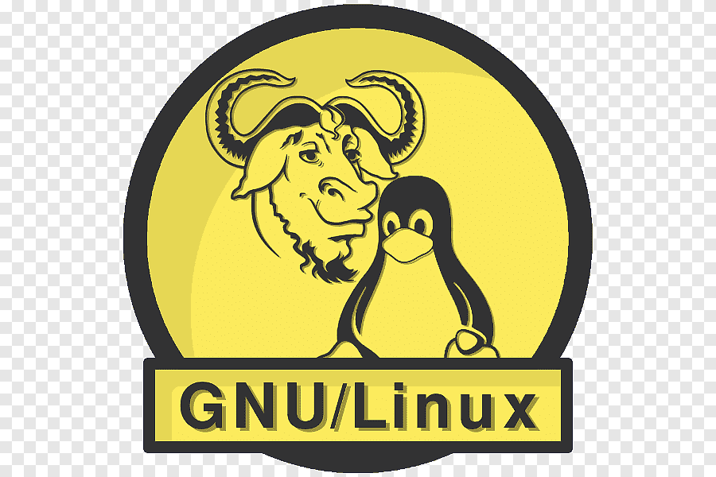

**[~](../../README.md)**

---

* TOC
{:toc}

---

**A brief, one-page resume is available in .pdf format [here](https://elvindesouza.github.io/resume)**

# Elvin deSouza - A Summary

{:width="500px"}

**Undergraduate Computer Engineer at Hochschule Hof University of Applied Sciences, Hof, Germany**

<!-- **Majoring in Information Security in association with IBM** -->

I like programming, cybersecurity, and linux.

I have a strong work ethic, with good teamwork and exceptional communication skills

I am also an avid programmer, with extensive problem solving skills and using programming patterns.

---

# Work Experience

{:width="200px"}
{:width="200px"}

## Web Engineer at Converge-Collegepond

_July-Oct 2022_

_Mumbai, India_

- Created and maintained web pages for the website built with WordPress
- Designed forms, implemented them on the website, parsed form responses, and aggregated data
- Increased traffic by monitoring SEO and making changes to SEO-related parameters
- Optimizing pages for load time, mobile viewing, and accessibility
- Revamping the website's frontend CSS and other styling
- Worked on various frontend and backend projects, including Linux server troubleshooting and administration

[Letter of Recommendation](resources/Collegepond-Converge-Recommendation.pdf)

[Offer Letter](resources/Collegepond-Converge-Offer.pdf)

[Letter of Experience](resources/Collegepond-Converge-Experience.pdf)

---

# Certifications and Accreditations

## CompTIA Security+ Certification

_SY0-601_

_PASS, score 786/900_

Ensures that I have the security problem-solving skills required to:

- Assess the security posture of an enterprise environment and recommend and implement appropriate security solutions
- Monitor and secure hybrid environments, including cloud, mobile, and IoT
- Operate with an awareness of applicable laws and policies, including principles of governance, risk, and compliance
- Identify, analyze, and respond to security events and incidents

[Certificate and Verification Code](resources/ComptiaSecurity.pdf)

## AWS Academy Cloud Foundations

AWS Academy Cloud Foundations is provides an overall understanding of cloud computing concepts, independent of specific technical roles. It provides a detailed overview of cloud concepts, AWS core services, security, architecture, pricing, and support.

[Certificate](https://www.credly.com/badges/152d8dfe-17fc-4dfe-9394-21ed0d521a49/public_url)

## CCNA: Introduction to Networking

This course introduces the architecture, structure, functions, components, and models of the Internet and other computer networks. 

    Explain the advances in modern network technologies.
    Implement initial settings including passwords, IP addressing, and default gateway parameters on a network switch and end devices.
    Explain how network protocols enable devices to access local and remote network resources.
    Explain how physical layer protocols, services, and network media support communications across data networks.
    Calculate numbers between decimal, binary, and hexadecimal systems.
    Explain how media access control in the data link layer supports communications across networks.
    Explain how Ethernet operates in a switched network.
    Explain how routers use network layer protocols and services to enable end-to-end connectivity.
    Explain how ARP and ND enable communication on a local area network.
    Implement initial settings on a router and end devices.
    Calculate an IPv4 subnetting scheme to efficiently segment your network.
    Implement an IPv6 addressing scheme.
    Use various tools to test network connectivity.
    Compare the operation of transport layer protocols in supporting end-to-end communication.
    Explain the operation of the application layer in providing support to end-user applications.
    Configure switches and routers with device hardening features to enhance security.
    Troubleshoot connectivity in a small network.

## CyberOps Associate

CyberOps Associate v1.0 covers knowledge and skills needed to successfully handle the tasks, duties, and responsibilities of an associate-level Security Analyst working in a Security Operations Center (SOC).

    Install virtual machines to create a safe environment for implementing and analyzing cybersecurity threat events.
    Explain the role of the Cybersecurity Operations Analyst in the enterprise.
    Explain the Windows Operating System features and characteristics needed to support cybersecurity analyses.
    Explain the features and characteristics of the Linux Operating System.
    Analyze the operation of network protocols and services.
    Explain the operation of the network infrastructure.
    Classify the various types of network attacks.
    Use network monitoring tools to identify attacks against network protocols and services.
    Explain how to prevent malicious access to computer networks, hosts, and data.
    Explain the impacts of cryptography on network security monitoring.
    Explain how to investigate endpoint vulnerabilities and attacks.
    Evaluate network security alerts.
    Analyze network intrusion data to identify compromised hosts and vulnerabilities.
    Apply incident response models to manage network security incidents.

## LinkedIn Learning Certifications

Available [here](https://github.com/elvindesouza/elvindesouza.github.io/tree/master/src/about/resources/LinkedInCertificates)

You may also view my LinkedIn profile(link at the bottom of this page) to see these certifications

---

# Education

![]img/HofUniversityInternationalStudents.jpg{:width="400px"}

## Computer Science/Informatik - International Exchange Student

_Hochschule Hof University of Applied Sciences_

_Hof, Bavaria, Germany_

_Feb 2023-Now_

Enrolled in the Computer Science program, taking up a subset of the following courses-

- 11.1.1.1 CCNA - Introduction to Networks
- 11.1.1.2 CCNA - Routing, Switching and Wireless Essentials
- 11.1.1.3 CCNA - Enterprise Networking, Security and Automation
- 11.1.2 CCNA - CyberSecurity Operations
- 11.1.1 CCNA - Network Security
- 11.3.5 Information System Security
- 11.5 Cloud Computing
- Project Work
- Deutsch als Fremdsprache: A2.1

[Certificate of Enrolment](resources/HofUniversity.pdf)

## Bachelor of Technology in Computer Engineering in association with IBM ( BTech. CE INFOSEC )

[Transcript of Marks](resources/VishwakarmaUniversity-Transcript.pdf)

_Vishwakarma University_

_Pune, India_

_AUG 2020-Now_

_CGPA 8.68/10_

_latest GPA 9.26/10_

- Specialization ( Minor ) : Information Security

### Relevant Courses 

**(6-month courses, substantial credit ratings only)**

- Application Security  CS03SG01
- Computer networking BTECHCS18503
- Data Structures BTECHCS18301
- Database Management Systems BTECHCS18403
- Design and Analysis of Algorithms BTECHCS18502
- Information Security Fundamentals-IBM COD0001392
- Information Technology Systems Security and Physical Security BTECHCS18410
- Operating Systems BTECHCS18501
- Problem Solving With Programming BTECHCS18205
- Project Management BTECHCS18514
- Technological Skill Development-III (Python) BTECHCS18407
- Technology Skill Development-II (Java) BTECHCS18406
- Technology skill Development Lab-1 (C++) BTECHCS18306
- Web Technologies BTECHCS18508

## Higher Secondary School Certificate

**Maharashtra State Board of Secondary & Higher Secondary Education**

_Rasiklal M. Dhariwal Junior College_

_Pune, India_

_FEB 2020_

_79.85%_

- Stream : Science
- Selection : Physics+Chemistry+Maths

## Secondary School Certificate

**Maharashtra State Board of Secondary & Higher Secondary Education**

_St. Vincent’s High School_

_Pune, India_

_MAR 2018_

_89.80%_

---

# Projects

## Can Johnny Encrypt E-Mails on Smartphones?

Research under Prof. Dr. Florian Adamsky of the Institute for Information Systems at Hof University – Encryption and signing of e-mails using S/MIME and OpenPGP on smartphones

## Lost In Translation

Project under Prof. Dr. Florian Adamsky of the Institute for Information Systems at Hof University- Exploiting automatic website translations (through phishing websites) using homoglyph attacks

## AutOSINT

A graphical user interface to automate OSINT/information gathering and reconnaissance
Use is made of APIs, among other things, to generate results
Documentation generated using Sphinx

## [Small Network Hardening](https://elvindesouza.github.io/hardening)

Hardened a small network by installing network security measures, and setting them up keeping in mind the services available on the network. Removed unnecessary services and applications, and audited user and service accounts on the systems. Reserved IP addresses manually, set up whitelists, and made other configurations to make the network more secure.

## [Small Network Penetration Testing](https://elvindesouza.github.io/NetworkPenetrationTesting)

Conducting a Network Penetration Test on a Small Network. Followed all the standard steps of a penetration test in accordance with applicable standards and guidelines, and documented the process.

## [GPG-GUI](https://elvindesouza.github.io/GPG-GUI/)

Simple graphical front-end to GnuPG, making encryption accessible to everyone!

## [Utility of the kexec Linux system call.](https://elvindesouza.github.io/security/kexec)

Documenting how a physical attack can be carried out by (mis)using the kexec system call to boot into another kernel(operating system) from a kernel, and perform an attack with scripting in a more familiar environment

---

# Community and Leadership

## Tech Department and Project Department Lead at the Revolution Software Development Club

_June 2021-Jan 2023_

[letter of appreciation](resources/RevolutionLead.pdf)

- Spread knowledge of industry-standard technology by organizing hackathons, workshops, projects and webinars
- Conducted research on bleeding edge tooling, and worked on projects involving the same
- Increased community outreach as a Content Strategist by writing in-depth technical pieces

**Webinar - Introduction to Debugging by Revolution SDC**

[Youtube](https://www.youtube.com/watch?v=FSbX6KquPnA)

[LinkedIn](https://www.linkedin.com/posts/revolution-software-club_on-30th-nov-2022-introduction-to-debugging-activity-7004085249617858560-fvSC?utm_source=share&utm_medium=member_desktop)

- Session on how to resolve bugs using the scientific method and using the VSCode debugger.
- I came up with the idea, conceptualized and designed the structure of the webinar and composed the speaking points covered in each chapter and live demonstrations performed by the other participants.
- I was the main presenter for the webinar and was the driving force behind its execution.

**Previous position**: Tech Assistant, [letter of appreciation](resources/RevolutionTechAssistant.pdf)

## Tech Assistant at the Genesis ML/AI Club

_June 2021-Now_

- Built a model with scikit-learn to predict heart failure with high accuracy rate using binary logistic regression
- Authored write-ups on applied ML (ranking, recommendation, classification, regression, clustering, anomaly detection)

[GitHub - Heart Failure Detection](https://github.com/elvindesouza/assorted/tree/master/heart-failure-detection)

[GitHub - Data Science and Data Visualization Introduction](https://github.com/elvindesouza/assorted/blob/master/Introduction/Python_Introductory_Notebook.ipynb)

---

# My Technical Skills and Proficiencies

I have experience in **application programming** and **application security**.

## Python

{:width="100px"}

- scripting and automation, using the standard library(with **re**
  , **shutil**, **os**, **pathlib**,etc.) along with the plethora of amazing libraries available like **pytest**,**selenium**,**requests**
- web development with **Django**, **database APIs**(MySQL,SQLite)
- [secure Python development ](../security/AppSec/secure_coding_python.md) using unit tests, running code linters, type checkers on projects to check for undetected issues, security tools like [Prospector](../security/AppSec/secure_coding_python.md#Prospector) and [Bandit](../security/AppSec/secure_coding_python.md#Bandit) to find vulnerabilities and possible flaws
- extensible module/library development following the PEP8 python style guide, conforming to the guidelines on project structure and layout, naming conventions, docstrings, type hints, commit messages, etc.
- experience with AI/ML and data visualization-processing libraries like
  **openCV**, **matplotlib**, **numpy**, **pandas**, **scikit-learn**, etc [as a Tech. Assistant at the Genesis ML Club](#tech-assistant-at-the-genesis-mlai-club)

## GNU/Linux

{:width="100px"}

scripting/command-line, security, architecture, administration, etc. and have gained expertise of the fundamentals like filesystem layout, permissions, conventions, etc. along with experience with popular software, good practices, and **bash** scripting.

I am also familiar with the coreutils/Unix-style(philisophy) programming, and have learnt the skills of **system management**, **security**, **scripting**, **containers**, **automation**, and **troubleshooting**

I also have experience in setting up and maintaining **webservers** like apache and nginx. Related skills here include setting up services in accodance with [available benchmarks](https://www.cisecurity.org/cis-benchmarks/) (www/ permissions, symlinks, updates-patches-maintenance, configuration files, managing and rotating logs)

## Information Security

I hold the [Comptia Security+](#comptia-security-certification) 

I have experience with the following vulnerability assessment and penetration testing tools/frameworks-

- Burp Suite, Nessus, OWASP ZAP, nikto, openVAS
- Metasploit
- sqlmap
- lynis
- wfuzz
- theharvester
- nmap
- hping3
- Wireshark
- john, hydra, hashcat

*Please explore the [Security section](https://elvindesouza.github.io/security/) of the website to see what topics/tooling I have experience/interest in.*

## Javascript for Web Development

{:width="50px"}

I also have experience with the modern web with **Angular**, **NodeJs**: **express**, ejs, pug, etc

## Other Technical Skills

- Git
- LaTeX
- SSH
- virtualization, Docker
- Markdown
- Applying Data Structures and Algorithms

# Soft Skills and Language Skills

- communication skills
- strong work ethic
- problem solving
- enthusiastic learner
- analytical thinking
- teamwork skills
- critical thinking

## English

- [Certified Level C2 on the CEFR](resources/English-C2.pdf)

## German

- Completed Deutsch A2.1 course
- [Level A1, Passed the Fit in Deutsch 1 (Fit1/Fit Eins) from the Goethe-Institut with grade A](resources/German_Fit1.pdf)

# Awards and Recognition

- Received recognition from RVDP, NCIIPC for reporting several vulnerabilities in government infrastructure
- 'Code Wars 2023' IBM-ICE National Hackathon- Shortlisted: Low-level design document for firewall to detect ARP spoofing
- Distinction (90/100) in Communication Skills Grade 3, Trinity College London
- Distinction in Choral Speaking Grade 2, Trinity College London
- Distinction (89/100) in Speech and Drama Grade 2, Trinity College London
- Scored 34/35 ( rank 221 Internationally ) in the International English Olympiad

---

_I am a proponent of free and open source software that adheres to the Unix philosophy. Software that adheres at least in part to this that I use, donate to development of, or keep an eye on is listed [here](../pages/software.md)_

_Aside from technology and programming related interests, my hobbies include playing the guitar and writing about things I am fascinated by._

---

# View my Work

_some links might not be available right now_

You can check out my GitHub [here](https://github.com/elvindesouza/)

You can check out my LinkedIn [here](https://www.linkedin.com/in/elvindesouza/)

              
<!-- You can check out my Leetcode [here](https://leetcode.com/elvindesouza/) -->
<!---->
<!-- You can check out my TryHackMe [here](https://tryhackme.com/p/elvindesouza) -->
<!---->
<!-- You can check out my Hackerrank [here](https://www.hackerrank.com/elvindesouza) -->
<!---->
<!-- You can check out my HackTheBox [here](https://app.hackthebox.com/profile/elvindesouza) -->
<!---->
<!-- You can check out my GitLab [here](https://gitlab.com/elvindesouza) -->

You can find my contact details [here](https://elvindesouza.github.io/about/contact/)

---
