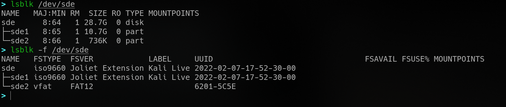
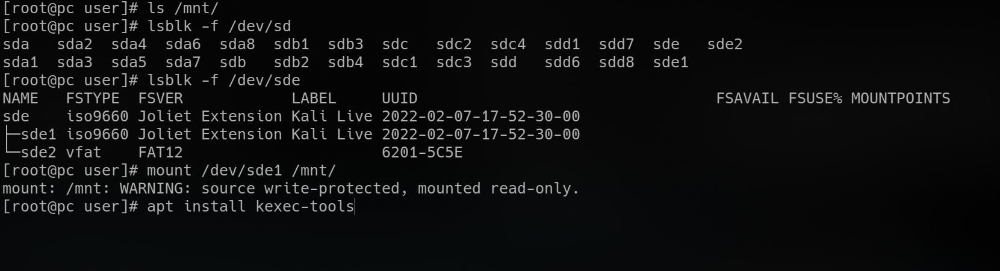
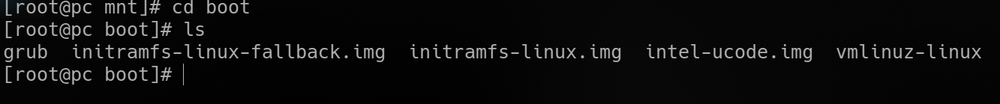
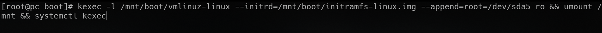

# kexec

from the [manpage](https://linux.die.net/man/8/kexec),

> kexec is a system call that enables you to load and boot into another kernel from the currently running kernel.

> kexec performs the function of the boot loader from within the kernel

There are two steps,

1. loading a new kernel
2. rebooting into the new kernel(preferably gracefully)

To load the kernel,

```
kexec  [-l (--load) kernel-image [--append=command-line-options] [--reuse-cmdline][--initrd=initrd-image]
        ]
 [-u  (--unload)]
 [-e  (--exec)]

where kernel-image is the kernel file
initrd is the initial ramdisk
```

A simple "reboot" for an archlinux system can be

`# kexec -l /boot/vmlinuz-linux --initrd=/boot/initramfs-linux.img --reuse-cmdline && sudo systemctl kexec`

where `systemctl kexec` would terminate services and shutdown gracefully

## Performing an [Evil Maid Attack](https://en.wikipedia.org/wiki/Evil_maid_attack) using the kexec system call

keep a flash drive other other removable media with a linux distribution of your choice with all the tools you could need ready.



Reconnaissance will tell you the types of running services and craft your installation accordingly

Use `systemd`, `cron`, `xdg-autostart` to execute scripts automatically to perform any guaranteed steps, crafted specifically for that machine.

**remember to have a script scrub any traces of installing and running kexec by scrubbing those lines from the normal boot's bash $HISTFILE from the new kernel**

if you know the root account's password, you can script to `chroot` and uninstall the package providing kexec, compilation tools as well as any source archive if installed from source

when you have obtained elevated privileges either through walking in on a root shell(autologin, perenially unattended machine) or piggybacking a service account with privileged access,

- insert the removable media, and find the identifier
- install the package providing kexec if availble, alternatively install build dependencies and [compile from source](https://mirrors.edge.kernel.org/pub/linux/utils/kernel/kexec/)
  

- mount the partition containing /boot, and obtain paths to the files needed
  

- find and load the kernel with `kexec`
- provide initial ramdisk location and pass needed kernel parameters
- unmount the partition
- run `systemctl kexec`
  

_you will now be in a familiar environment, and your scripts set up to autorun have already chrooted into the previous kernel's root directory, installed backdoors, and wiped traces of ever running kexec. you may now proceed with the remainder of the attack, aimed at devices on the network that trust this system_

[Further reading](https://lwn.net/Articles/580269/)

## Scope of a physical attack?

This highlights the importance of [Physical Security](https://en.wikipedia.org/wiki/Physical_security).
This system call lets you bypass the BIOS password and bootloader on UNIX-like systems. This is ripe for physical attacks and perpetrators who want to carry out an attack (persistent) on many systems from the inside while remaining relatively undetected.

An attacker wanting to set up exfil/C&C the easy way can just bring along a flash drive containing a linux environment and applications, scripts, tools of their choosing, and `kexec` into it. A familiar environment now lies before them, and they can carry out attacks from this system and remain undetected, and unperturbed by firewalls and other gateway-facing measures.

## Prevention?

1. disable the root account
2. principle of least privilege, [here is a quick rundown](https://elvindsouza.github.io/hardening/#least-privilege) on implementation, from a project of mine
3. physical security measures like securing equipment down, especially hard disks
4. manage hubs and disable unused USB/SATA ports from the BIOS
5. set up firewall rules to account for these kinds of attacks from systems on the local network

**remember, an attacker can always edit GRUB and boot into a root shell, so make sure you have locked your UEFI BIOS and bootloader down AND your storage media are secured**
