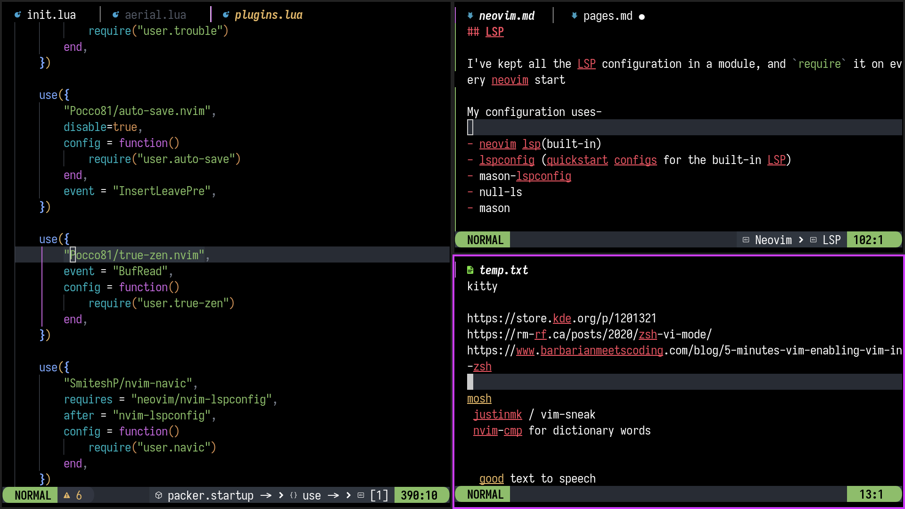

**[~](../../README.md)**

**[~/Pages](../pages.md)**

---

* TOC
{:toc}

---

*The entire up-to-date configuration is available [here](https://github.com/elvindesouza/neovim-config)*

# Neovim

_(re-)writing the neovim configuration in lua_



[Starting point](https://github.com/LunarVim/nvim-basic-ide) (by *chris@machine* on YouTube)

git clone the repository, and start editing


**In your init.lua, keep all your main calls in this file. all the individual plugins should be lazyloaded with `:h events` in your plugins.lua**

The first call in your init.lua should be [impatient](https://github.com/lewis6991/impatient.nvim)(please read the documentation)

Next, `require` your options, autocommands, and keymap lua files

The last thing you should `require` is your plugins file, and any of your own modules

## Plugins - packer.nvim

[A list of popular neovim/lua plugins right now](https://github.com/search?l=Lua&o=desc&q=neovim+plugin&s=stars&type=Repositories)

Read the packer documentation for available options and autocommands


### General Recommendations

**Absolutely essential-**

- syntax highlighting
- [LSP](https://en.wikipedia.org/wiki/Language_Server_Protocol)
- autocompletion(+snippets)

**Niceities-**

- editing help(autopairs, indent, commenting, tabout, surround, hop)
- UI improvements(winbar, lualine, bufferline, dap-ui, etc.)


Additionally, you can add dashboard, project manager, session manager, etc. plugins


## Keybindings

Add this to your Keybindings file. Now use keymap(...) to add your keybindings

```
-- Shorten function name
local keymap = vim.keymap.set
-- Silent keymap option
local opts = { silent = true, noremap = true }

--Remap space as leader key
keymap("", "<Space>", "<Nop>", opts)
vim.g.mapleader = " "

-- Modes
--   normal_mode = "n",
--   insert_mode = "i",
--   visual_mode = "v",
--   visual_block_mode = "x",
--   term_mode = "t",
--   command_mode = "c",
```


## Options

Add this to your options file

```
local opt = vim.opt
local cmd = vim.cmd
```

Set your options with `opt.name=`

If you're unsure of how to set the opt, use `cmd()`


## Autocommands

As of Oct22, `vim.api.nvim_create_autocmd()` is the recommended way too create autocommands. 

## LSP

I've kept all the LSP configuration in a module, and `require` it on every neovim start

My configuration uses-

- neovim lsp(built-in)
- lspconfig (quickstart configs for the built-in LSP)
- mason-lspconfig
- null-ls
- mason

(`nvim-cmp` for autocompletion)


# Version Control

Add to your .gitignore-

```
packer_compiled.lua
```

## Backup and Restore

For the most part, you can just `git clone` and open nvim (sometimes more than once) to get your configuration up on a new machine. Install the required package managers used by mason, and install the remaining binaries with mason


*I may add sections detailing every plugin, its use and configuration, along with screenshots and a ref to the config file on GitHub*
