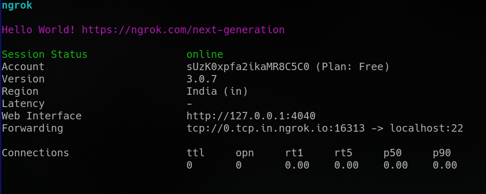

**[~](../../README.md)**

**[~/Pages](../pages.md)**

---

# Bypassing CGNAT with ngrok

> ngrok is a cross-platform application that enables developers to expose a local development server to the Internet with minimal effort

**I use ngrok for administration and remote desktop for systems on a home network behind CGNAT**

# Setup

1. Install ngrok, this includes adding it to $PATH

2. Add your authtoken from your profile page on the website with

```
$ ngrok config --add-authtoken TOKEN
```

3. Open a tunnel. Here, I use SSH port forwarding to secure all FTP, VNC, etc. traffic. These ports are closed and blocked by the firewall by default, but can be accessed by using SSH port forwarding

```
ngrok --region=in tcp 22
```



you can check for running agents by `grep`ping for the ngrok process and using `kill` if you can't `Ctrl-C`-it in your terminal window


# VNC through SSH

[My Documentation of how I attempted to secure SSH](../security/ssh.md)

VNC is reliable, and great for low-bandwidth questions, but you might prefer RDP if you're connecting from a Microsoft Windows client

_X2Go_, _moonlight_ are other alternatives, with different use cases

I use [x11vnc](https://github.com/LibVNC/x11vnc) to view an existing X session on a real display

from the client side, run

```
$ ssh -t -L 5900:localhost:5900 -p <PORT> username@address.ngrok.io 'x11vnc -localhost -display :0 -loop -wait 50 -noxdamage
```

from _man vncviewer_ ,

> -PreferredEncoding encoding

              This option specifies the  preferred  encoding
              to  use from one of "Tight", "ZRLE", "hextile"
              or "raw".

open up anoher terminal and use

```
vncviewer -PreferredEncoding=ZRLE :0
```

(:0 corresponds to port 5900)

_The bandwidth on the free plan is very restricted, but seems to be no issues forwarding VNC traffic through SSH, through an ngrok tunnel_

# Autostart

The systemd unit is only available with the paid plan, however, this can easily be emulated by putting your invocation in an autostart script for your display manager or window manager or session manager


---

Similarly, you can tunnel FTP(or just use SFTP), using SSH port forwarding

To foward spice protocol traffic,

```
$ ssh -L 5900:localhost:5900 -p <PORT> username@address.ngrok.io
```
