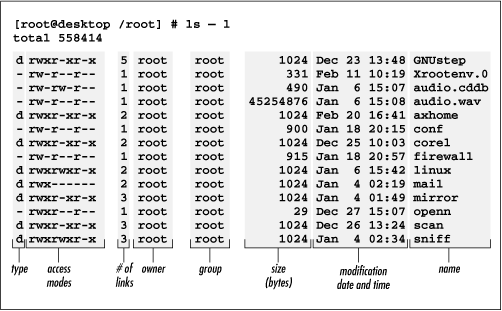

**[~](../../README.md)**

**[~/Pages](../pages.md)**

---

* TOC
{:toc}

---

# General UNIX Command-Line Essentials

## passwd

```
Usage: passwd [options] [LOGIN]

Options:
  -a, --all                     report password status on all accounts
  -d, --delete                  delete the password for the named account
  -e, --expire                  force expire the password for the named account
  -h, --help                    display this help message and exit
  -k, --keep-tokens             change password only if expired
  -i, --inactive INACTIVE       set password inactive after expiration
                                to INACTIVE
  -l, --lock                    lock the password of the named account
  -n, --mindays MIN_DAYS        set minimum number of days before password
                                change to MIN_DAYS
  -q, --quiet                   quiet mode
  -r, --repository REPOSITORY   change password in REPOSITORY repository
  -R, --root CHROOT_DIR         directory to chroot into
  -S, --status                  report password status on the named account
  -u, --unlock                  unlock the password of the named account
  -w, --warndays WARN_DAYS      set expiration warning days to WARN_DAYS
  -x, --maxdays MAX_DAYS        set maximum number of days before password
                                change to MAX_DAYS
```

## date

```
>date
Friday 09 September 2022 06:23:16 PM IST
```

```
> date --help                                                                                                ~
Usage: date [OPTION]... [+FORMAT]
  or:  date [-u|--utc|--universal] [MMDDhhmm[[CC]YY][.ss]]
Display date and time in the given FORMAT.
With -s, or with [MMDDhhmm[[CC]YY][.ss]], set the date and time.

Mandatory arguments to long options are mandatory for short options too.
  -d, --date=STRING          display time described by STRING, not 'now'
      --debug                annotate the parsed date,
                              and warn about questionable usage to stderr
  -f, --file=DATEFILE        like --date; once for each line of DATEFILE
  -I[FMT], --iso-8601[=FMT]  output date/time in ISO 8601 format.
                               FMT='date' for date only (the default),
                               'hours', 'minutes', 'seconds', or 'ns'
                               for date and time to the indicated precision.
                               Example: 2006-08-14T02:34:56-06:00
  --resolution               output the available resolution of timestamps
                               Example: 0.000000001
  -R, --rfc-email            output date and time in RFC 5322 format.
                               Example: Mon, 14 Aug 2006 02:34:56 -0600
      --rfc-3339=FMT         output date/time in RFC 3339 format.
                               FMT='date', 'seconds', or 'ns'
                               for date and time to the indicated precision.
                               Example: 2006-08-14 02:34:56-06:00
  -r, --reference=FILE       display the last modification time of FILE
  -s, --set=STRING           set time described by STRING
  -u, --utc, --universal     print or set Coordinated Universal Time (UTC)
      --help        display this help and exit
      --version     output version information and exit

FORMAT controls the output.  Interpreted sequences are:

  %%   a literal %
  %a   locale's abbreviated weekday name (e.g., Sun)
  %A   locale's full weekday name (e.g., Sunday)
  %b   locale's abbreviated month name (e.g., Jan)
  %B   locale's full month name (e.g., January)
  %c   locale's date and time (e.g., Thu Mar  3 23:05:25 2005)
  %C   century; like %Y, except omit last two digits (e.g., 20)
  %d   day of month (e.g., 01)
  %D   date; same as %m/%d/%y
  %e   day of month, space padded; same as %_d
  %F   full date; like %+4Y-%m-%d
  %g   last two digits of year of ISO week number (see %G)
  %G   year of ISO week number (see %V); normally useful only with %V
  %h   same as %b
  %H   hour (00..23)
  %I   hour (01..12)
  %j   day of year (001..366)
  %k   hour, space padded ( 0..23); same as %_H
  %l   hour, space padded ( 1..12); same as %_I
  %m   month (01..12)
  %M   minute (00..59)
  %n   a newline
  %N   nanoseconds (000000000..999999999)
  %p   locale's equivalent of either AM or PM; blank if not known
  %P   like %p, but lower case
  %q   quarter of year (1..4)
  %r   locale's 12-hour clock time (e.g., 11:11:04 PM)
  %R   24-hour hour and minute; same as %H:%M
  %s   seconds since the Epoch (1970-01-01 00:00 UTC)
  %S   second (00..60)
  %t   a tab
  %T   time; same as %H:%M:%S
  %u   day of week (1..7); 1 is Monday
  %U   week number of year, with Sunday as first day of week (00..53)
  %V   ISO week number, with Monday as first day of week (01..53)
  %w   day of week (0..6); 0 is Sunday
  %W   week number of year, with Monday as first day of week (00..53)
  %x   locale's date representation (e.g., 12/31/99)
  %X   locale's time representation (e.g., 23:13:48)
  %y   last two digits of year (00..99)
  %Y   year
  %z   +hhmm numeric time zone (e.g., -0400)
  %:z  +hh:mm numeric time zone (e.g., -04:00)
  %::z  +hh:mm:ss numeric time zone (e.g., -04:00:00)
  %:::z  numeric time zone with : to necessary precision (e.g., -04, +05:30)
  %Z   alphabetic time zone abbreviation (e.g., EDT)

By default, date pads numeric fields with zeroes.
The following optional flags may follow '%':

  -  (hyphen) do not pad the field
  _  (underscore) pad with spaces
  0  (zero) pad with zeros
  +  pad with zeros, and put '+' before future years with >4 digits
  ^  use upper case if possible
  #  use opposite case if possible

After any flags comes an optional field width, as a decimal number;
then an optional modifier, which is either
E to use the locale's alternate representations if available, or
O to use the locale's alternate numeric symbols if available.

Examples:
Convert seconds since the Epoch (1970-01-01 UTC) to a date
  $ date --date='@2147483647'

Show the time on the west coast of the US (use tzselect(1) to find TZ)
  $ TZ='America/Los_Angeles' date

Show the local time for 9AM next Friday on the west coast of the US
  $ date --date='TZ="America/Los_Angeles" 09:00 next Fri'

GNU coreutils online help: <https://www.gnu.org/software/coreutils/>
Full documentation <https://www.gnu.org/software/coreutils/date>
or available locally via: info '(coreutils) date invocation'
```

## wc

```
> wc --help                                                            ~
Usage: wc [OPTION]... [FILE]...
  or:  wc [OPTION]... --files0-from=F
Print newline, word, and byte counts for each FILE, and a total line if
more than one FILE is specified.  A word is a non-zero-length sequence of
printable characters delimited by white space.

With no FILE, or when FILE is -, read standard input.

The options below may be used to select which counts are printed, always in
the following order: newline, word, character, byte, maximum line length.
  -c, --bytes            print the byte counts
  -m, --chars            print the character counts
  -l, --lines            print the newline counts
      --files0-from=F    read input from the files specified by
                           NUL-terminated names in file F;
                           If F is - then read names from standard input
  -L, --max-line-length  print the maximum display width
  -w, --words            print the word counts
      --help        display this help and exit
      --version     output version information and exit

GNU coreutils online help: <https://www.gnu.org/software/coreutils/>
Full documentation <https://www.gnu.org/software/coreutils/wc>
or available locally via: info '(coreutils) wc invocation'
```

## man

```
> man --help                                                           ~
Usage: man [OPTION...] [SECTION] PAGE...

  -C, --config-file=FILE     use this user configuration file
  -d, --debug                emit debugging messages
  -D, --default              reset all options to their default values
      --warnings[=WARNINGS]  enable warnings from groff

 Main modes of operation:
  -f, --whatis               equivalent to whatis
  -k, --apropos              equivalent to apropos
  -K, --global-apropos       search for text in all pages
  -l, --local-file           interpret PAGE argument(s) as local filename(s)
  -w, --where, --path, --location
                             print physical location of man page(s)
  -W, --where-cat, --location-cat
                             print physical location of cat file(s)

  -c, --catman               used by catman to reformat out of date cat pages
  -R, --recode=ENCODING      output source page encoded in ENCODING

 Finding manual pages:
  -L, --locale=LOCALE        define the locale for this particular man search
  -m, --systems=SYSTEM       use manual pages from other systems
  -M, --manpath=PATH         set search path for manual pages to PATH

  -S, -s, --sections=LIST    use colon separated section list

  -e, --extension=EXTENSION  limit search to extension type EXTENSION

  -i, --ignore-case          look for pages case-insensitively (default)
  -I, --match-case           look for pages case-sensitively

      --regex                show all pages matching regex
      --wildcard             show all pages matching wildcard

      --names-only           make --regex and --wildcard match page names only,
                             not descriptions

  -a, --all                  find all matching manual pages
  -u, --update               force a cache consistency check

      --no-subpages          don't try subpages, e.g. 'man foo bar' => 'man
                             foo-bar'

 Controlling formatted output:
  -P, --pager=PAGER          use program PAGER to display output
  -r, --prompt=STRING        provide the `less' pager with a prompt

  -7, --ascii                display ASCII translation of certain latin1 chars
  -E, --encoding=ENCODING    use selected output encoding
      --no-hyphenation, --nh turn off hyphenation
      --no-justification,                              --nj   turn off justification
  -p, --preprocessor=STRING  STRING indicates which preprocessors to run:
                             e - [n]eqn, p - pic, t - tbl,
g - grap, r - refer, v - vgrind

  -t, --troff                use groff to format pages
  -T, --troff-device[=DEVICE]   use groff with selected device

  -H, --html[=BROWSER]       use  or BROWSER to display HTML output
  -X, --gxditview[=RESOLUTION]   use groff and display through gxditview
                             (X11):
                             -X = -TX75, -X100 = -TX100, -X100-12 = -TX100-12
  -Z, --ditroff              use groff and force it to produce ditroff

  -?, --help                 give this help list
      --usage                give a short usage message
  -V, --version              print program version

Mandatory or optional arguments to long options are also mandatory or optional
for any corresponding short options.

Report bugs to cjwatson@debian.org.
```

## who

```
> who                                                                  ~
user     tty1         2022-09-09 08:19
user     pts/0        2022-09-09 18:21 (:0)
user     pts/1        2022-09-09 18:22 (:0)
```

```
> who --help                                                           ~
Usage: who [OPTION]... [ FILE | ARG1 ARG2 ]
Print information about users who are currently logged in.

  -a, --all         same as -b -d --login -p -r -t -T -u
  -b, --boot        time of last system boot
  -d, --dead        print dead processes
  -H, --heading     print line of column headings
  -l, --login       print system login processes
      --lookup      attempt to canonicalize hostnames via DNS
  -m                only hostname and user associated with stdin
  -p, --process     print active processes spawned by init
  -q, --count       all login names and number of users logged on
  -r, --runlevel    print current runlevel
  -s, --short       print only name, line, and time (default)
  -t, --time        print last system clock change
  -T, -w, --mesg    add user's message status as +, - or ?
  -u, --users       list users logged in
      --message     same as -T
      --writable    same as -T
      --help        display this help and exit
      --version     output version information and exit

If FILE is not specified, use /var/run/utmp.  /var/log/wtmp as FILE is common.
If ARG1 ARG2 given, -m presumed: 'am i' or 'mom likes' are usual.

GNU coreutils online help: <https://www.gnu.org/software/coreutils/>
Full documentation <https://www.gnu.org/software/coreutils/who>
or available locally via: info '(coreutils) who invocation'
```

## mkdir

```
> mkdir --help                                                         ~
Usage: mkdir [OPTION]... DIRECTORY...
Create the DIRECTORY(ies), if they do not already exist.

Mandatory arguments to long options are mandatory for short options too.
  -m, --mode=MODE   set file mode (as in chmod), not a=rwx - umask
  -p, --parents     no error if existing, make parent directories as needed,
                    with their file modes unaffected by any -m option.
  -v, --verbose     print a message for each created directory
  -Z                   set SELinux security context of each created directory
                         to the default type
      --context[=CTX]  like -Z, or if CTX is specified then set the SELinux
                         or SMACK security context to CTX
      --help        display this help and exit
      --version     output version information and exit

GNU coreutils online help: <https://www.gnu.org/software/coreutils/>
Full documentation <https://www.gnu.org/software/coreutils/mkdir>
or available locally via: info '(coreutils) mkdir invocation'
```

## rmdir

```
> rmdir --help                                                         ~
Usage: rmdir [OPTION]... DIRECTORY...
Remove the DIRECTORY(ies), if they are empty.

      --ignore-fail-on-non-empty
                    ignore each failure that is solely because a directory
                    is non-empty

  -p, --parents     remove DIRECTORY and its ancestors; e.g., 'rmdir -p a/b/c'
                    is similar to 'rmdir a/b/c a/b a'

  -v, --verbose     output a diagnostic for every directory processed
      --help        display this help and exit
      --version     output version information and exit

GNU coreutils online help: <https://www.gnu.org/software/coreutils/>
Full documentation <https://www.gnu.org/software/coreutils/rmdir>
or available locally via: info '(coreutils) rmdir invocation'
```

## rm

```
> rm --help                                                            ~
Usage: rm [OPTION]... [FILE]...
Remove (unlink) the FILE(s).

  -f, --force           ignore nonexistent files and arguments, never prompt
  -i                    prompt before every removal
  -I                    prompt once before removing more than three files, or
                          when removing recursively; less intrusive than -i,
                          while still giving protection against most mistakes
      --interactive[=WHEN]  prompt according to WHEN: never, once (-I), or
                          always (-i); without WHEN, prompt always
      --one-file-system  when removing a hierarchy recursively, skip any
                          directory that is on a file system different from
                          that of the corresponding command line argument
      --no-preserve-root  do not treat '/' specially
      --preserve-root[=all]  do not remove '/' (default);
                              with 'all', reject any command line argument
                              on a separate device from its parent
  -r, -R, --recursive   remove directories and their contents recursively
  -d, --dir             remove empty directories
  -v, --verbose         explain what is being done
      --help        display this help and exit
      --version     output version information and exit

By default, rm does not remove directories.  Use the --recursive (-r or -R)
option to remove each listed directory, too, along with all of its contents.

To remove a file whose name starts with a '-', for example '-foo',
use one of these commands:
  rm -- -foo

  rm ./-foo

Note that if you use rm to remove a file, it might be possible to recover
some of its contents, given sufficient expertise and/or time.  For greater
assurance that the contents are truly unrecoverable, consider using shred(1).

GNU coreutils online help: <https://www.gnu.org/software/coreutils/>
Full documentation <https://www.gnu.org/software/coreutils/rm>
or available locally via: info '(coreutils) rm invocation'
```

## ls



```
regular files show up  - in the mode field
directory is marked with a d
symbolic link is marked with an l
character device is marked with a c
block device is marked with a b

(named pipe is marked with a p
socket is marked with an s
door is marked with a D)

```

```
> ls --help                                                                                                  ~
Usage: ls [OPTION]... [FILE]...
List information about the FILEs (the current directory by default).
Sort entries alphabetically if none of -cftuvSUX nor --sort is specified.

Mandatory arguments to long options are mandatory for short options too.
  -a, --all                  do not ignore entries starting with .
  -A, --almost-all           do not list implied . and ..
      --author               with -l, print the author of each file
  -b, --escape               print C-style escapes for nongraphic characters
      --block-size=SIZE      with -l, scale sizes by SIZE when printing them;
                             e.g., '--block-size=M'; see SIZE format below

  -B, --ignore-backups       do not list implied entries ending with ~
  -c                         with -lt: sort by, and show, ctime (time of last
                             modification of file status information);
                             with -l: show ctime and sort by name;
                             otherwise: sort by ctime, newest first

  -C                         list entries by columns
      --color[=WHEN]         color the output WHEN; more info below
  -d, --directory            list directories themselves, not their contents
  -D, --dired                generate output designed for Emacs' dired mode
  -f                         list all entries in directory order
  -F, --classify[=WHEN]      append indicator (one of */=>@|) to entries WHEN
      --file-type            likewise, except do not append '*'
      --format=WORD          across -x, commas -m, horizontal -x, long -l,
                             single-column -1, verbose -l, vertical -C

      --full-time            like -l --time-style=full-iso
  -g                         like -l, but do not list owner
      --group-directories-first
                             group directories before files;
                             can be augmented with a --sort option, but any
                             use of --sort=none (-U) disables grouping

  -G, --no-group             in a long listing, don't print group names
  -h, --human-readable       with -l and -s, print sizes like 1K 234M 2G etc.
      --si                   likewise, but use powers of 1000 not 1024
  -H, --dereference-command-line
                             follow symbolic links listed on the command line
      --dereference-command-line-symlink-to-dir
                             follow each command line symbolic link
                             that points to a directory

      --hide=PATTERN         do not list implied entries matching shell PATTERN
                             (overridden by -a or -A)

      --hyperlink[=WHEN]     hyperlink file names WHEN
      --indicator-style=WORD
                             append indicator with style WORD to entry names:
                             none (default), slash (-p),
                             file-type (--file-type), classify (-F)

  -i, --inode                print the index number of each file
  -I, --ignore=PATTERN       do not list implied entries matching shell PATTERN
  -k, --kibibytes            default to 1024-byte blocks for file system usage;
                             used only with -s and per directory totals

  -l                         use a long listing format
  -L, --dereference          when showing file information for a symbolic
                             link, show information for the file the link
                             references rather than for the link itself

  -m                         fill width with a comma separated list of entries
  -n, --numeric-uid-gid      like -l, but list numeric user and group IDs
  -N, --literal              print entry names without quoting
  -o                         like -l, but do not list group information
  -p, --indicator-style=slash
                             append / indicator to directories
  -q, --hide-control-chars   print ? instead of nongraphic characters
      --show-control-chars   show nongraphic characters as-is (the default,
                             unless program is 'ls' and output is a terminal)

  -Q, --quote-name           enclose entry names in double quotes
      --quoting-style=WORD   use quoting style WORD for entry names:
                             literal, locale, shell, shell-always,
                             shell-escape, shell-escape-always, c, escape
                             (overrides QUOTING_STYLE environment variable)

  -r, --reverse              reverse order while sorting
  -R, --recursive            list subdirectories recursively
  -s, --size                 print the allocated size of each file, in blocks
  -S                         sort by file size, largest first
      --sort=WORD            sort by WORD instead of name: none (-U), size (-S),
                             time (-t), version (-v), extension (-X), width

      --time=WORD            change the default of using modification times;
                               access time (-u): atime, access, use;
                               change time (-c): ctime, status;
                               birth time: birth, creation;
                             with -l, WORD determines which time to show;
                             with --sort=time, sort by WORD (newest first)

      --time-style=TIME_STYLE
                             time/date format with -l; see TIME_STYLE below
  -t                         sort by time, newest first; see --time
  -T, --tabsize=COLS         assume tab stops at each COLS instead of 8
  -u                         with -lt: sort by, and show, access time;
                             with -l: show access time and sort by name;
                             otherwise: sort by access time, newest first

  -U                         do not sort; list entries in directory order
  -v                         natural sort of (version) numbers within text
  -w, --width=COLS           set output width to COLS.  0 means no limit
  -x                         list entries by lines instead of by columns
  -X                         sort alphabetically by entry extension
  -Z, --context              print any security context of each file
      --zero                 end each output line with NUL, not newline
  -1                         list one file per line
      --help        display this help and exit
      --version     output version information and exit

The SIZE argument is an integer and optional unit (example: 10K is 10*1024).
Units are K,M,G,T,P,E,Z,Y (powers of 1024) or KB,MB,... (powers of 1000).
Binary prefixes can be used, too: KiB=K, MiB=M, and so on.

The TIME_STYLE argument can be full-iso, long-iso, iso, locale, or +FORMAT.
FORMAT is interpreted like in date(1).  If FORMAT is FORMAT1<newline>FORMAT2,
then FORMAT1 applies to non-recent files and FORMAT2 to recent files.
TIME_STYLE prefixed with 'posix-' takes effect only outside the POSIX locale.
Also the TIME_STYLE environment variable sets the default style to use.

The WHEN argument defaults to 'always' and can also be 'auto' or 'never'.

Using color to distinguish file types is disabled both by default and
with --color=never.  With --color=auto, ls emits color codes only when
standard output is connected to a terminal.  The LS_COLORS environment
variable can change the settings.  Use the dircolors(1) command to set it.

Exit status:
 0  if OK,
 1  if minor problems (e.g., cannot access subdirectory),
 2  if serious trouble (e.g., cannot access command-line argument).

GNU coreutils online help: <https://www.gnu.org/software/coreutils/>
Full documentation <https://www.gnu.org/software/coreutils/ls>
or available locally via: info '(coreutils) ls invocation'
```

## pwd

```
NAME
       pwd - print name of current/working directory

SYNOPSIS
       pwd [OPTION]...

DESCRIPTION
       Print the full filename of the current working directory.

       -L, --logical
              use PWD from environment, even if it contains symlinks

       -P, --physical
              avoid all symlinks

       --help display this help and exit

       --version
              output version information and exit

       If no option is specified, -P is assumed.

       NOTE:  your  shell  may  have  its own version of pwd, which usually supersedes the version described
       here.  Please refer to your shell's documentation for details about the options it supports.
```

## cp

```
> cp --help                                                                                                  ~
Usage: cp [OPTION]... [-T] SOURCE DEST
  or:  cp [OPTION]... SOURCE... DIRECTORY
  or:  cp [OPTION]... -t DIRECTORY SOURCE...
Copy SOURCE to DEST, or multiple SOURCE(s) to DIRECTORY.

Mandatory arguments to long options are mandatory for short options too.
  -a, --archive                same as -dR --preserve=all
      --attributes-only        don't copy the file data, just the attributes
      --backup[=CONTROL]       make a backup of each existing destination file
  -b                           like --backup but does not accept an argument
      --copy-contents          copy contents of special files when recursive
  -d                           same as --no-dereference --preserve=links
  -f, --force                  if an existing destination file cannot be
                                 opened, remove it and try again (this option
                                 is ignored when the -n option is also used)
  -i, --interactive            prompt before overwrite (overrides a previous -n
                                  option)
  -H                           follow command-line symbolic links in SOURCE
  -l, --link                   hard link files instead of copying
  -L, --dereference            always follow symbolic links in SOURCE
  -n, --no-clobber             do not overwrite an existing file (overrides
                                 a previous -i option)
  -P, --no-dereference         never follow symbolic links in SOURCE
  -p                           same as --preserve=mode,ownership,timestamps
      --preserve[=ATTR_LIST]   preserve the specified attributes (default:
                                 mode,ownership,timestamps), if possible
                                 additional attributes: context, links, xattr,
                                 all
      --no-preserve=ATTR_LIST  don't preserve the specified attributes
      --parents                use full source file name under DIRECTORY
  -R, -r, --recursive          copy directories recursively
      --reflink[=WHEN]         control clone/CoW copies. See below
      --remove-destination     remove each existing destination file before
                                 attempting to open it (contrast with --force)
      --sparse=WHEN            control creation of sparse files. See below
      --strip-trailing-slashes  remove any trailing slashes from each SOURCE
                                 argument
  -s, --symbolic-link          make symbolic links instead of copying
  -S, --suffix=SUFFIX          override the usual backup suffix
  -t, --target-directory=DIRECTORY  copy all SOURCE arguments into DIRECTORY
  -T, --no-target-directory    treat DEST as a normal file
  -u, --update                 copy only when the SOURCE file is newer
                                 than the destination file or when the
                                 destination file is missing
  -v, --verbose                explain what is being done
  -x, --one-file-system        stay on this file system
  -Z                           set SELinux security context of destination
                                 file to default type
      --context[=CTX]          like -Z, or if CTX is specified then set the
                                 SELinux or SMACK security context to CTX
      --help        display this help and exit
      --version     output version information and exit

By default, sparse SOURCE files are detected by a crude heuristic and the
corresponding DEST file is made sparse as well.  That is the behavior
selected by --sparse=auto.  Specify --sparse=always to create a sparse DEST
file whenever the SOURCE file contains a long enough sequence of zero bytes.
Use --sparse=never to inhibit creation of sparse files.

When --reflink[=always] is specified, perform a lightweight copy, where the
data blocks are copied only when modified.  If this is not possible the copy
fails, or if --reflink=auto is specified, fall back to a standard copy.
Use --reflink=never to ensure a standard copy is performed.

The backup suffix is '~', unless set with --suffix or SIMPLE_BACKUP_SUFFIX.
The version control method may be selected via the --backup option or through
the VERSION_CONTROL environment variable.  Here are the values:

  none, off       never make backups (even if --backup is given)
  numbered, t     make numbered backups
  existing, nil   numbered if numbered backups exist, simple otherwise
  simple, never   always make simple backups

As a special case, cp makes a backup of SOURCE when the force and backup
options are given and SOURCE and DEST are the same name for an existing,
regular file.

GNU coreutils online help: <https://www.gnu.org/software/coreutils/>
Full documentation <https://www.gnu.org/software/coreutils/cp>
or available locally via: info '(coreutils) cp invocation'
```

## mv

```
> mv --help                                                                                                  ~
Usage: mv [OPTION]... [-T] SOURCE DEST
  or:  mv [OPTION]... SOURCE... DIRECTORY
  or:  mv [OPTION]... -t DIRECTORY SOURCE...
Rename SOURCE to DEST, or move SOURCE(s) to DIRECTORY.

Mandatory arguments to long options are mandatory for short options too.
      --backup[=CONTROL]       make a backup of each existing destination file
  -b                           like --backup but does not accept an argument
  -f, --force                  do not prompt before overwriting
  -i, --interactive            prompt before overwrite
  -n, --no-clobber             do not overwrite an existing file
If you specify more than one of -i, -f, -n, only the final one takes effect.
      --strip-trailing-slashes  remove any trailing slashes from each SOURCE
                                 argument
  -S, --suffix=SUFFIX          override the usual backup suffix
  -t, --target-directory=DIRECTORY  move all SOURCE arguments into DIRECTORY
  -T, --no-target-directory    treat DEST as a normal file
  -u, --update                 move only when the SOURCE file is newer
                                 than the destination file or when the
                                 destination file is missing
  -v, --verbose                explain what is being done
  -Z, --context                set SELinux security context of destination
                                 file to default type
      --help        display this help and exit
      --version     output version information and exit

The backup suffix is '~', unless set with --suffix or SIMPLE_BACKUP_SUFFIX.
The version control method may be selected via the --backup option or through
the VERSION_CONTROL environment variable.  Here are the values:

  none, off       never make backups (even if --backup is given)
  numbered, t     make numbered backups
  existing, nil   numbered if numbered backups exist, simple otherwise
  simple, never   always make simple backups

GNU coreutils online help: <https://www.gnu.org/software/coreutils/>
Full documentation <https://www.gnu.org/software/coreutils/mv>
or available locally via: info '(coreutils) mv invocation'
```

## cd

## head

```
> head --help                                                                                                ~
Usage: head [OPTION]... [FILE]...
Print the first 10 lines of each FILE to standard output.
With more than one FILE, precede each with a header giving the file name.

With no FILE, or when FILE is -, read standard input.

Mandatory arguments to long options are mandatory for short options too.
  -c, --bytes=[-]NUM       print the first NUM bytes of each file;
                             with the leading '-', print all but the last
                             NUM bytes of each file
  -n, --lines=[-]NUM       print the first NUM lines instead of the first 10;
                             with the leading '-', print all but the last
                             NUM lines of each file
  -q, --quiet, --silent    never print headers giving file names
  -v, --verbose            always print headers giving file names
  -z, --zero-terminated    line delimiter is NUL, not newline
      --help        display this help and exit
      --version     output version information and exit

NUM may have a multiplier suffix:
b 512, kB 1000, K 1024, MB 1000*1000, M 1024*1024,
GB 1000*1000*1000, G 1024*1024*1024, and so on for T, P, E, Z, Y.
Binary prefixes can be used, too: KiB=K, MiB=M, and so on.

GNU coreutils online help: <https://www.gnu.org/software/coreutils/>
Full documentation <https://www.gnu.org/software/coreutils/head>
or available locally via: info '(coreutils) head invocation'
```

## tail

```
> tail --help                                                                                                ~
Usage: tail [OPTION]... [FILE]...
Print the last 10 lines of each FILE to standard output.
With more than one FILE, precede each with a header giving the file name.

With no FILE, or when FILE is -, read standard input.

Mandatory arguments to long options are mandatory for short options too.
  -c, --bytes=[+]NUM       output the last NUM bytes; or use -c +NUM to
                             output starting with byte NUM of each file
  -f, --follow[={name|descriptor}]
                           output appended data as the file grows;
                             an absent option argument means 'descriptor'
  -F                       same as --follow=name --retry
  -n, --lines=[+]NUM       output the last NUM lines, instead of the last 10;
                             or use -n +NUM to output starting with line NUM
      --max-unchanged-stats=N
                           with --follow=name, reopen a FILE which has not
                             changed size after N (default 5) iterations
                             to see if it has been unlinked or renamed
                             (this is the usual case of rotated log files);
                             with inotify, this option is rarely useful
      --pid=PID            with -f, terminate after process ID, PID dies
  -q, --quiet, --silent    never output headers giving file names
      --retry              keep trying to open a file if it is inaccessible
  -s, --sleep-interval=N   with -f, sleep for approximately N seconds
                             (default 1.0) between iterations;
                             with inotify and --pid=P, check process P at
                             least once every N seconds
  -v, --verbose            always output headers giving file names
  -z, --zero-terminated    line delimiter is NUL, not newline
      --help        display this help and exit
      --version     output version information and exit

NUM may have a multiplier suffix:
b 512, kB 1000, K 1024, MB 1000*1000, M 1024*1024,
GB 1000*1000*1000, G 1024*1024*1024, and so on for T, P, E, Z, Y.
Binary prefixes can be used, too: KiB=K, MiB=M, and so on.

With --follow (-f), tail defaults to following the file descriptor, which
means that even if a tail'ed file is renamed, tail will continue to track
its end.  This default behavior is not desirable when you really want to
track the actual name of the file, not the file descriptor (e.g., log
rotation).  Use --follow=name in that case.  That causes tail to track the
named file in a way that accommodates renaming, removal and creation.

GNU coreutils online help: <https://www.gnu.org/software/coreutils/>
Full documentation <https://www.gnu.org/software/coreutils/tail>
or available locally via: info '(coreutils) tail invocation'
```

## cat

```
Usage: cat [OPTION]... [FILE]...
Concatenate FILE(s) to standard output.

With no FILE, or when FILE is -, read standard input.

  -A, --show-all           equivalent to -vET
  -b, --number-nonblank    number nonempty output lines, overrides -n
  -e                       equivalent to -vE
  -E, --show-ends          display $ at end of each line
  -n, --number             number all output lines
  -s, --squeeze-blank      suppress repeated empty output lines
  -t                       equivalent to -vT
  -T, --show-tabs          display TAB characters as ^I
  -u                       (ignored)
  -v, --show-nonprinting   use ^ and M- notation, except for LFD and TAB
      --help        display this help and exit
      --version     output version information and exit

Examples:
  cat f - g  Output f's contents, then standard input, then g's contents.
  cat        Copy standard input to standard output.

GNU coreutils online help: <https://www.gnu.org/software/coreutils/>
Full documentation <https://www.gnu.org/software/coreutils/cat>
or available locally via: info '(coreutils) cat invocation'
```

## more

```
> more --help                                                                   ~

Usage:
 more [options] <file>...

A file perusal filter for CRT viewing.

Options:
 -d, --silent          display help instead of ringing bell
 -f, --logical         count logical rather than screen lines
 -l, --no-pause        suppress pause after form feed
 -c, --print-over      do not scroll, display text and clean line ends
 -p, --clean-print     do not scroll, clean screen and display text
 -e, --exit-on-eof     exit on end-of-file
 -s, --squeeze         squeeze multiple blank lines into one
 -u, --plain           suppress underlining and bold
 -n, --lines <number>  the number of lines per screenful
 -<number>             same as --lines
 +<number>             display file beginning from line number
 +/<pattern>           display file beginning from pattern match

 -h, --help            display this help
 -V, --version         display version

For more details see more(1).
```

## less

_refer to comprehensive help_

## touch

```
> touch --help                                                                  ~
Usage: touch [OPTION]... FILE...
Update the access and modification times of each FILE to the current time.

A FILE argument that does not exist is created empty, unless -c or -h
is supplied.

A FILE argument string of - is handled specially and causes touch to
change the times of the file associated with standard output.

Mandatory arguments to long options are mandatory for short options too.
  -a                     change only the access time
  -c, --no-create        do not create any files
  -d, --date=STRING      parse STRING and use it instead of current time
  -f                     (ignored)
  -h, --no-dereference   affect each symbolic link instead of any referenced
                         file (useful only on systems that can change the
                         timestamps of a symlink)
  -m                     change only the modification time
  -r, --reference=FILE   use this file's times instead of current time
  -t STAMP               use [[CC]YY]MMDDhhmm[.ss] instead of current time
      --time=WORD        change the specified time:
                           WORD is access, atime, or use: equivalent to -a
                           WORD is modify or mtime: equivalent to -m
      --help        display this help and exit
      --version     output version information and exit

Note that the -d and -t options accept different time-date formats.

GNU coreutils online help: <https://www.gnu.org/software/coreutils/>
Full documentation <https://www.gnu.org/software/coreutils/touch>
or available locally via: info '(coreutils) touch invocation'
```

## echo

```
NAME
       echo - display a line of text

SYNOPSIS
       echo [SHORT-OPTION]... [STRING]...
       echo LONG-OPTION

DESCRIPTION
       Echo the STRING(s) to standard output.

       -n     do not output the trailing newline

       -e     enable interpretation of backslash escapes

       -E     disable interpretation of backslash escapes (default)

       --help display this help and exit

       --version
              output version information and exit

       If -e is in effect, the following sequences are recognized:

       \\     backslash

       \a     alert (BEL)

       \b     backspace

       \c     produce no further output

       \e     escape

       \f     form feed

       \n     new line

       \r     carriage return

       \t     horizontal tab

       \v     vertical tab

       \0NNN  byte with octal value NNN (1 to 3 digits)

       \xHH   byte with hexadecimal value HH (1 to 2 digits)

       NOTE:  your shell may have its own version of echo, which usually super‐
       sedes the version described here.  Please refer to your shell's documen‐
       tation for details about the options it supports.

       NOTE:  printf(1)  is a preferred alternative, which does not have issues
       outputting option-like strings.
```

## chmod

https://en.wikipedia.org/wiki/File-system_permissions#Traditional_Unix_permissions


```
> chmod --help                                                                          ~
Usage: chmod [OPTION]... MODE[,MODE]... FILE...
  or:  chmod [OPTION]... OCTAL-MODE FILE...
  or:  chmod [OPTION]... --reference=RFILE FILE...
Change the mode of each FILE to MODE.
With --reference, change the mode of each FILE to that of RFILE.

  -c, --changes          like verbose but report only when a change is made
  -f, --silent, --quiet  suppress most error messages
  -v, --verbose          output a diagnostic for every file processed
      --no-preserve-root  do not treat '/' specially (the default)
      --preserve-root    fail to operate recursively on '/'
      --reference=RFILE  use RFILE's mode instead of MODE values
  -R, --recursive        change files and directories recursively
      --help        display this help and exit
      --version     output version information and exit

Each MODE is of the form '[ugoa]*([-+=]([rwxXst]*|[ugo]))+|[-+=][0-7]+'.

GNU coreutils online help: <https://www.gnu.org/software/coreutils/>
Full documentation <https://www.gnu.org/software/coreutils/chmod>
or available locally via: info '(coreutils) chmod invocation'
```

## alias

```
NAME
       alias — define or display aliases

SYNOPSIS
       alias [alias-name[=string]...]

DESCRIPTION
       The alias utility shall create or redefine alias definitions or write the values
       of existing alias definitions to standard output. An alias definition provides a
       string value that shall replace a command name when it is encountered; see  Sec‐
       tion 2.3.1, Alias Substitution.

```

## grep

```
> grep --help                                                                           ~
Usage: grep [OPTION]... PATTERNS [FILE]...
Search for PATTERNS in each FILE.
Example: grep -i 'hello world' menu.h main.c
PATTERNS can contain multiple patterns separated by newlines.

Pattern selection and interpretation:
  -E, --extended-regexp     PATTERNS are extended regular expressions
  -F, --fixed-strings       PATTERNS are strings
  -G, --basic-regexp        PATTERNS are basic regular expressions
  -P, --perl-regexp         PATTERNS are Perl regular expressions
  -e, --regexp=PATTERNS     use PATTERNS for matching
  -f, --file=FILE           take PATTERNS from FILE
  -i, --ignore-case         ignore case distinctions in patterns and data
      --no-ignore-case      do not ignore case distinctions (default)
  -w, --word-regexp         match only whole words
  -x, --line-regexp         match only whole lines
  -z, --null-data           a data line ends in 0 byte, not newline

Miscellaneous:
  -s, --no-messages         suppress error messages
  -v, --invert-match        select non-matching lines
  -V, --version             display version information and exit
      --help                display this help text and exit

Output control:
  -m, --max-count=NUM       stop after NUM selected lines
  -b, --byte-offset         print the byte offset with output lines
  -n, --line-number         print line number with output lines
      --line-buffered       flush output on every line
  -H, --with-filename       print file name with output lines
  -h, --no-filename         suppress the file name prefix on output
      --label=LABEL         use LABEL as the standard input file name prefix
  -o, --only-matching       show only nonempty parts of lines that match
  -q, --quiet, --silent     suppress all normal output
      --binary-files=TYPE   assume that binary files are TYPE;
                            TYPE is 'binary', 'text', or 'without-match'
  -a, --text                equivalent to --binary-files=text
  -I                        equivalent to --binary-files=without-match
  -d, --directories=ACTION  how to handle directories;
                            ACTION is 'read', 'recurse', or 'skip'
  -D, --devices=ACTION      how to handle devices, FIFOs and sockets;
                            ACTION is 'read' or 'skip'
  -r, --recursive           like --directories=recurse
  -R, --dereference-recursive  likewise, but follow all symlinks
      --include=GLOB        search only files that match GLOB (a file pattern)
      --exclude=GLOB        skip files that match GLOB
      --exclude-from=FILE   skip files that match any file pattern from FILE
      --exclude-dir=GLOB    skip directories that match GLOB
  -L, --files-without-match  print only names of FILEs with no selected lines
  -l, --files-with-matches  print only names of FILEs with selected lines
  -c, --count               print only a count of selected lines per FILE
  -T, --initial-tab         make tabs line up (if needed)
  -Z, --null                print 0 byte after FILE name

Context control:
  -B, --before-context=NUM  print NUM lines of leading context
  -A, --after-context=NUM   print NUM lines of trailing context
  -C, --context=NUM         print NUM lines of output context
  -NUM                      same as --context=NUM
      --group-separator=SEP  print SEP on line between matches with context
      --no-group-separator  do not print separator for matches with context
      --color[=WHEN],
      --colour[=WHEN]       use markers to highlight the matching strings;
                            WHEN is 'always', 'never', or 'auto'
  -U, --binary              do not strip CR characters at EOL (MSDOS/Windows)

When FILE is '-', read standard input.  With no FILE, read '.' if
recursive, '-' otherwise.  With fewer than two FILEs, assume -h.
Exit status is 0 if any line is selected, 1 otherwise;
if any error occurs and -q is not given, the exit status is 2.

Report bugs to: bug-grep@gnu.org
GNU grep home page: <https://www.gnu.org/software/grep/>
General help using GNU software: <https://www.gnu.org/gethelp/>
```

## paste

```
> paste --help                                                                          ~
Usage: paste [OPTION]... [FILE]...
Write lines consisting of the sequentially corresponding lines from
each FILE, separated by TABs, to standard output.

With no FILE, or when FILE is -, read standard input.

Mandatory arguments to long options are mandatory for short options too.
  -d, --delimiters=LIST   reuse characters from LIST instead of TABs
  -s, --serial            paste one file at a time instead of in parallel
  -z, --zero-terminated    line delimiter is NUL, not newline
      --help        display this help and exit
      --version     output version information and exit

GNU coreutils online help: <https://www.gnu.org/software/coreutils/>
Full documentation <https://www.gnu.org/software/coreutils/paste>
or available locally via: info '(coreutils) paste invocation'
```

## cut

```
> cut --help                                                                            ~
Usage: cut OPTION... [FILE]...
Print selected parts of lines from each FILE to standard output.

With no FILE, or when FILE is -, read standard input.

Mandatory arguments to long options are mandatory for short options too.
  -b, --bytes=LIST        select only these bytes
  -c, --characters=LIST   select only these characters
  -d, --delimiter=DELIM   use DELIM instead of TAB for field delimiter
  -f, --fields=LIST       select only these fields;  also print any line
                            that contains no delimiter character, unless
                            the -s option is specified
  -n                      (ignored)
      --complement        complement the set of selected bytes, characters
                            or fields
  -s, --only-delimited    do not print lines not containing delimiters
      --output-delimiter=STRING  use STRING as the output delimiter
                            the default is to use the input delimiter
  -z, --zero-terminated    line delimiter is NUL, not newline
      --help        display this help and exit
      --version     output version information and exit

Use one, and only one of -b, -c or -f.  Each LIST is made up of one
range, or many ranges separated by commas.  Selected input is written
in the same order that it is read, and is written exactly once.
Each range is one of:

  N     N'th byte, character or field, counted from 1
  N-    from N'th byte, character or field, to end of line
  N-M   from N'th to M'th (included) byte, character or field
  -M    from first to M'th (included) byte, character or field

GNU coreutils online help: <https://www.gnu.org/software/coreutils/>
Full documentation <https://www.gnu.org/software/coreutils/cut>
or available locally via: info '(coreutils) cut invocation'
```

## tee

```
Usage: tee [OPTION]... [FILE]...
Copy standard input to each FILE, and also to standard output.

  -a, --append              append to the given FILEs, do not overwrite
  -i, --ignore-interrupts   ignore interrupt signals
  -p                        diagnose errors writing to non pipes
      --output-error[=MODE]   set behavior on write error.  See MODE below
      --help        display this help and exit
      --version     output version information and exit

MODE determines behavior with write errors on the outputs:
  warn           diagnose errors writing to any output
  warn-nopipe    diagnose errors writing to any output not a pipe
  exit           exit on error writing to any output
  exit-nopipe    exit on error writing to any output not a pipe
The default MODE for the -p option is 'warn-nopipe'.
The default operation when --output-error is not specified, is to
exit immediately on error writing to a pipe, and diagnose errors
writing to non pipe outputs.

GNU coreutils online help: <https://www.gnu.org/software/coreutils/>
Full documentation <https://www.gnu.org/software/coreutils/tee>
or available locally via: info '(coreutils) tee invocation'
```

## Environment Variables

### $HOME

### $PATH

### $SHELL

### $TERM

Common Envvars-

    SHELL: This describes the shell that will be interpreting any commands you type in. In most cases, this will be bash by default, but other values can be set if you prefer other options.
    TERM: This specifies the type of terminal to emulate when running the shell. Different hardware terminals can be emulated for different operating requirements. You usually won’t need to worry about this though.
    USER: The current logged in user.
    PWD: The current working directory.
    OLDPWD: The previous working directory. This is kept by the shell in order to switch back to your previous directory by running cd -.
    LS_COLORS: This defines color codes that are used to optionally add colored output to the ls command. This is used to distinguish different file types and provide more info to the user at a glance.
    MAIL: The path to the current user’s mailbox.
    PATH: A list of directories that the system will check when looking for commands. When a user types in a command, the system will check directories in this order for the executable.
    LANG: The current language and localization settings, including character encoding.
    HOME: The current user’s home directory.
    _: The most recent previously executed command.

Common Shell Vars-


    BASHOPTS: The list of options that were used when bash was executed. This can be useful for finding out if the shell environment will operate in the way you want it to.
    BASH_VERSION: The version of bash being executed, in human-readable form.
    BASH_VERSINFO: The version of bash, in machine-readable output.
    COLUMNS: The number of columns wide that are being used to draw output on the screen.
    DIRSTACK: The stack of directories that are available with the pushd and popd commands.
    HISTFILESIZE: Number of lines of command history stored to a file.
    HISTSIZE: Number of lines of command history allowed in memory.
    HOSTNAME: The hostname of the computer at this time.
    IFS: The internal field separator to separate input on the command line. By default, this is a space.
    PS1: The primary command prompt definition. This is used to define what your prompt looks like when you start a shell session. The PS2 is used to declare secondary prompts for when a command spans multiple lines.
    SHELLOPTS: Shell options that can be set with the set option.
    UID: The UID of the current user.


## IO Operators and Pipes

https://homepages.uc.edu/~thomam/Intro_Unix_Text/IO_Redir_Pipes.html

---

https://cheatography.com/davechild/cheat-sheets/linux-command-line/
# Exploring the Unix command-line

1. Change your password to a password you would like to use for the remainder of the semester.

```
$ passwd
```

2. Display the system’s date.

```
$ date
```

3. Count the number of lines in the /etc/passwd file.

```
$ cat /etc/passwd | wc -l
```

4. Find out who else is on the system.

```
$ who
$ users
```

5. Direct the output of the man pages for the date command to a file named mydate.

```
$ man mydate > mydate
```

{ height=200px }

6. Create a subdirectory called mydir.

```
$ mkdir mydir
```

7.  Move the file mydate into the new subdirectory.

```
$ mv mydate mydir/
```

8. Go to the subdirectory mydir and copy the file mydate to a new file called ourdate

```
$ cd mydir
$ cp mydate ourdate
```

9. List the contents of mydir.

```
 $ ls mydir
```

10. Do a long listing on the file ourdate and note the permissions.

```
 $ ls -l ourdate
```

11. Display the name of the current directory starting from the root.

```
 $ pwd
```

12. Move the files in the directory mydir back to the HOME directory.

```
 $ mv mydir ~
```

13. List all the files in your HOME directory.

```
 $ ls -la
```

{ height=300px }

14. Display the first 5 lines of mydate.

```
 $ head -5 mydate
```


15. Display the last 8 lines of mydate.

```
$ tail -8 mydate
```


16. Remove the directory mydir.

```
$ rm -rf mydir
```

17. Redirect the output of the long listing of files to a file named list.

```
 $ ls -l > list
```

18. Select any 5 capitals of states in India and enter them in a file named ccapitals1. Choose 5 more capitals and enter them in a file named capitals2. Choose 5 more capitals and enter them in a file named capitals3. Concatenate all 3 files and redirect the output to a file named capitals.


```
$ cat capitals1 capitals2 capitals3 > capitals
```

19. Concatenate the file capitals2 at the end of file capitals.

```
$ cat capitals2 >> capitals
```

20. Redirect the file capitals as an input to the command “wc –l”.

```
$ cat capitals | wc -l
```

21. Give read and write permissions to all users for the file capitals.

```
$ chmod a+rw capitals
```

22. Give read permissions only to the owner of the file capitals. Open the file, make some changes and try to save it. What happens ?

```
$ chmod 400 capitals
```

23. Create an alias to concatenate the 3 files capitals1, capitals2, capitals3 and redirect the output to a file named capitals. Activate the alias and make it run.

```
$ alias capitalcat='cat capitals1 capitals2 capitals3 > capitals'
$ capitalcat
```

24. What are the environment variables PATH, HOME and TERM set to on your
    terminal ?

```
$ echo $PATH

/home/elvin/bin:/usr/lib/ccache/bin/:/sbin:/usr/bin:/usr/sbin:/usr/local/bin:/usr/local/sbin:/opt/bin:/usr/bin/core_perl:/usr/games/bin:/home/elvin/.local/bin:/var/lib/flatpak/exports/bin:/usr/local/sbin:/usr/local/bin:/usr/bin:/var/lib/flatpak/exports/bin:/usr/bin/site_perl:/usr/bin/vendor_perl:/usr/bin/core_perl

$ echo $TERM
xterm-256color

$ echo $HOME
/home/elvin

$
```

25. Find out the number of times the string “the” appears in the file mydate.

```
$ grep -c the mydate
```

26. Find out the line numbers on which the string “date” exists in mydate.

```
$ grep -n date mydate
```

27. Print all lines of mydate except those that have the letter “i” in them.

```
$ grep -vn i mydate
```

28. Create the file monotonic as follows:
    ^a?b?b?c?..............x?y?z$
    Run the egrep command for monotonic against /usr/dict/words and search for all 4 letter words.

```
$ egrep -f monotonic /usr/share/dict/words | grep '^....$'
```

29. List 5 states in north east India in a file mystates. List their corresponding capitals in a file mycapitals. Use the paste command to join the 2 files.

```
$ paste mystates mycapitals
```

30. Use the cut command to print the 1 st and 3rd columns of the /etc/passwd file for all students in this class.

```
$ cat /etc/passwd | cut -c 1,3

$ cat /etc/passwd | grep -v /usr/bin/nologin | cut -c 1,3 # checking for login shell(set of student and administrator accounts)

```

31. Count the number of people logged in and also trap the users in a file using the tee command.

```
$ who | tee user_logins | grep -c -

```

## [Explored in more depth HERE](../security/LinuxSecurity/linux.md)