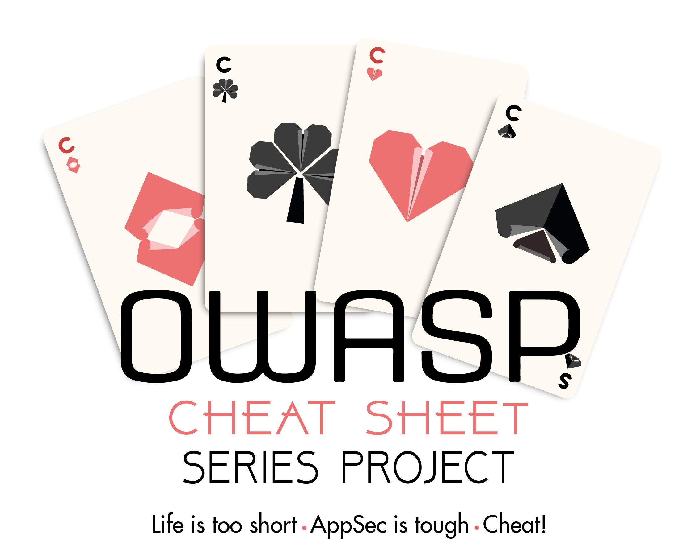

**[~](../../README.md)**

**[~/Security](../security.md)**

---

* TOC
{:toc}

---

# Application Security, Secure Software Development and DevSecOps

> Application security (AppSec) includes all tasks that introduce a secure software development life cycle to development teams.

> Its final goal is to improve security practices and, through that, to find, fix and preferably prevent security issues within applications.

# Recent Blogposts

## [The OWASP Top Ten](OWASP10.md)

The OWASP Top Ten is a standard awareness document for developers and web application security. It represents a broad consensus about the most critical security risks to web applications.

Talking about the cause-prevention of these risks, and actually performing many related attacks in a controlled environment for each of these ten

## [Secure Coding with Python](secure_coding_python.md)

Tools and guidelines to follow when developing projects in Python, to make them less vulnerable and insecure, ensuring high quality and robust Python code

Covers codestyle, module structure guidelines, security tools to check python code, tests with Python, formatters and standardization, and type hinting along with type checking to scan for issues.

## [Secure Coding](secure_coding.md)

_Secure Coding Manifesto_- Rules of secure coding or secure software development

A set of practices that applies security considerations to how software will be coded and encrypted to best defend against a cyber attack or vulnerabilities.

## [Static Code Analysis](static_analysis.md)

Static Code Analysis (also known as Source Code Analysis) is usually performed as part of a Code Review (also known as white-box testing) and is carried out at the Implementation phase of a Security Development Lifecycle (SDL)

## [Dynamic Code Analysis](dynamic_analysis.md)

Dynamic code analysis involves running code and examining the outcome, which also entails testing possible execution paths of the code.

## [SAST](sast.md)

## [DAST](dast.md)

# OWASP Cheatsheet

_The_ [OWASP Top 10](res/IndexTopTen.html)

[Index of all Cheatsheets](res/Glossary.html)

[Application Security Verification Standard](res/IndexASVS.html)

[Proactive Controls](res/IndexProactiveControls.html)

[ Mobile Application Security Verification Standard](res/IndexMASVS.html)

# Gold Standard Resources

[OWASP](https://owasp.org/)

[ISO 27000 Series](http://www.27000.org/)

[NIST 800-53](https://en.wikipedia.org/wiki/NIST_Special_Publication_800-53)
