**[~](../../../../README.md)**

**[~/Security](../../../security.md)**

**[~/Security/Appsec](../../appsec.md)**

**[~/Security/Appsec/OWASP10](../OWASP10.md)**

---

* TOC
{:toc}

---

> SQL injection (SQLi) is a web security vulnerability that allows an attacker to interfere with the queries that an application makes to its database. It generally allows an attacker to view data that they are not normally able to retrieve. This might include data belonging to other users, or any other data that the application itself is able to access. In many cases, an attacker can modify or delete this data, causing persistent changes to the application's content or behavior.

# Cause

- User-supplied data is not validated, filtered, or sanitized by the application.

- Dynamic queries or non-parameterized calls without context-aware escaping are used directly in the interpreter.

- Hostile data is used within object-relational mapping (ORM) search parameters to extract additional, sensitive records.

- Hostile data is directly used or concatenated. The SQL or command contains the structure and malicious data in dynamic queries, commands, or stored procedures.

# Prevention

- The preferred option is to use a safe API, which avoids using the interpreter entirely, provides a parameterized interface, or migrates to Object Relational Mapping Tools (ORMs).
  Note: Even when parameterized, stored procedures can still introduce SQL injection if PL/SQL or T-SQL concatenates queries and data or executes hostile data with EXECUTE IMMEDIATE or exec().

- Use positive server-side input validation. This is not a complete defense as many applications require special characters, such as text areas or APIs for mobile applications

- For any residual dynamic queries, escape special characters using the specific escape syntax for that interpreter.
  Note: SQL structures such as table names, column names, and so on cannot be escaped, and thus user-supplied structure names are dangerous. This is a common issue in report-writing software.

- Use LIMIT and other SQL controls within queries to prevent mass disclosure of records in case of SQL injection.

# Performing an SQLi Attack

## Retrieving hidden data

The query given is-
`SELECT * FROM products WHERE category = 'Gifts' AND released = 1`

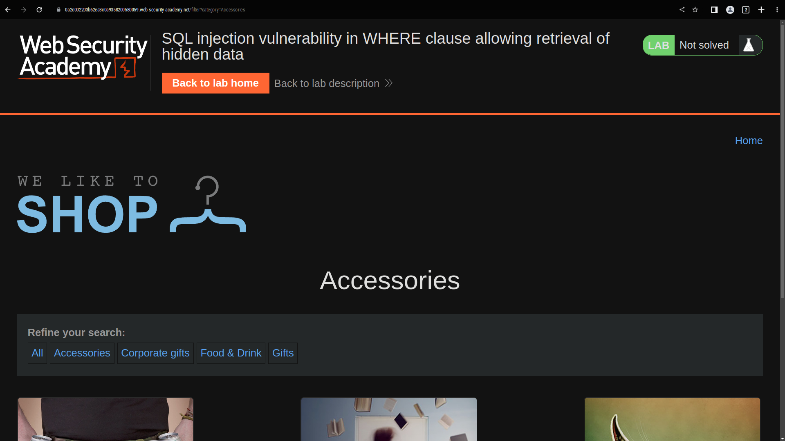

change the parameters in the request to perform a query that returns all products

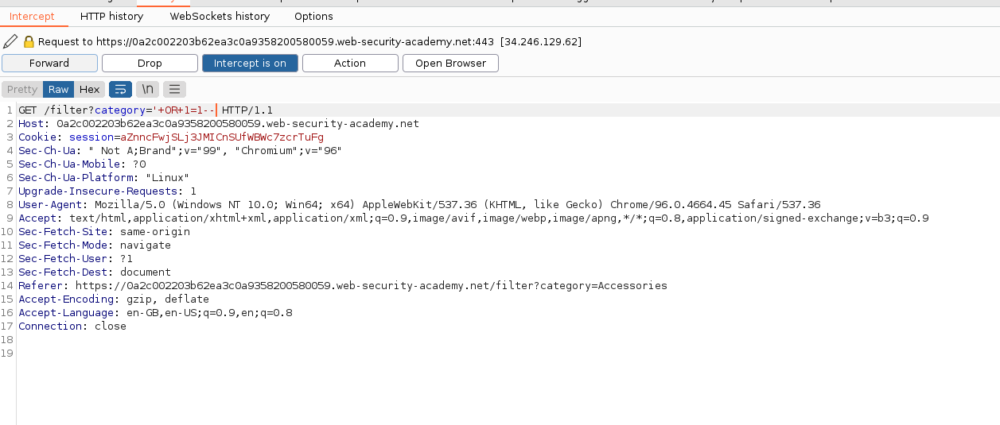

the query would be

`SELECT * FROM products WHERE category = '' OR 1=1--' AND released = 1`

## Subverting application logic

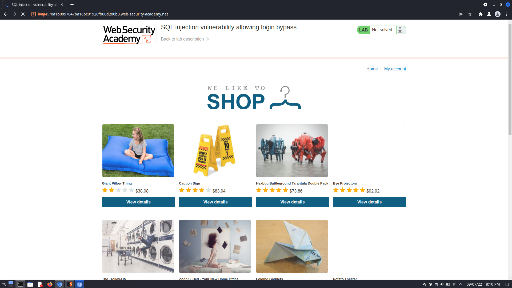
On the login page, we may assume that the SQL query is

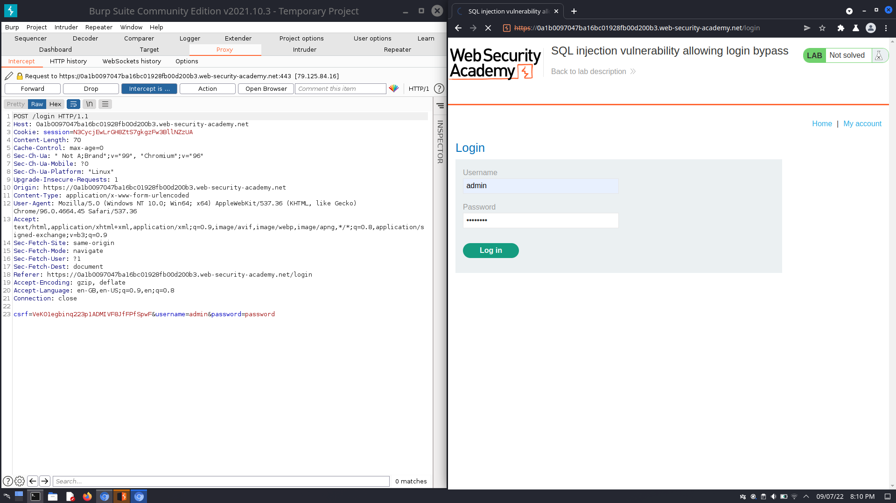
`SELECT * FROM users WHERE username = 'wiener' AND password = 'bluecheese'`

we can either manipulate the `username` or `password` parameters in a similar way to bypass authentication

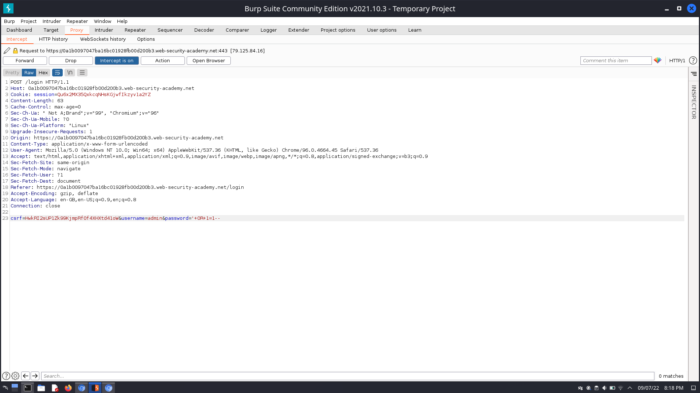

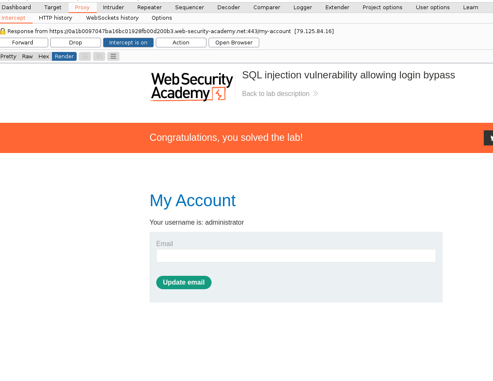

In a real-life situation, you would be able to see what tech stack the website is running, and guess the username of the administrator account. At this point, you only need to make the SQL server interpret the code for the password checking logic as a comment, bypassing authentication

## UNION attack

### Finding the number of columns

For a UNION query to work, two key requirements must be met:

- The individual queries must return the same number of columns(you may use `Null` columns in your query)
- The data types in each column must be compatible between the individual queries.
  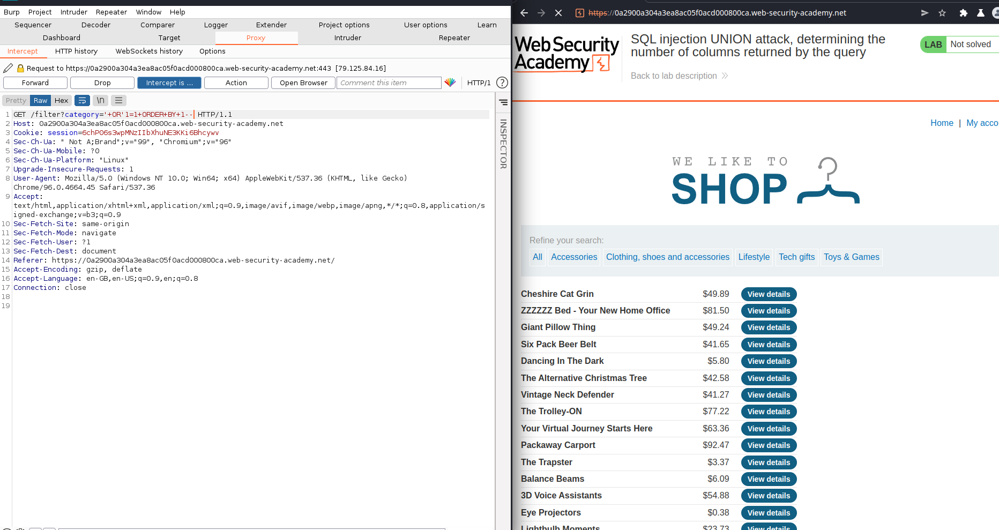

_two effective methods to determine how many columns are being returned from the original query_

- injecting a series of ORDER BY clauses and incrementing the specified column index until an error occurs
  here, we only recieve an error message when ordering by the 4th column
  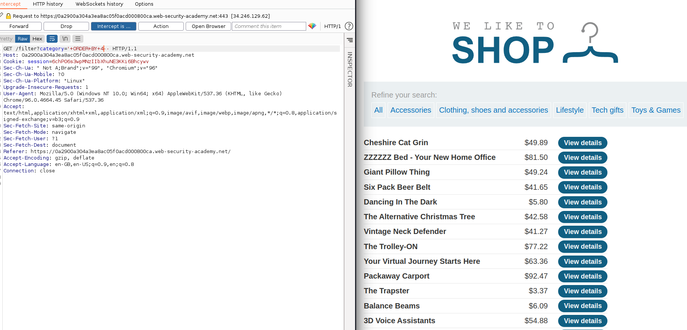

- submitting a series of UNION SELECT payloads specifying a different number of null values
  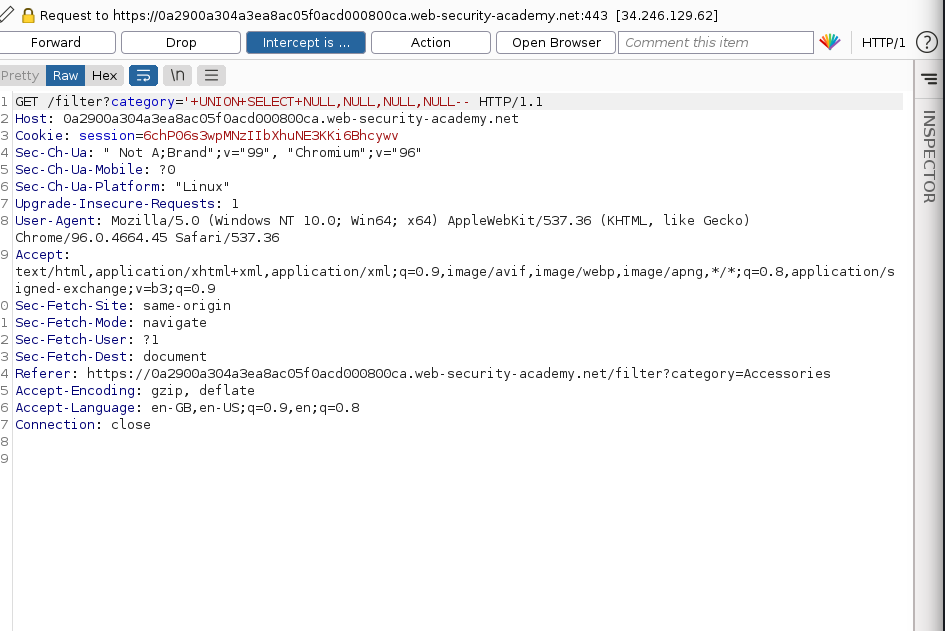

  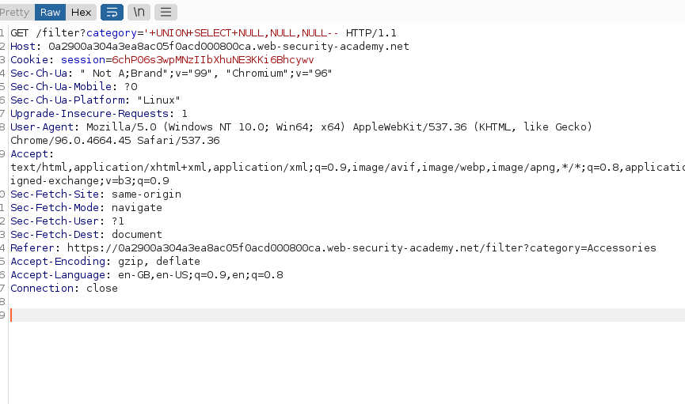

### Finding compatible datatypes of columns

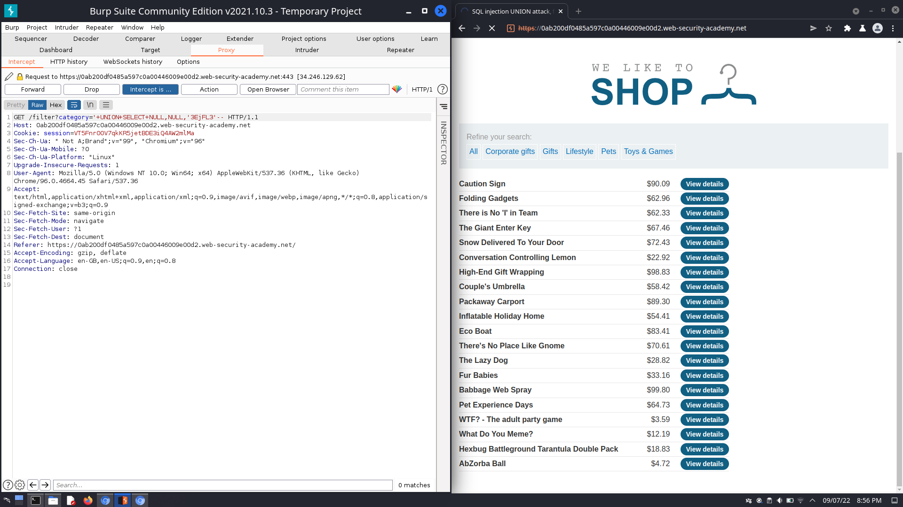

### Performing the UNION attack

I have determined the number of columns returned by the original query and found which columns can hold string data, and can now retrieve interesting data

If after [Examining the database](#examining-the-database) it surfaces that the database contains a different table called `users`, with columns called `username` and `password`, I can now perform an SQL injection UNION attack that retrieves all usernames and passwords, and use the information to log in as the administrator user

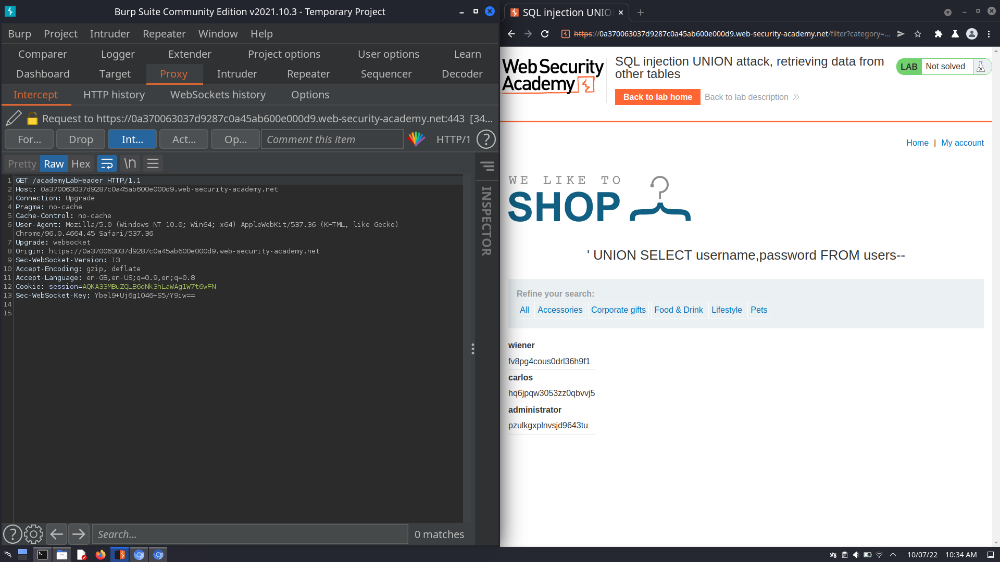

## Examining the Database

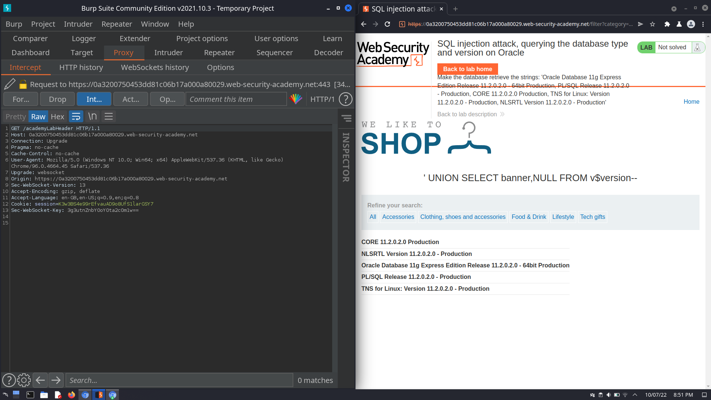

# Resources

[Cheat Sheets](https://pentestmonkey.net/category/cheat-sheet)

[Quick Reference to SQLi](https://www.websec.ca/kb/sql_injection)

[Portswigger's SQLi Cheat Sheet](https://portswigger.net/web-security/sql-injection/cheat-sheet)

_wip_
