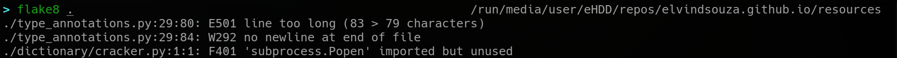

**[~](../../../README.md)**

**[~/Security](../../security.md)**

**[~/Security/Appsec](0application-security.md)**

---

* TOC
{:toc}

---

Consistency is key. A group of programmers all writing in different styles, using different design philosophies, and poor naming schemes and smelly code leave a lot of vulnerabilities undiscovered.

## Prospector

from their [website](https://prospector.landscape.io),

> Prospector is a tool to analyse Python code and output information about errors, potential problems, convention violations and complexity.

> It brings together the functionality of other Python analysis tools such as Pylint, pycodestyle, and McCabe complexity.

Install with `pip install prospector`


_usage instructions from the project's website_

#### Running from the command line


_running prospector against a Django project_

Recommended usage-
On projects with a lower rate of commits, increase the strictness after every pass

`prospector --strictness <level>`

_Valid levels are verylow, low, medium, high and veryhigh_

This will ensure that the highest priority issues are addressed first, and AppSec moves down a list of warnings and errors, from high priority to low priority

Instead of running it on the commandline, you could integrate it into your development or CI/CD pipelines

For example, you can enable prospector linting in Visual Studio Code, and have it run on open files, project files, or all workspace files


_pass in your prospector args in Visual Studio Code_

## Bandit

> a tool designed to find common security issues in Python code.

[GitHub](https://github.com/PyCQA/bandit)

[Documentation](https://bandit.readthedocs.io/en/latest/)


_running bandit against a Python-C interfacing project_

Bandit also has a [pre-commit](https://pre-commit.com/) hook for version control integration

similar to [Prospector](#prospector), we can use a `--severity-level {all,low,medium,high}` switch

Add this to the pre-commit configuration

```
repos:
-   repo: https://github.com/PyCQA/bandit
    rev: '' # Update me!
    hooks:
    - id: bandit
```

You can have your reports in a variety of file formats, listed [here](https://bandit.readthedocs.io/en/latest/formatters/index.html#complete-formatter-listing)

Similarly, you can enable integration with many IDEs, for on-the-fly scanning


_configuring Bandit integration in Visual Studio Code_

## PEP 8 and black

[PEP 8](https://peps.python.org/pep-0008/) is a style guide for python code. The guidelines cover indentation, tabs vs spaces, max. line length, blank lines, import statements, etc.

[Black](https://black.readthedocs.io/en/stable) is a PEP 8 compliant _opinionated_ formatter

Black reformats entire files in place. It intentionally has few configuration options so the developer can focus on the content instead.

You can choose to run it on directory(ies) or on file(s)


_running black on a directory of Python scripts_

It is much easier to use, and has saner defaults compared to `autopep8` and `yapf`

## pylama

Code audit tool for Python. Pylama wraps these tools:

- [pycodestyle](#pycodestyle)
- [pydocstyle](#pydocstyle)
- [Pylint](#pylint)
- [Mypy](#mypy)
- eradicate
- Vulture
- PyFlakes
- Mccabe
- Radon

[Documentation](https://klen.github.io/pylama/#installation)

It is very easy to use, and does a lot of the heavy lifting for you. Invocation is simple, like most of the tools here.

## mypy

Reasonably new versions of Python will have support for [Type Hinting](https://docs.python.org/3/library/typing.html)

[PEP 484](https://peps.python.org/pep-0484/) introduced type hinting

From the Python docs,

> The Python runtime does not enforce function and variable type annotations. They can be used by third party tools such as type checkers, IDEs, linters, etc.

The main goal is to write high-quality code which is easy to debug. Using a static type checker either through command line, on a file or project, or using the IDE integration

[mypy](https://mypy.readthedocs.io/en/stable/) is a static analyzer, when given code with type annotations, can type check your code and find common bugs

In an example I made [here](../../resources/type_annotations.py), the script runs without exceptions when given the test input list, but running `mypy` uncovers an issue- the returned variable can be a list of integers or None!


_the script running without any errors_


_running mypy on a python script, that exposes unseen issues_

## flake8

A tool for style guide enforcement

Flake8 is configurable, and supports storing its configuration in your project in one of setup.cfg, tox.ini, or .flake8

```
flake8 --ignore D203 \
         --exclude .git,__pycache__,docs/source/conf.py,old,build,dist \
         --max-complexity 10
```


_running flake8 against a directory containing Python files_

Flake8 is a wrapper around [pycodestyle](#pycodestyle)

## pylint
Pylint has a huge number of checks

Configuration can be stored in .pylintrc

## pycodestyle

[Documentation](https://pycodestyle.pycqa.org/en/latest/)

Check your Python code against some of the conventions in PEP8

Does not support variable name and docstring conventions, and does not apply fixes natively, but these can be enabled with plugins

## pydocstyle

[Documentation](http://www.pydocstyle.org/en/stable/)

Documentation is very important!

Checks compliance with docstring conventions, to ensure the code can be understood and maintained by other parties

## it is compliant with most of [PEP 257](https://peps.python.org/pep-0257/)

[Valuable Resource](https://github.com/PyCQA)
