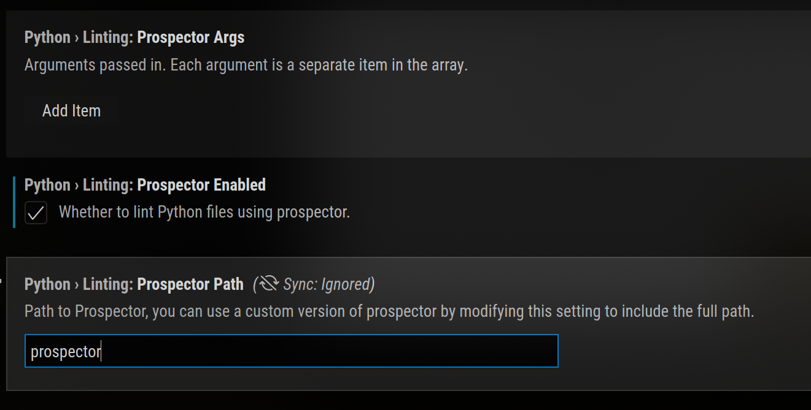

# Static Code Analysis

Static Code Analysis (also known as Source Code Analysis) is usually performed as part of a Code Review (also known as white-box testing) and is carried out at the Implementation phase of a Security Development Lifecycle (SDL)

Scales Well (Can be run on lots of software, and can be repeatedly (like in nightly builds))

For things that such tools can automatically find with high confidence, such as buffer overflows, SQL Injection Flaws, etc. they are great.

# Main Advantages

- analyzes source code without executing it, it always terminates
- finishes execution faster than dynamic analysis
- automate-
  - maintaining code quality
  - finding bugs early
  - find security vulnerabilities early
- easy to incoporate into projects

## Types of static analysis

- codestyle
- security linting
- error detection
- UML creation
- code duplication detection
- complexity analysis
- secrets detection
- comment style analysis
- dead coe detectio
- framework best practices

## Static Analysis with Python

**covered [here](secure_coding_python.md)**

## Automate Static Analysis

### Incorporate it into your project

Most popular static analysis tools have plug-ins for popular IDEs, and run against open files, project files, or workspace files

_pass in your prospector args in Visual Studio Code_

### Incorporate it into CI/CD

_fin_
