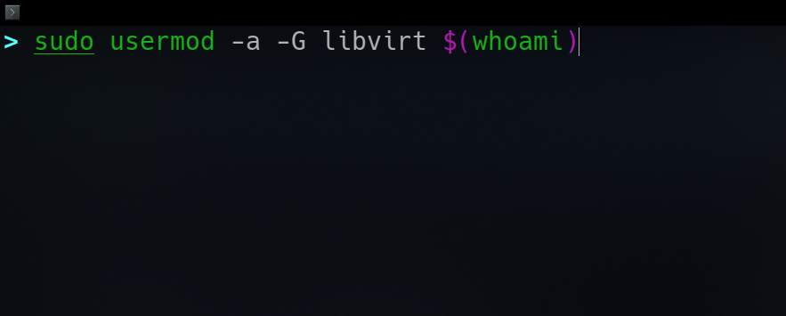
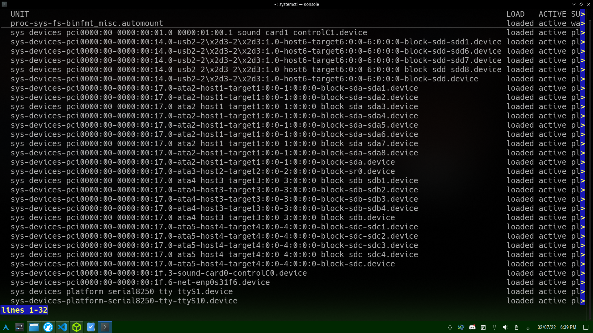
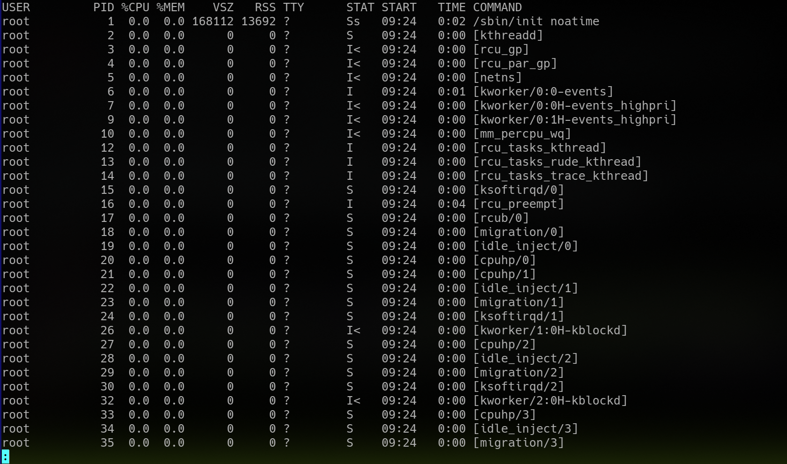
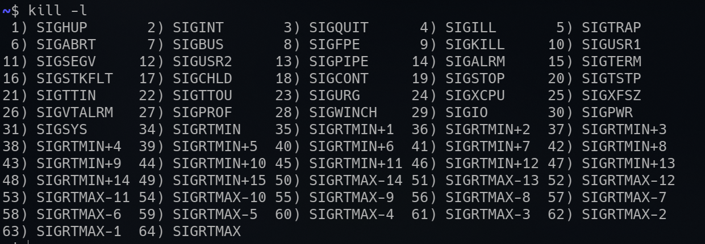
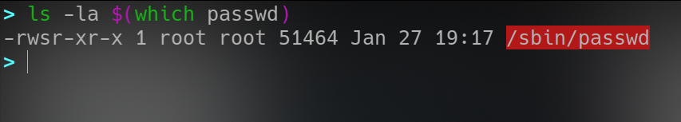

**[~](../../../README.md)**

**[~/Security](../../security.md)**

---

* TOC
{:toc}

---

# GNU/Linux Operating System Security

## Linux Filesystem Hierarchy Standard(https://www.pathname.com/fhs/)

```
----/ (root)
    |
    ---- /bin essential command binaries
    ---- /boot containing bootloader, kernel executable, etc.
    ---- /dev device files
    ---- /etc configuration files
    ---- /home user directories
    ---- /lib shared library files required for boot
    ---- /media mountpoint
    ---- /mnt mountpoint
    ---- /opt optional files, like 3P tools
    ---- /root root user's ~(home) directory
    ---- /sbin system administration binaries
    ---- /tmp temp. files, usually cleared every boot
    ---- /usr executables,libraries,manpages,etc.
    ---- /var logs,webserver files, cron files, etc.
```

[device files](https://www.debian.org/releases/wheezy/amd64/apds01.html.en#:~:text=In%20Linux%20various%20special%20files,block%20devices%20and%20character%20devices.)

Reading: [UNIX Philosophy](https://en.wikipedia.org/wiki/Unix_philosophy)

## The Linux Command Line

### Shells and the Bash Shell

the default bash prompt

`<username>@<hostname><current working directory>$`

_the prompt can be changed though, and a simple alternative prompt(put in your .bashrc)_

`PS1='\[\033[01;34m\]\w\[\033[00m\]\$ '`

_for the zsh shell, a simple prompt(put in the .zshrc)_

```
unset SINGLE_LINE_ZLE
PS1="%{$fg[cyan]%}%B>%b%{$reset_color%} "
RPROMPT="%~"
```

### Getting Help and Manpages

`man` -pages are a quick reference

`info` pages are usually longer and structured

Most tools will have a `--help` flag that will output a short description of the options, and syntax for the command

`apropos` searches descriptions of manpages for the keyword

### General System Information

`uname`- operating system information(kernel, distribution)

`whoami`-username

`id`-identity

`hostname`

`ifconfig` or `ip`

[netstat](../netstat_linux.html) print network connections, routing tables, interface statistics, masquerade connections, and multicast memberships

`ss` utilility to investigate sockets, to dump socket stats

`ps` process stats

`who` display logins

`env` print environment variables or set environment and execute command

`lsblk` list block devices

`lsusb` list USB devices

`lsof` list open files

`lspci` list PCI devices

`which` to return path to the file or link to be executed

`find <location> <options>` to find files and folders. refer to the manual

`locate <file>` to use mlocate, which uses a local database, and produces results much faster than find

`wc` to count (words,lines,characters,etc.)

<!-- xargs,head/tail, grep,tr,sort,cut,column,awk,sed -->

## [SSH](https://elvindesouza.github.io/hardening/#setting-up-remotelocal-administrationssh)

## Users and Groups

_remember to pass `--help` to all these commands to see the available options_

### Elevated Privileges

`sudo` execute command as a different user

edit the sudo configuration with `$ visudo`!

`su` requests credentials via PAM and switches to the userid, and executes a shell

### Users

`useradd`,`userdel`,`usermod`


[Skeleton Directory](http://www.linfo.org/etc_skel.html) for home directories of newly created users `/etc/skel`

### Groups

`addgroup`,`delgroup`

### Authentication

`passwd` to change the user's password

If you want to bypass the complexity test, run the command with sudo, as

`sudo passwd <username>`

## Updates and Package Management

Ubuntu, Debian or RHEL is likely to be running on a server or enterprise system.

### APT

`apt`- package manager for debian-based, high-level interface

`apt` or `apt-get`??

> (Ubuntu's) APT is the Advanced Package Tool, an advanced interface to the Debian packaging system which provides the apt-get program

Enabled repositories can be checked in the `sources.list` file or any of the drop-ins in the `sources.list.d/` directory

`cat /etc/apt/sources.list`

**General maintenance**
When removing packages, be sure to purge configuration files too if not needed

Keep track of autoremovable(orphan/unused) packages, and remember to `clean` or `autoclean` too

`sudo apt autoremove --purge -y; sudo apt remove --purge -y <package>`

Update a debian-based system with

```
$ sudo apt update
$ sudo apt upgrade
```

`aptitude`- ncurses UI for the apt package manager

---

`dpkg` debian package manager

`snap`- snap package manager

`pip`- Python's package manager

## Services and Process Management

### Services and Daemons

**I have previously covered basic administration with systemd [here](https://elvindesouza.github.io/hardening/#systemd)**

The Linux system you are using likely uses [systemd](https://systemd.io/)

[The story behind systemd](http://0pointer.de/blog/projects/systemd.html)

The main command used to introspect and control systemd is `systemctl`


**journalctl** is the logging system and is also already covered [here](https://elvindesouza.github.io/hardening/#systemd)

**Timers** are systemd unit files and can be used as an alternative to cron

### Process management

A process can be in one of the following states

- Running
- Waiting (waiting for an event or system resource)
- Stopped
- Zombie (stopped but still has an entry in the process table).

View processes with the `ps` command

The `ps aux` command displays the most amount of information a user usually needs to understand the current state of their system’s running processes


_`ps aux` piped into `less`_

Processes can be controlled using `kill`, `pkill`, `pgrep`, and `killall`

We must send a signal to a process, which can be listed with


The most important signals used-

- 1:SIGHUP controlling terminal is closed. read `nohup --help`
- 2:SIGINT Ctrl+C interrupt
- 3:SIGQUIT Ctrl+D
- 9:SIGKILL kill a process immediately, no cleanup

  > use `kill -9 pid` if the program doesn't respond to a `kill pid`

      <iframe width="560" height="315" src="https://www.youtube.com/embed/0rG74rG_ubs" title="YouTube video player" frameborder="0" allow="accelerometer; autoplay; clipboard-write; encrypted-media; gyroscope; picture-in-picture" allowfullscreen></iframe>

- 10:SIGTERM terminate program
  Send the default SIGTERM to a process with `kill pid`, giving it the chance to terminate gracefully

## File Descriptors

- 0:STDIN
- 1:STDOUT
- 2:STDERR

_use `2>/dev/null` in your scripts to send STDERR to `/dev/null`_

## Permission Management

Remember to set up correct permissions on webserver directories, log folders, and configuration files

### Linux Permissions

**a file or directoy can be assigned**

- r(Read)
- w(Write)
- x(Execute)

**These three permissions can be set for the**

- owner
- group
- others

### Change Permissions

`chmod [u|g|o|a(all)][+|-][r|w|x]`

prepend + or - to add or remove permissions

_OR_ use numeric mode to directly assign an octal value


_chmod usage_

Change ownership of a file or director with the `chown` command


_chown usage_

`chattr` is the command in Linux that allows a user to set certain attributes of a file

_for example, you might make `/etc/resolv.conf` immutable with `chattr +i /etc/resolv.conf`_

`lsattr` is the command that displays the attributes of a file.

### SUID-SGID-Sticky Bit

Set User ID,Set Group ID


_this lets a user run `password` to change their password without privileged access_

## SELinux

[RedHat](https://www.redhat.com/en/topics/linux/what-is-selinux)

provides Mandatory Access Control, through Linux Security Modules in the kernel

every process, file, object, etc. is given a label

## AppArmor

[Canonical/Ubuntu](https://ubuntu.com/server/docs/security-apparmor)

> AppArmor is a Linux Security Module implementation of name-based mandatory access controls

---

Periodically audit the system for vulnerabilities and misconfigurations like

- obsolete software
- out-of-date kernel
- user permission issues
- world-writable files
- misconfigured cronjobs/services

Always keep an eye on the EOL/EOSL of the linux distribution you are running on your servers

## Linux-Specific Hardening

- Removing or disabling all unnecessary services and software
- Removing all services that rely on unencrypted authentication mechanisms
- Ensure NTP is enabled and Syslog is running
- Ensure that each user has its own account
- Enforce the use of strong passwords
- Set up password aging and restrict the use of previous passwords
- Locking user accounts after login failures
- Disable all unwanted SUID/SGID binaries

<!-- ## Webserver Security -->
<!-- Snort, chkrootkit, rkhunter, Lynis,  -->
<!-- fail2ban -->
<!-- iptables,ufw -->
