**[~](../../../../README.md)**

**[~/Security](../../../security.md)**

**[~/Security/Networking](../../networking.md)**

---

* TOC
{:toc}

---

# Aim

Studying Linux and Windows network commands. [ping, pathping, ipconfig/ifconfig, arp, netstat, nbtstat, nslookup, route, traceroute/tracert, nmap, etc]

---

# GNU/Linux

## ping

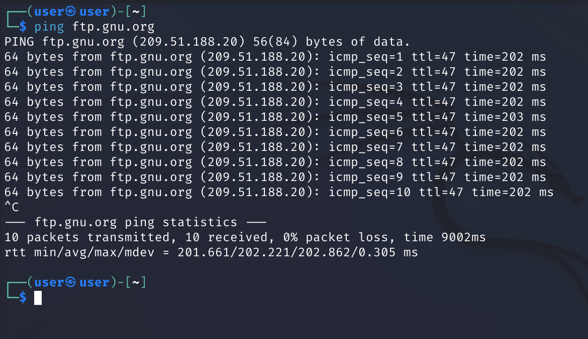

```
Usage
  ping [options] <destination>
```

`ping` uses ICMP datagrams to provoke a response from the chosen destination host, mainly intending to probe whether it is alive.

It sends ICMP ECHO_REQUEST to network hosts

Here, we use ping to check whether `ftp.gnu.org` is up, and to see how many packets were dropped, along with the time-to-response(latency)

## ifconfig

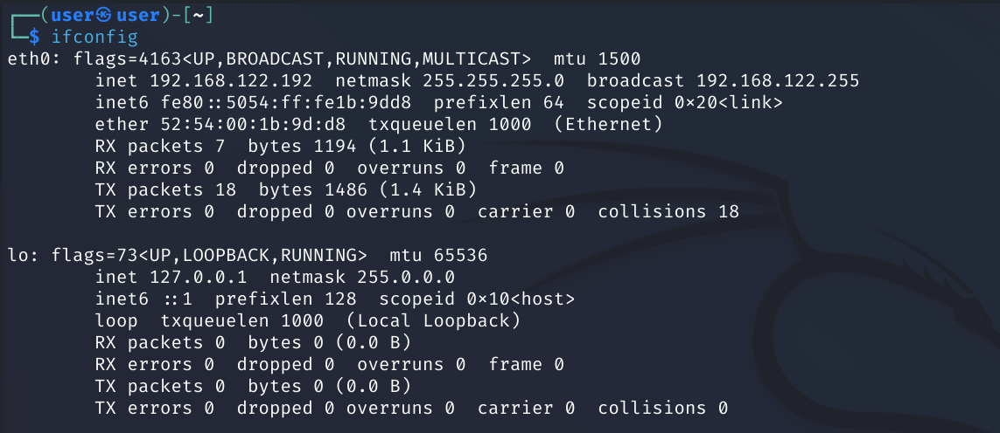

`ifconfig` is a program to retrieve and to set selected properties of
network interfaces.

Now, we'll run only `ifconfig` to see a listing of all the network interfaces on this system

Here, we see the ethernet interface `eth0` listed, with an IPv4 address of _192.168.122.192_, with a netmask _255.255.255.0_

We also see the MTU(Maximum transmission unit) defined

On the third line, we see the MAC address for this NIC

The second interface listed is a loopback interface. The most commonly used IP address on the loopback network is _127.0.0.1_ for IPv4 and _::1_ for IPv6. The standard domain name for the address is localhost.

## arp

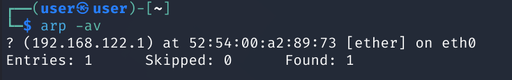

Use `arp` to manipulate the system's ARP cache

`arp` manipulates or displays the kernel's IPv4 network neighbour cache

You can add, delete or simply display the current contents of the cache

Here, we use the `-a` flag to use the BSD-style output format, and the `-v` flag to print verbose output

ARP stands for Address Resolution Protocol, and is used to find the MAC address of a network neighbour for a given IPv4 address

## netstat

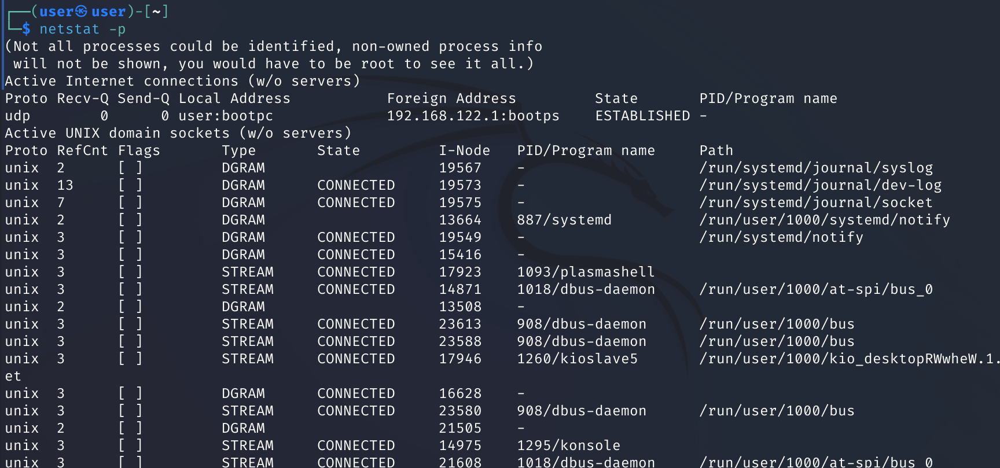

We can use `netstat` to print network connections, routing tables, interface statistics, masquerade connections, and multicast memberships.

Here, the `-p` flag is used, which shows the PID and name of the program to which each socket belongs

## nslookup

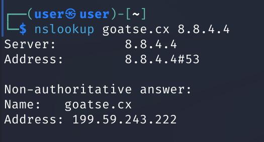

`nslookup` is used to query internet nameservers interactively

Here, we will use the non-interactive mode.

We lookup _goatse.cx_ using nameserver _8.8.4.4_

## route

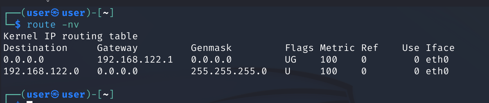

Use `route` to show or manipulate the IP routing table

We use the `-n` flag to show numerical addresse instead of trying to determine symbolic hostnames

The `-v` flag selects verbose operation

## traceroute

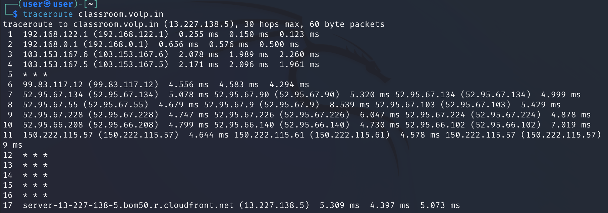

`traceroute` is used to print the route packets trace to a certain network host

Here, a simple `traceroute` is done to `classroom.volp.in`

The output shows every hop taken to the destination host, along with the time taken and resolved hostnames and IP addresses

There are many possible routes to a specific host, and this is evident from the command's results

## nmap

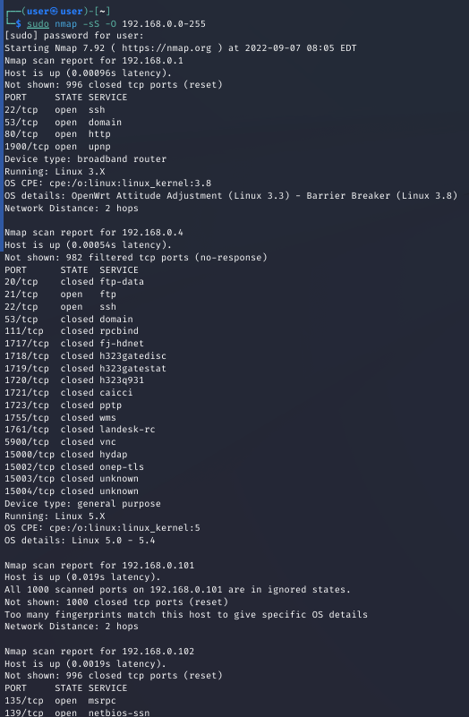

`nmap` is a network exploration tool and security/port scanner

It is an open source tool for network exploration and security auditing

Here, we invoke nmap and scan the network (hosts `192.168.0.0-192.168.0.255`)

We use the `-sS` flag to perform a TCP SYN scan, which is fast, and can scan thousands of ports per second on a fast network. It is also relatively stealthy.

The `-O` flag enables remote OS detection using TCP/IP stack fingerprinting

The results of this scan show a list of hosts, their open ports, and a guess of the running operating system and also the device type

# Microsoft Windows

## ping

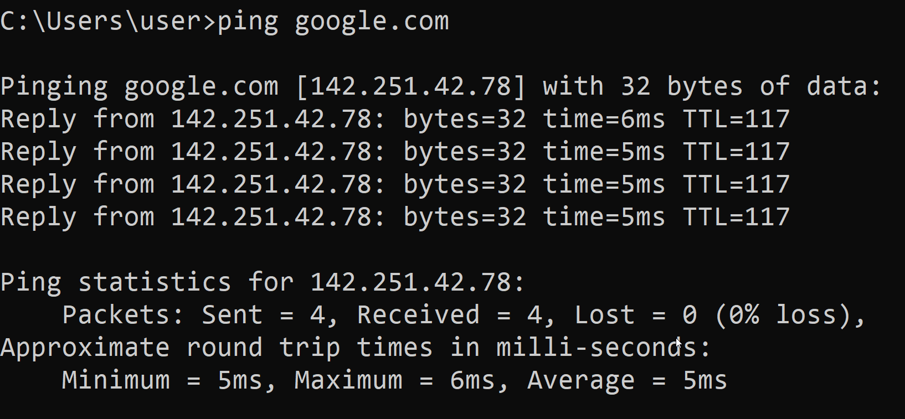

```
Usage:
  ping [/t] [/a] [/n <count>] [/l <size>] [/f] [/I <TTL>] [/v <TOS>] [/r <count>] [/s <count>] [{/j <hostlist> | /k <hostlist>}] [/w <timeout>] [/R] [/S <Srcaddr>] [/4] [/6] <targetname>
```

`ping` verifies IP-level connectivity to another TCP/IP computer by sending Internet Control Message Protocol (ICMP) echo Request messages

Here, we use ping to check whether `google.com` is up, and to see how many packets were dropped, along with the response time(latency)

## pathping

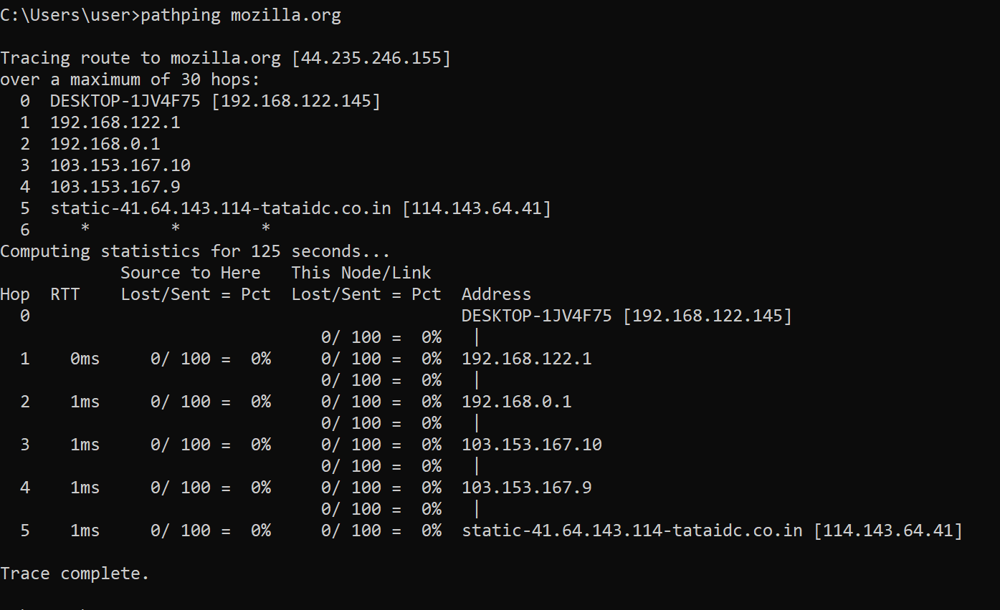

```
Usage:
  pathping [/n] [/h <maximumhops>] [/g <hostlist>] [/p <Period>] [/q <numqueries> [/w <timeout>] [/i <IPaddress>] [/4 <IPv4>] [/6 <IPv6>][<targetname>]
```

`pathping` provides information about network latency and network loss at intermediate hops between a source and destination

This command sends multiple echo Request messages to each router between a source and destination, over a period of time, and then computes results based on the packets returned from each router

Here, the destination is `mozilla.org`

## ipconfig

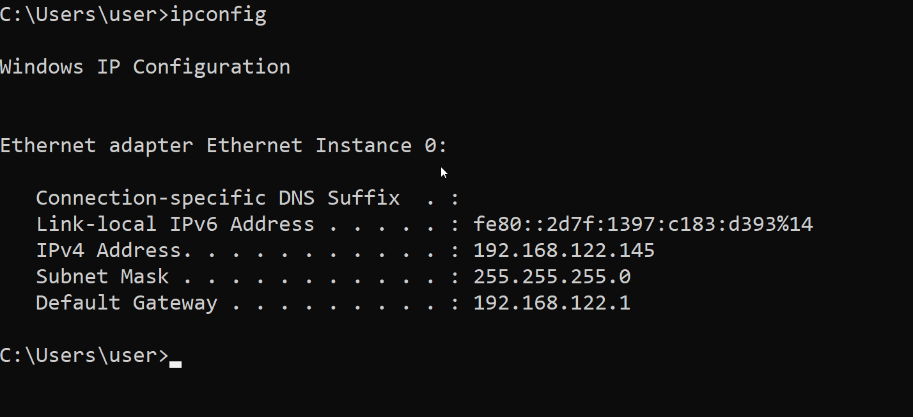

Displays all current TCP/IP network configuration values and refreshes Dynamic Host Configuration Protocol (DHCP) and Domain Name System (DNS) settings network interfaces.

Now, we'll run only `ipconfig` to see Internet Protocol version 4 (IPv4) and IPv6 addresses, subnet mask, and default gateway for all adapters

Here, we see the ethernet interface listed, with an IPv4 address of _192.168.122.145_, with a netmask _255.255.255.0_, and default gateway _192.168.122.1_

## arp

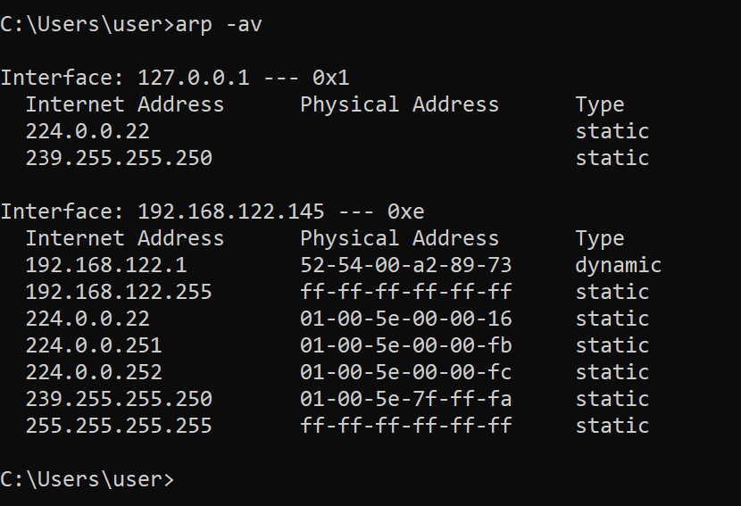

Displays and modifies entries in the Address Resolution Protocol (ARP) cache

We use the `-a` flag to display current ARP table entries, and `-v` to enable verbose mode

## nbtstat

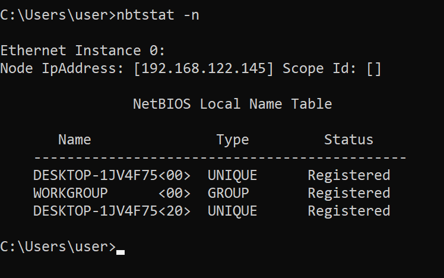

This tool displays protocol statistics and current TCP/IP connections using NetBIOS over TCP/IP

The `-n` flag is used here, which lists local NetBIOS names

## netstat

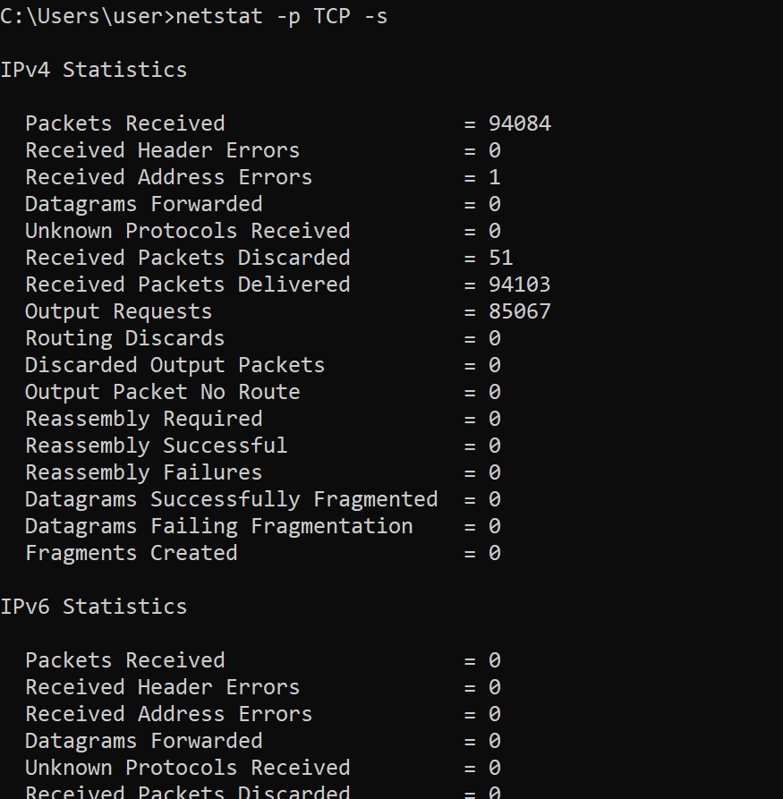

We can use `netstat` to print network connections, routing tables, interface statistics, masquerade connections, and multicast memberships.

Here, the `-p` flag is used with argument `TCP` to show connections of the TCP protocol

The `-s` flag shows per-protocol statistics

## nslookup

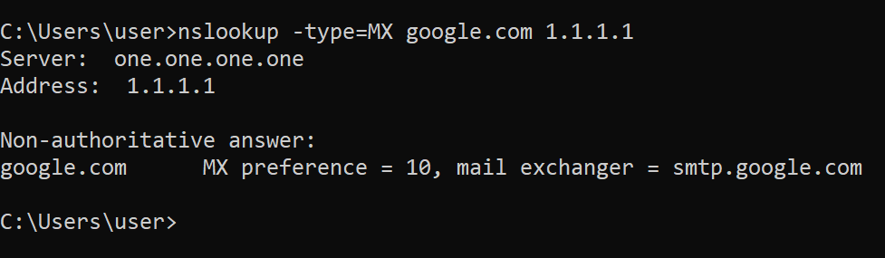

`nslookup` is used to query internet nameservers interactively

Here, we will use the non-interactive mode.

We look up _google.com_ using nameserver _1.1.1.1_

The `-type` flag with value of `MX` is used to set query type to MX records

## route

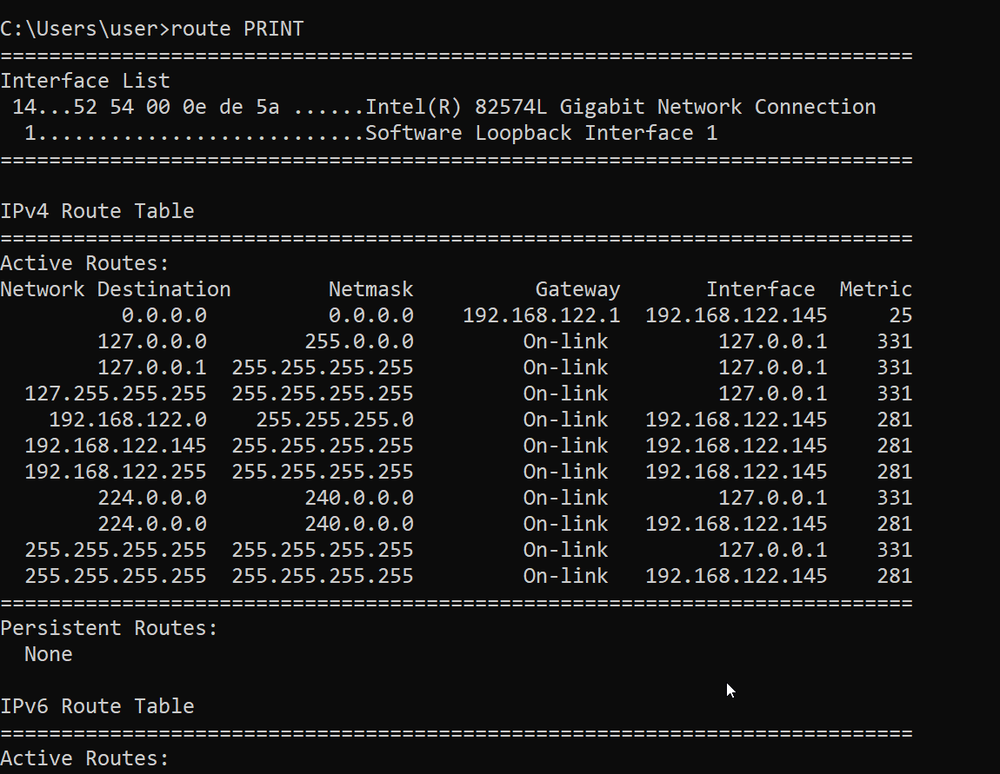

Use `route` to show or manipulate the IP routing table

The working is similar to the Linux command of the same name

## tracert

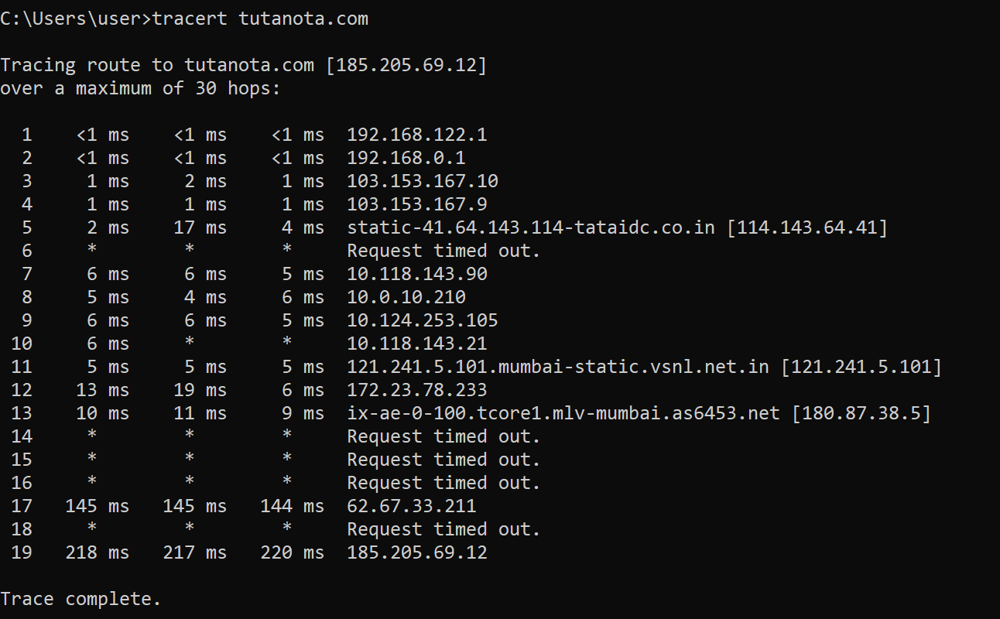

`tracert` determines the path taken to a destination by sending Internet Control Message Protocol (ICMP) echo Request or ICMPv6 messages to the destination with incrementally increasing time to live (TTL) field values

Here, a simple `tracert` is done to `tutanota.com`

Some routers do not return time Exceeded messages for packets with expired TTL values and are invisible to the `tracert` command. In this case, a row of asterisks (\*) is displayed for that hop

## nmap

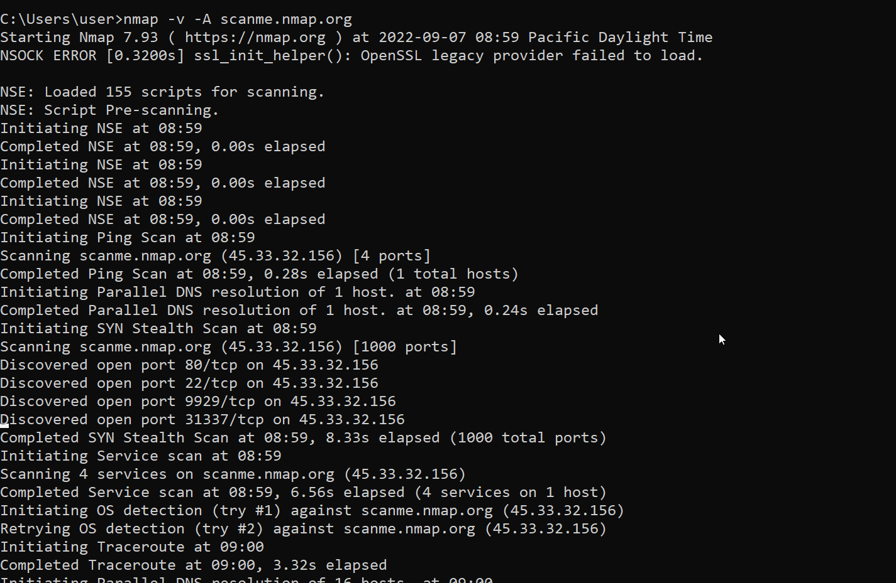

`nmap` is a network exploration tool and security/port scanner

The usage is the same as on GNU/Linux.

We use the `-A` flag to enable OS detection, version detection, script scanning, and traceroute

The `-v` flag enables verbose output

The target host is `scanme.nmap.org`

# Conclusion

We have learned usage of the fundamental Linux and Microsoft Windows command-line tools.

Tools like `ping` and `traceroute`/`tracert` are fundamental in troubleshooting network connectivity issues. `ipconfig` is a commonly used to clear the DNS cache when issues with name resolution arise

We have also gained some insight into the internals of the Linux and Windows network stack, along with some networking protocols and concepts. Some examples include- sockets, routing tables, DNS and nameservers, IP addressing, TCP 3-way handshake, MAC addresses, loopback interfaces, MTU, ICMP, ARP

Lastly, some experience has been gained with the general syntax and usage of the command-line - usage of arguments, values, and flags to achieve a desired result. These results can be parsed with the programming language of our choice to incorporate logic, or to simply view the results as-is.

