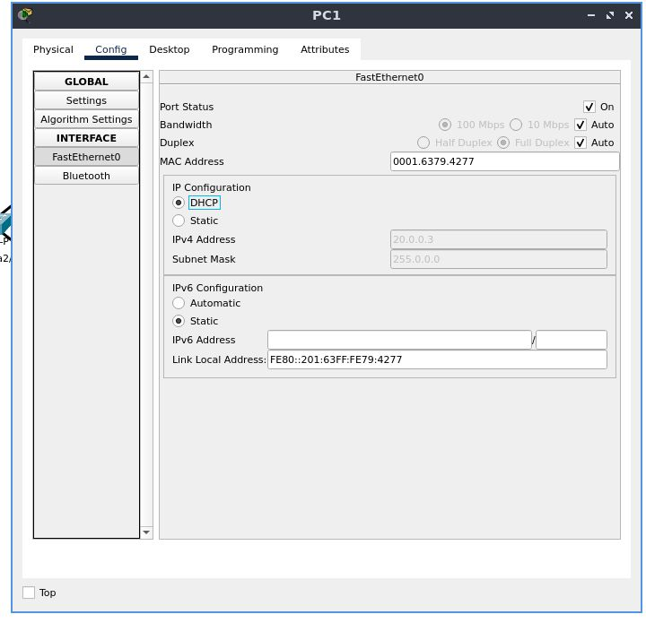

**[~](../../../../README.md)**

**[~/Security](../../../security.md)**

**[~/Security/Networking](../0network-security.md)**

---

* TOC
{:toc}

---

*The save file is available [here](../resources/firewall.pkt.pkt)*

# Aim

To Design and Configure Firewall on server

---

We have been given a source network topology map, and must add one switch, three PCs, and one server system. These should be connected with fast ethernet cables.

# Adding Devices

Open up Packet Tracer and go to the Logical view, and start adding devices. After all the network and end devices have been added, begin adding connections and configuring devices.

You can start to configure all the devices individually

# Configuration of all devices

We must set up a device(server system) as a DHCP server and HTTP server with a firewall set up to block ICMP traffic and to allow IP traffic

## Switch 0

{ height=300px }

The ports on the switch to which there are connections are enabled by default, and there is no additional configuration needed.

## Server 0

{ height=300px }

Go to the "Desktop" tab, and in the menu select "Firewall". Enable the firewall service on the server.

{ height=300px }

Add inbound rules-

1. Deny ICMP as 0.0.0.0 Remote IP and 255.255.255.255 as a Remote Wild Card
2. Allow IP as 0.0.0.0 Remote IP and 255.255.255.255 as a Remote Wild Card

Now from the same Desktop tab, select IP configuration

Assign this host a static IP address of _20.0.0.1_

The subnet mask would be _255.0.0.0_

{ height=300px }

Now go to the "Services" tab, and enable the HTTP server

Under the "SERVICES" section, select "DHCP". Enable the DHCP server.

{ height=300px }

{ height=300px }

## PC 0

In the "Config" tab, go to the "FastEthernet0" configuration, located under the "INTERFACE" section

Set the IPv4 configuration to DHCP

{ height=300px }

## PC 1

Set the IP configuration to DHCP the same way we did before

{ height=300px }

For all the PCs configured, we can wait for the negotiations to complete, and we will see the DHCP-configured IP address greyed out in that field.

## PC 2

Set the IP configuration to DHCP the same way we did before. Observe the IP address and subnet mask.

{ height=300px }

## Testing Connectivity and Correctness of Configuration

We now double click on the "PC2" device, and visit the "Desktop" tab, and select "Command Prompt". We will use `ping`, which is a computer network administration software utility which was covered in a previous experiment.

_Ping operates by means of Internet Control Message Protocol (ICMP) packets. Pinging involves sending an ICMP echo request to the target host and waiting for an ICMP echo reply_

We will use this as a tool to verify and to confirm that the server is dropping these ICMP packets. Make sure that the output of the command shows "Request timed out" for all the (default) 4 attempts

Next, open the configuration for PC1, go to the "Desktop" tab, and select "Web Browser". Type in "http://20.0.0.1" in the address bar, and hit "Go". The webpage should be displayed.

From this, we have verified that the firewall rules are correct, and produce the intended result of dropping ICMP traffic, while allowing IP traffic through

{ height=300px }
{ height=300px }

Now, let's modify the ruleset of the firewall to allow ICMP packets and drop IP traffic

{ height=300px }

We see that this time, IP traffic is blocked, while ICMP packets are allowed through, and we can get an ICMP echo reply.

{ height=300px }
{ height=300px }

_Our final network topology map is_

# Conclusion

We have learned to use a firewall in this experiment.

A firewall is a network security device that monitors incoming and outgoing network traffic and decides whether to allow or block specific traffic based on a defined set of security rules

For the tests carried out with the PCs, we see the greyed out default gateway and IPv4 addresses correctly configured with DHCP, and we can confirm that the firewall we set up is working as intended too

With this firewall, we can choose to allow or deny traffic based on a ruleset.

---
