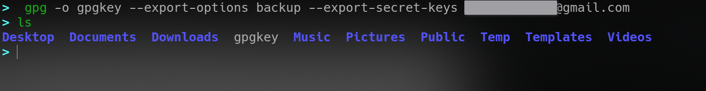

* TOC
{:toc}

---


# Single file encryption with GPG:

There are many ways to encrypt/lock files, folders and drives on Linux. I was looking for a method in which individual files were encrypted, most encryption software talked about online had filesystem encryption and container(stacked filesystem/FUSE) encryption

- GnuPG offers individual file encryption-decryption

## Asymmetric Encryption

you can generate a new keyset at any time with

`$ gpg --gen-key`

> your name doesn't necessarily have to be your real name, and unless you are going to use encryption with e-mails, the address doesn't have to be your actual address either

```
> echo $GNUPGHOME
/home/user/.local/share/gnupg
```

After completing the GPG key generation (RSA-RSA 4096bit, no expiry), I could perform encryption(encrypting a file to myself) on a single file with

`$ gpg -r rmyadd@email.com -e <file>`

I put all the files I wanted to encrypt(documents, important photographs) in a folder and ran

`$ gpg --encrypt-files <files> -r myadd@email.com`

This encrypted all the files with the .gpg suffix, and deleted the original ones. I could then decrypt the files(w/the correct credentials) with

`$ gpg -o filename.ext -d filename.ext.gpg`

To export your public key, so that others can send you encrypted files and messages(check email caveat above), use the following

`$ gpg --export --armor --output publickey <ID>`

## Symmetric Encryption

You can use symmetric encryption(passphrase) on a file too, with

`$ gpg -c file`

Decryption for symmetrically encrypted files follows the same process

Symmetric encryption has its advantages, and you can feel free to use it with archiving less important data(vacation photos, etc.). In this case, you could just use 7zip instead.

The GPG documentation is FANTASTIC, btw

# GPG and Signatures

## Signing a file or message

Signatures use your **private** key while encryption uses your **public** key

_They provide_

- data integrity
- authentication
- support for nonrepudiation

To sign a file,

`$ gpg --output file.sig --sign file`

A more common method is to send or distribute the unencrypted file or message, with a separate signature file

`$ gpg --output file.sig --detach-sig file`

## Verify a Signature

`$ gpg --verify sign.sig`

## Backup and Restore of keys

If exported in an OpenPGP-compliant way, the private key will always contain the public key

**export** the key with

`gpg -o key.gpg --export-options backup --export-secret-keys your@email.com`

or LONG keyid if you do not remember typing an email



**import** the key with

` gpg --import-options restore --import key.gpg`

`gpg --edit-key your@email.com`

```
gpg> trust
.
.
.
1 = I don't know or won't say
2 = I do NOT trust
3 = I trust marginally
4 = I trust fully
5 = I trust ultimately
m = back to the main menu
Your decision? 5
Do you really want to set this key to ultimate trust? (y/N) y
gpg> quit
```

---

_This is a precursor to my next project, where I create a simple frontend for GPG **asymmetric** file encryption, link below_

## [GPG-GUI ](https://elvindesouza.github.io/GPG-GUI/)
