**[~](../../../../README.md)**

**[~/Security](../../../security.md)**

**[~/Security/Networking](../../networking.md)**

---

* TOC
{:toc}

---

# Aim

To Design and configure DHCP server using Cisco packet tracer

---

# Adding Devices

We will be using Cisco Packet Tracer to create a network topology map consisting of a few PCs, and a server system

Open up Packet Tracer and go to the Logical view, and start adding devices.

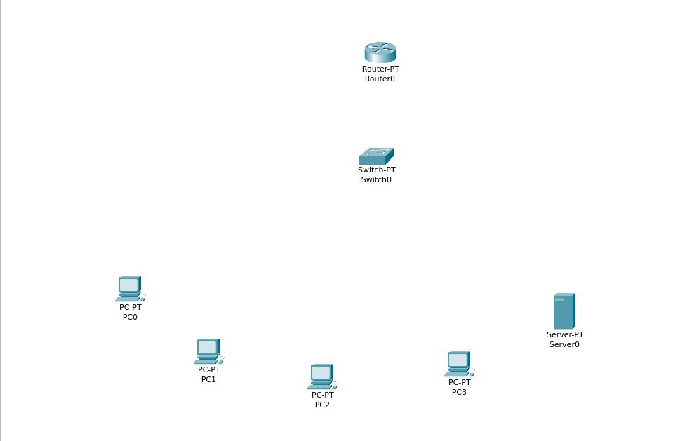

After all the network and end devices have been added, begin adding connections and configuring devices.

You can add or remove network interfaces to these devices and create connections.

You can start to configure all the devices individually

# Configuration of all devices

We must set up a device(server system) as a DHCP server consisting of

- an IP address pool, with at least one address excluded from the pool
- a DNS nameserver
- a default gateway

To connect to the network, a system must have at least one compatible physical network interface

We will be using the **10.0.0.0/8** private address space

## Router 0

Double click the router device to configure it.Switch off the router.

Remove all the network interfaces, add a gigabit ethernet interface, and add covers to the rest of the slots

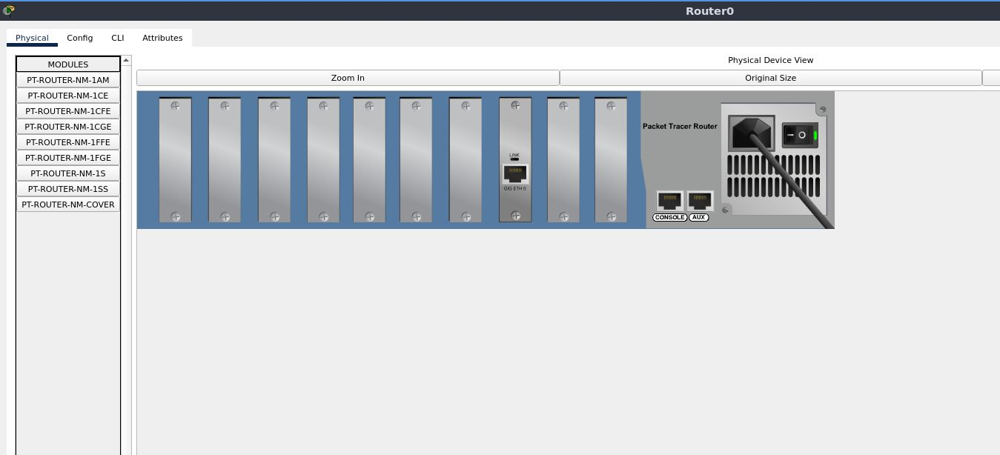

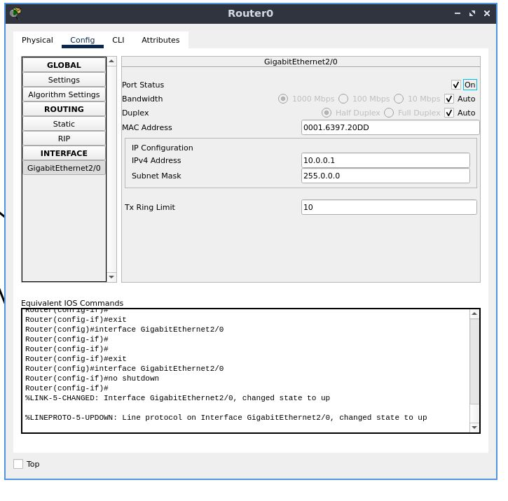

Power on the system, and enable the ethernet port

Go to the "Config" tab. Under the "INTERFACE" section, select the first interface GigabitEthernet0, the /0 suffix is the port number. Here, the interface has a single port. Configure the IPv4 address and subnet mask.

Here,

GigabitEthernet2/0 -> 10.0.0.1

subnet mask -> 255.0.0.0

Remember-

The start address eg. 10.0.0.1 is always reserved for the router.

For other devices, do not assign an address that ends in .0 or .255, these are reserved for network protocols

## Switch 0

Power off the system, and ensure that there are _five_ fast ethernet ports, and _one_ gigabit ethernet port. Add and remove network interfaces accordingly.

Power on the system and enable the ports you need to use. Disable all the rest of the ports(if any) as a security measure.

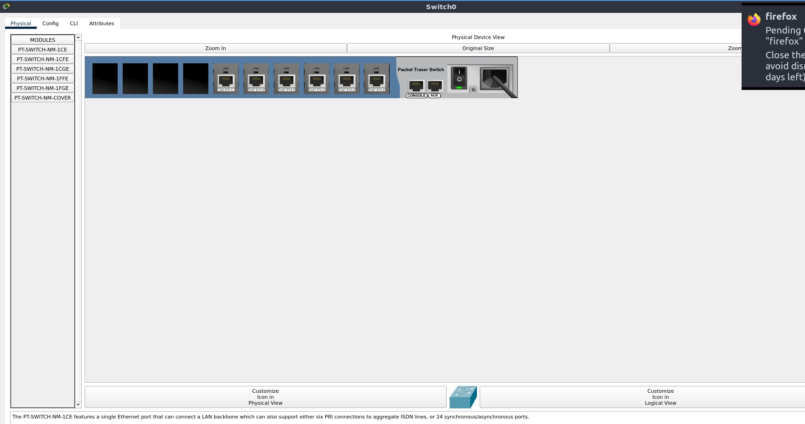

There should be a gigabit ethernet connection to the router, and fast ethernet connections to the rest of the devices

## Server 0

Go to the "Config" tab, and in the "GLOBAL" section, select "Settings"

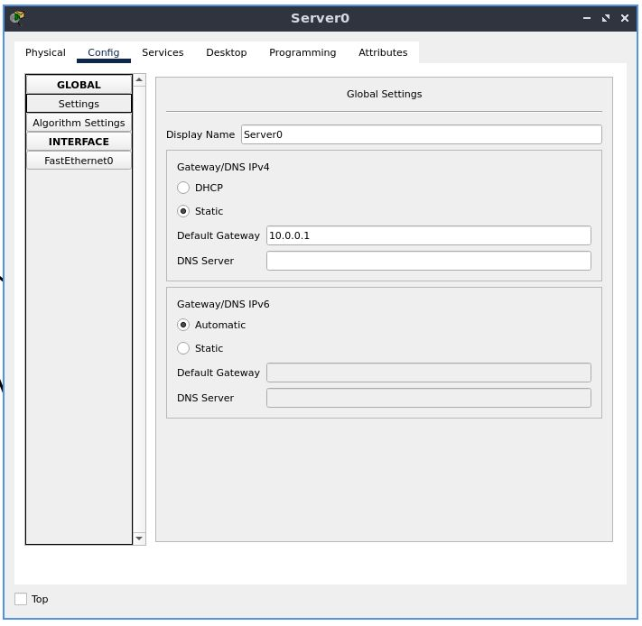

Statically set the default gateway to _10.0.0.1_

Now, go to "FastEthernet0" under the "INTERFACE" section.

Statically set the IPv4 address to _10.0.0.2_

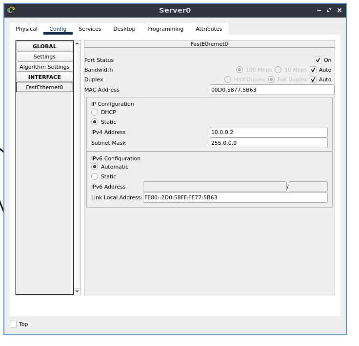

Now, go to the "Services" section. Under the "SERVICES" section, select "DHCP".

We will be configuring the DHCP server for end devices, keep in mind the IP address pool, and addresses you must not or cannot use

Select the first pool in the list, and begin editing its properties.

Set the default gateway to _10.0.0.1_

Set the start IP address to _10.0.0.3_, with a maximum of _10_ users(you may change this later)

The subnet mask will be _255.0.0.0_

Click "Save" to save properties of this pool

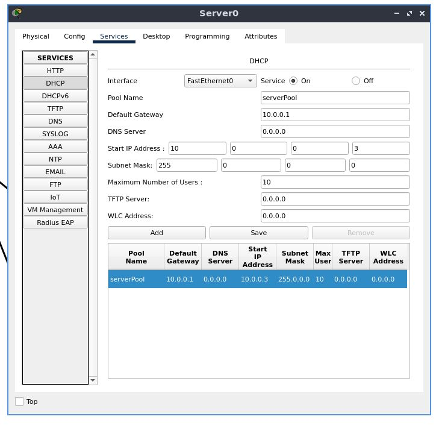

## PC 0

In the "Config" tab, under the "GLOBAL" section, select "Settings"

Set the IPv4 default gateway/DNS to DHCP

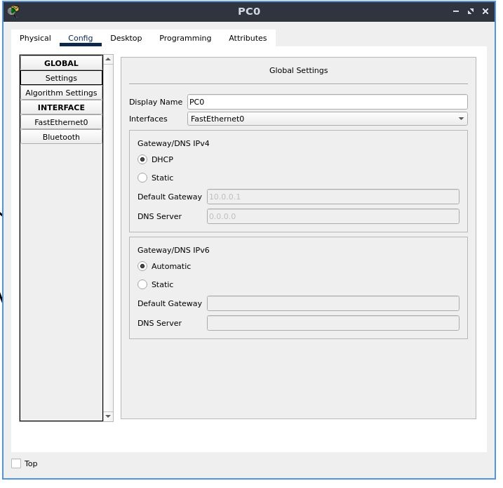
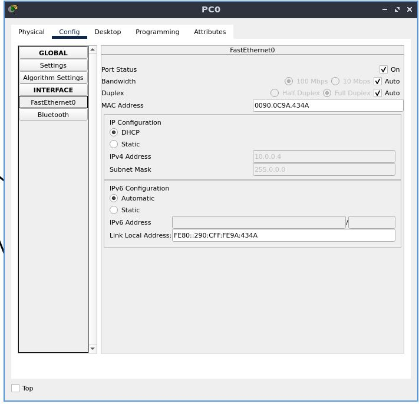

Now, go to the "FastEthernet0" configuration, located under the "INTERFACE" section

Set the configuration for the IPv4 address and subnet mask to DHCP

## PC 1

set the default gateway address to DHCP in a similar fashion

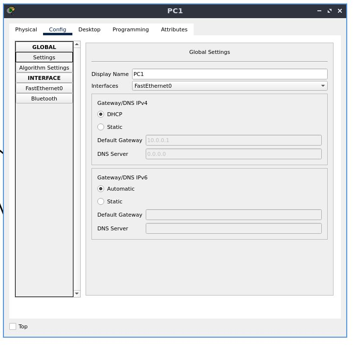
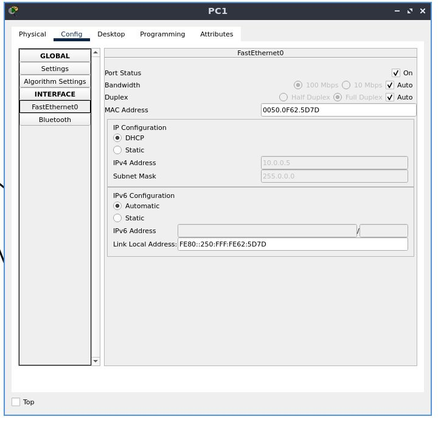

also set the IP configuration to DHCP the same way we did before

## PC 2

set the default gateway address to DHCP in a similar fashion

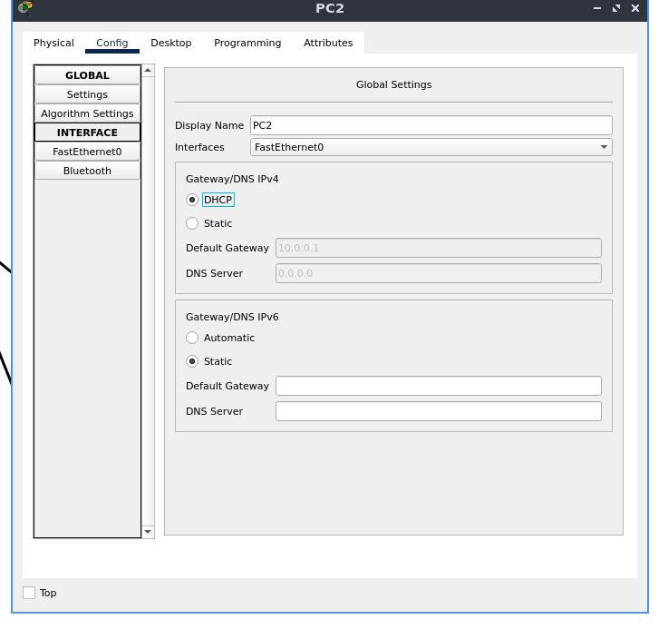
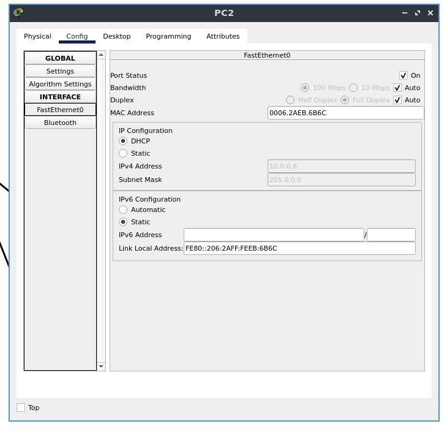

also set the IP configuration to DHCP the same way we did before

## PC 3

set the default gateway address to DHCP in a similar fashion

also set the IP configuration to DHCP the same way done before

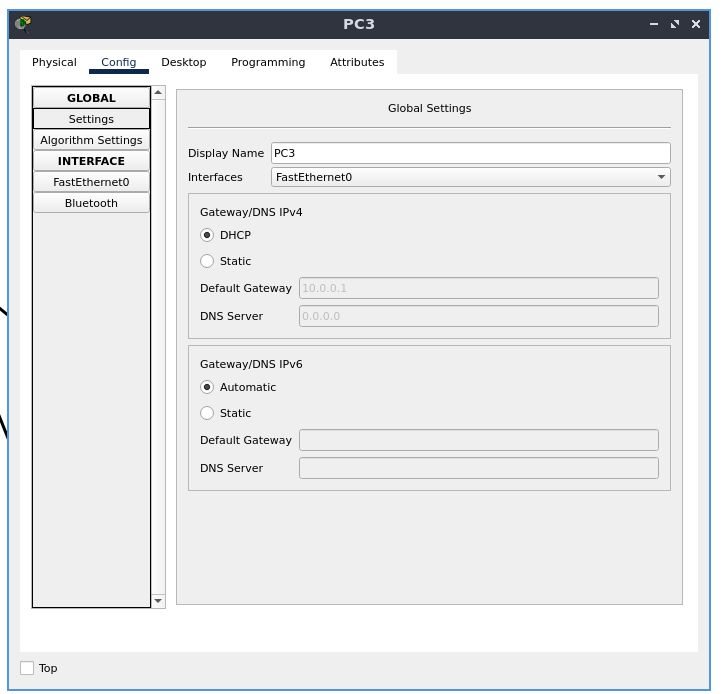
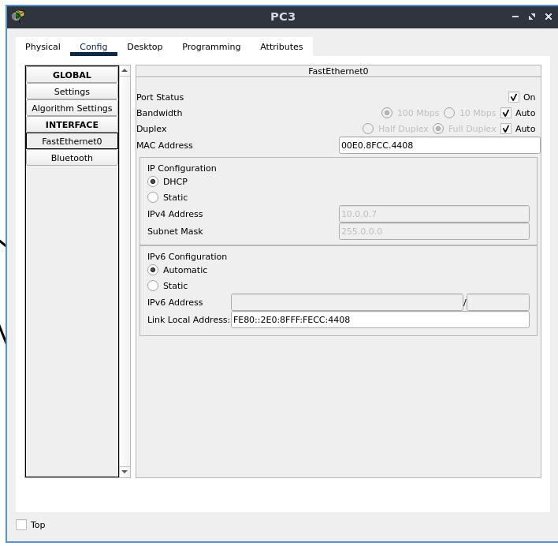

## Testing Connectivity

_this is our final topology map:_

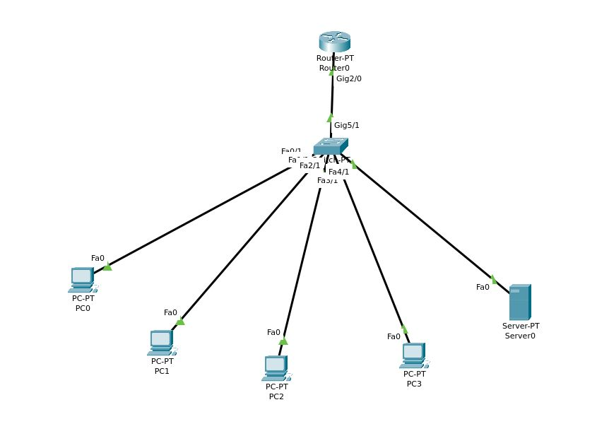

We now go to the simulation tab and try to use error-reporting protocols that network devices can use to generate error messages to the source IP

We will use this as a tool to verify network connectivity and to confirm that the DHCP server is working as intended. Make sure all the tests listed at the bottom are marked with "successful". Run the simulation at a preferred speed to see the simulated network, including your tests, along with other STP, DTP, ARP, etc. traffic flow.

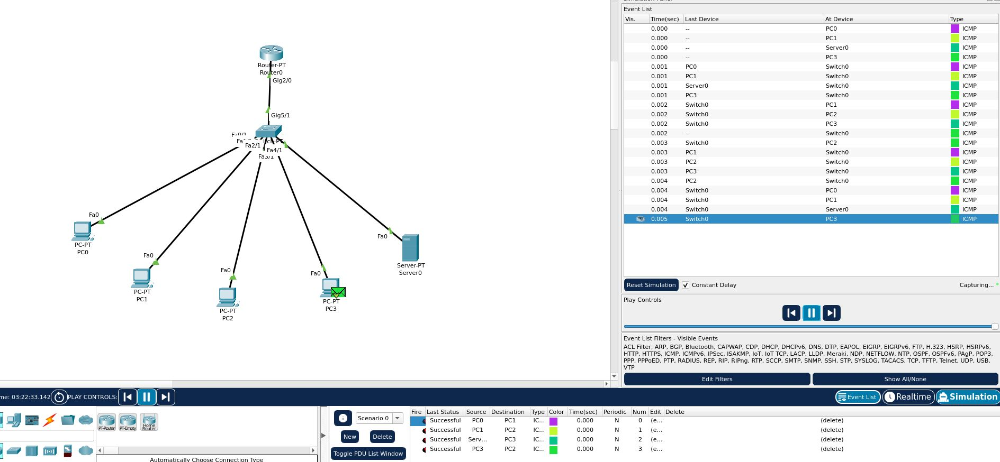

# Conclusion

A DHCP Server is a network server that automatically provides and assigns IP addresses, default gateways and other network parameters to client devices

We are using a server system to host this DHCP server, and have configured an IP address pool, default gateway, and other parameters

For all the PCs, we can see the greyed out default gateway and IPv4 addresses configured with DHCP, and we can confirm that the DHCP server we set up is working as intended

With this DHCP server, we do not have to manually set up each client that joins the network

