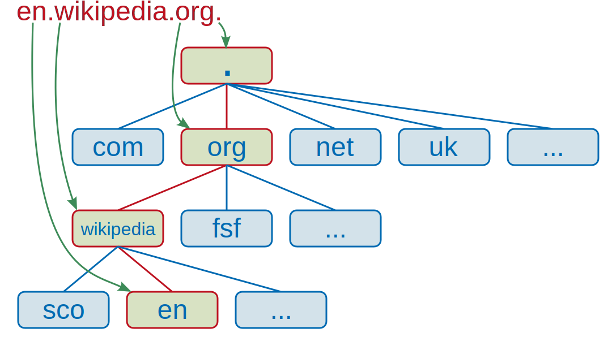

* TOC
{:toc}

---

# Domain Name System
<!-- TODO dnsenum -->

- communicate with others on the internet without needing to remember their IP addresses

[IP addressing](ip_addressing.md)

## Hierarchy

### Top-Level (.com,.org,et cetera)

rightmost part of a domain name

- g(eneric)TLD->.gov

- c(ountry)c(ode)TLD-> .in

### Second-Level Domain(google, facebook, github)

- <63 characters
- a-z, 0-9, - (cannot start or end w/ hypen and no consecutive hyphens)

### Subdomain(help(.SLD.TLD))

- To the left of the SLD
- No limit on the number of subdomains for a given domain
- must respect maximum length constraints

## Record Types

1. A

   resolves to IPv4 address

2. AAAA

   resolves to IPv6 addresses

3. CNAME

   resolve to another domain name

4. MX

   Mail Exchanger/mailservers

5. TXT

   text field, used to verify ownership of domain too

## Steps of a DNS request

1. The local cache is checked, if not found, the request will be made the the DNS server

   On Microsoft Windows, you would run `ipconfig /flushdns` to clear the cache

2. the recursive DNS server checks its cache for a record, if not found, it queries the internet's root DNS servers

   For the difference between recursive and authoritative DNS servers, [click here](https://umbrella.cisco.com/blog/what-is-the-difference-between-authoritative-and-recursive-dns-nameservers)

3. the root server will redirect you to the appropriate TLD server

4. the TLD server will have records for the authoritative DNS servers(nameservers) with the record

5. depending on the record type, it is sent back to the recursive server, where it will be cached and sent to the requester

### Using nslookup

`nslookup [--type=RECORDTYPE] [server]`

[RECORDTYPE](#record-types)
to use the default nameserver to perform a query for a certain type of record

<!-- ## DNSSEC

## OSCP stapling -->

<!-- dnssec, ocsp stapling, denial o existence, recommended servers -->

_WIP_
