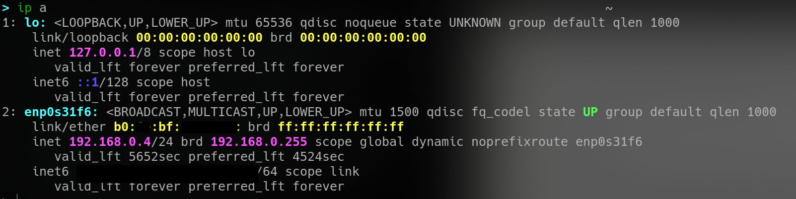

**[~](../../../README.md)**

**[~/Security/Networking](../networking.md)**

**[~/Security](../../security.md)**

---

* TOC
{:toc}

---

# IP addressing

_prereq reading_

[Theory of Networking](networking_basix.md)

[Ping](networking_basix.md#ping)

## LAN and subnetting

Subnetting is achieved by splitting up the number of hosts that can fit within the network, represented by a number called a subnet mask.

Subnets use IP addresses in three different ways, to identify the

- network address
- host address
- default gateway

for small networks like a home network, you likely will not need more than 254 devices connected at a time

_example of an assigned IP address(and subnet) of a computer on a small network_

## DHCP and DHCP Servers

IP addresses can be assigned manually, or automatically using a DHCP server

After connecting to a network, if not already assigned an IP address, a _DHCP Discover_ request is sent out to check for DHCP servers on the network

the DHCP server then replies with an IP the device could use with a _DHCP Offer_

the client confirms by sending a _DHCP Request_

the DHCP server will send a _DHCP ACK_ reply

# MAC addresses

Each Network Interface Card has a (supposedly)unique MAC

It is a 12-character (hexadecimal numbers) address

the first 3 pairs identify the manufacturer and the other 3 are the "unique" address of the NIC

MAC addresses can be spoofed with programs like `macchanger`

## ARP

**associating MAC with IP**

between layer 2 and 3 of the OSI model

allows devices to identify themselves on a network
