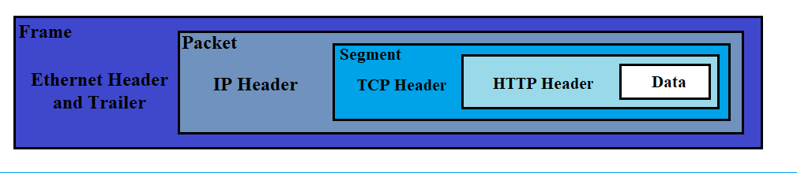
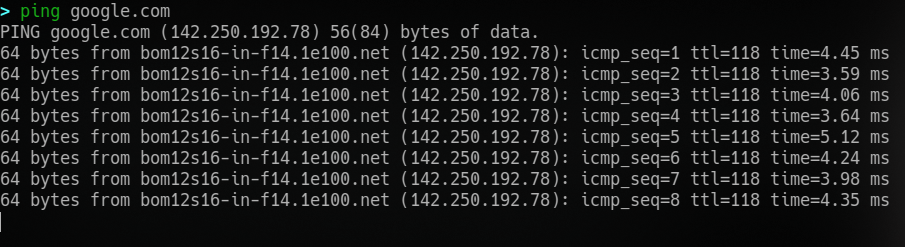
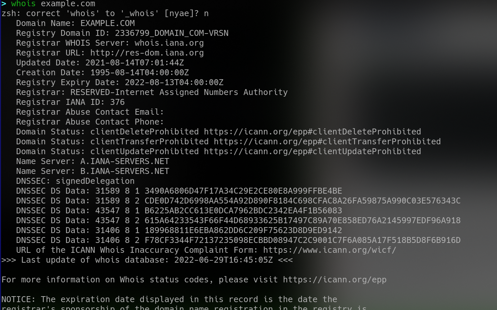

**[~](../../../README.md)**


**[~/Security/Networking](../networking.md)**

**[~/Security](../../security.md)**

---

* TOC
{:toc}

---

# The Theory of Networking

## OSI Model

The Open Systems Interconnection(OSI) Model is a standardised model which we use to demonstrate the theory behind computer networking

_in practice, the [TCP/IP model](#tcpip-model) reflects real-world networking more accurately_

The seven layers-

```
7. application
    works almost exclusively with applications, providing an interface for them to use in order to transmit data

6. presentation
    receives data from the application layer

    translates the data into a standardised format, as well as handling any encryption, compression or other transformations to the data

5. session
    receives the correctly formatted data from the presentation layer, it looks to see if it can set up a connection with the other computer across the network

    establishes session if posible, and maintains it

4. transport
    TCP(connection-based),UDP(connectionless)
    divided transmission into segments(TCP) or datagrams(UDP)

3. network
    logical addressing, locating the destination of the request

2. data link
    physical addressing of the transmission. receives a packet from the (3)network layer and adds in the MAC address(see references) of the endpoint

    checks received packets for corruption

    presents data in form suitable for transmission

1. physical
    hardware, binary to electromagnetic signals and vice versa

    actual transmission and receival of data
```

_References_

[MAC address](ip_addressing.md#mac-addresses)

## Encapsulation/Working

As the data is passed down each layer of the model, a header is added to the start of the transmission

The data link layer also adds a piece on at the end of the transmission, to verify integrity




the receiver would perfom _de-encapsulation_, reversing this process

## TCP/IP Model

The layers of the TCP/IP model, with their closest OSI Model equivalents

- Application(5,6,7)
- Transport(4)
- Internet(3)
- Network Interface(1,2)

## TCP three-way handshake

1. SYN

   client to server

   initial communication, SYN bit

2. SYN/ACK

   server to client

   acknowledging the SYN, with packet with SYN and ACK bit

3. ACK

   client to server

   packet with only ACK bit, connection successful

## [Inspecting a TCP handshake with Wireshark](wireshark.md)

## Ping

test whether a connection to a remote resource is possible

`ping` is first tool you must run to when troubleshooting network problems. Check if the host is up before moving on to more involved steps.

`ping` measures the time taken for ICMP packets to travel between devices

```
  ping [-aAbBdDfhLnOqrRUvV46] [-c count] [-F flowlabel] [-i interval] [-I interface] [-l preload] [-m mark]
            [-M pmtudisc_option] [-N nodeinfo_option] [-w deadline] [-W timeout] [-p pattern] [-Q tos] [-s packetsize]
            [-S sndbuf] [-t ttl] [-T timestamp option] [hop...] {destination}
```



## [traceroute](traceroute.html)

## WHOIS

related writeup, [Domain Name System](dns.md)

- to get a list of available infomation on a domain registration



[Full WHOIS response](../resources/whois.txt)

## Dig

- manually query recursive DNS servers of our choice for information about domains
- shows the ANSWER(containing IP addresses), TTL, etc. of the query
