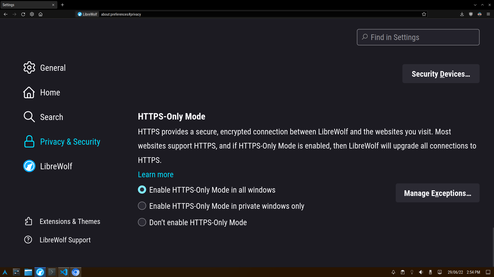
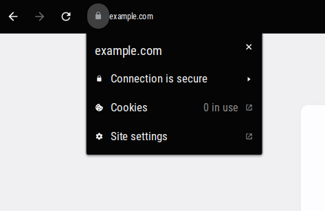
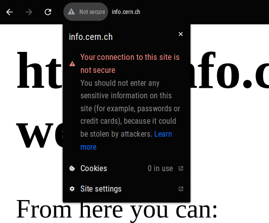
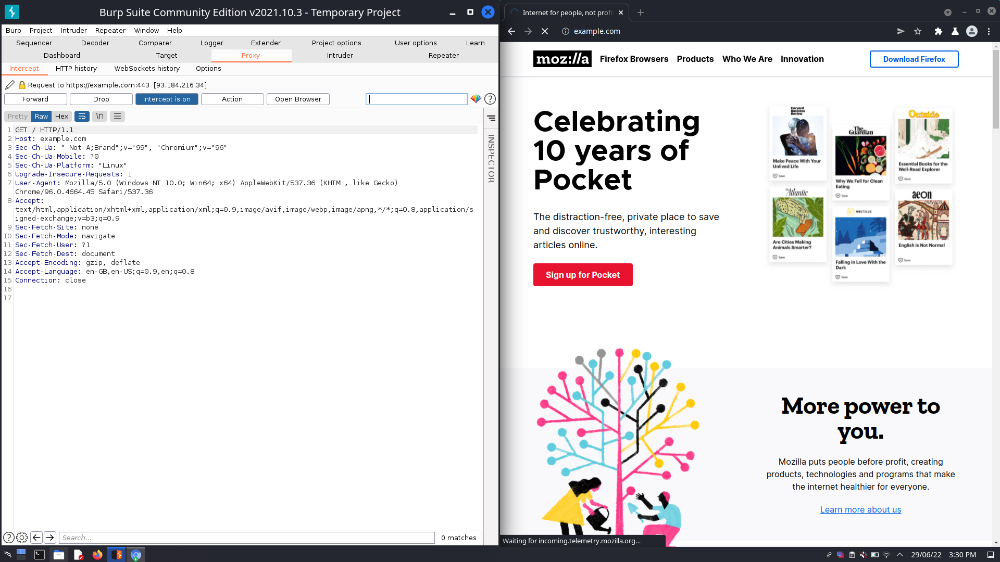
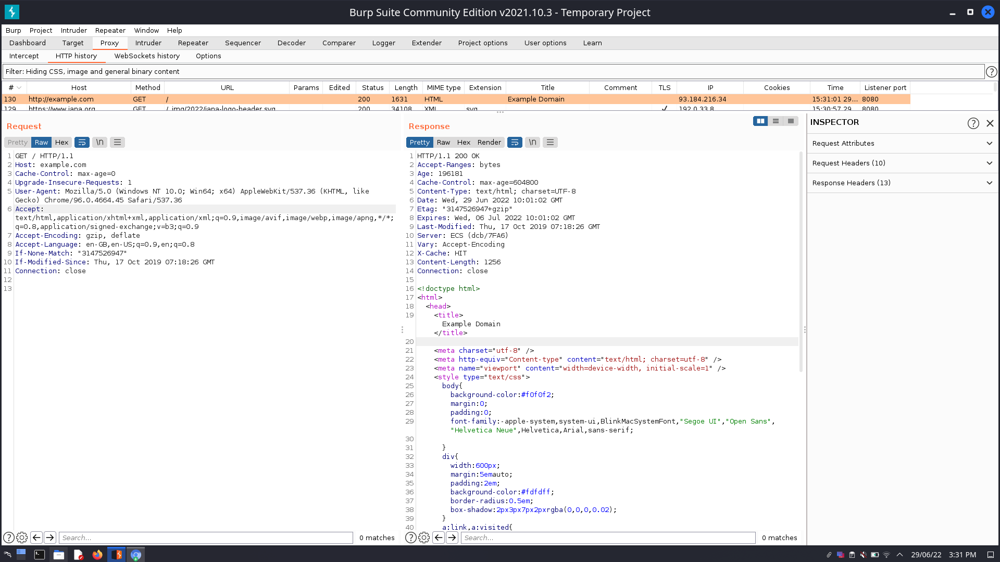

* TOC
{:toc}

---

# How the Web Works, HTTP Request/Response Cycle

## HyperText Transfer Protocol Secure(HTTPS)

- encrypted communication
- protects the **integrity and confidentiality** of data

As an organization, you must teach employees basic web safety skills and how to detect fraudulent, phishing, or suspicious websites.

The easiest way would be to click the "lock" icon in the address bar in Google Chrome or Microsoft Edge

## Uniform Resource Locators(URLs)

comprised of the

- scheme (http, https, smb, ftp)
- user(eg-for SSH)
- host(eg-for ssh, can be domain too)
- port(default 443 for HTTPS, 80 for HTTP, 22 for SSH)
- path
- querystring
- fragment

## Requests

[Here](../resources/request.py) we use the `requests` module in python make a request

[Here](../resources/response.txt) is the response

## HTTP Methods

1. GET-get information from a server
2. POST-submit data to a server
3. PUT-update data on server
4. DELETE-delete data on server

## HTTP Status Codes

Click [here](https://developer.mozilla.org/en-US/docs/Web/HTTP/Status) to view the list of response status codes

Common codes-

- 200-OK
- 201-created
- 301-permanent redirect
- 302-temp. redirect
- 400-bad request
- 401-not authorized
- 403-forbidden
- 405-method not allowed
- 404-page not found
- 500-internal service error
- 503-service unavailable

Something interesting about [418](https://developer.mozilla.org/en-US/docs/Web/HTTP/Status/418)

## HTTP Headers

#### Common Request Headers

- host
- user-agent(browser software and version number)
- content-length(length of data in the request content)
- accept-encoding(supported compression)
- cookie

#### Common Response Headers

- set-cookie
- cache-control(how long to cache content of response before requesting again)
- content-type(type of data)
- content-encoding(compression used)

# Intercepting and inspecting requests-responses with a proxy

Her[2 images]e, I use Burp Suite and the integrated browser to intercept request-response and either forward or drop them

## Cookies

_view cookies in Firefox by using DevTools and switching to the network tab_

Cookies are saved when you receive a "Set-Cookie" header
Then every further request you make, you'll send the cookie data back to the web server.

Because HTTP is stateless (doesn't keep track of your previous requests), cookies are used to remind the webserver of session state or user information.

You can view cookies set when visiting a website or logging in by using your browser's developer tools

[Firefox DevTools Docs](https://firefox-source-docs.mozilla.org/devtools-user/)
