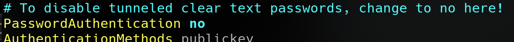
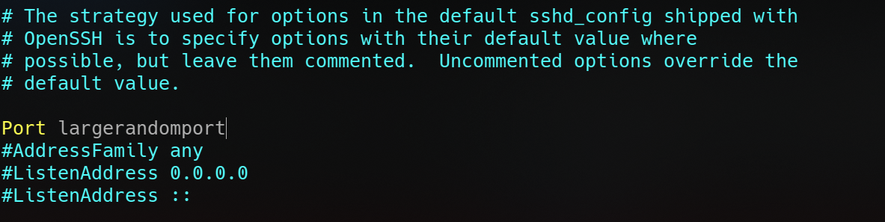

**[~](../../README.md)**

**[~/Security](../security.md)**

---

* TOC
{:toc}

---

# Secure Shell

> operate securely over an unsecured network
> remote shell login, but any network service can be secured with SSH
> standard TCP port 22

## Installation

First, install the appropriate package for an implementation that provides an SSH server like `openssh`

## Key generation

First, generate keys with

`> ssh-keygen -t ed25519` (this algorithm in particular because +performance)

for high security,

`> ssh-keygen -t rsa -b 4096`

## Public Key (Passwordless) Authentication

Then copy over your public key to the designated "remote" machine

`> ssh-copy-id -i .ssh/id_ed25519.pub username@192.168.0.2`

Public Key Authentication is now set up! Try it by connecting to the machine with

`> ssh username@host`

You may now disable password logins, and force the use of SSH keys, by changing these two lines in your SSHd configuration file (`/etc/ssh/sshd_config/`)



## Changing the default port

If you aim for remote administration over untrusted networks like the internet, **Change your default port to a non-standard one** before opening up your service to the WAN!

`/etc/ssh/sshd_config`



Don't forget to configure port forwarding on your router

## Deny root login

You can configure the server to deny remote logins with the root user, by editing the SSHd configuration file (`/etc/ssh/sshd_config/`)

```
PermitRootLogin no
```

## Whitelist access for users or groups

To whitelist access for users:

```
AllowUsers    user1 user2
```

To whitelist access for groups:

```
AllowGroups   group1 group2
```

## Intrusion Prevention

Install an intrusion prevention service like `Fail2ban`.

I have already described setting up Fail2Ban [here](https://elvindesouza.github.io/hardening/#fail2ban-installation-and-setup)

Additionally, opt for a stateful firewall to detect and prevent brute force attacks. Don't forget to configure it

## X11 forwarding

_requires xauth_

forward X windows, and run applications, you can use it to set up thin clients, or run applications that only have a GUI in your SSH session

Do your research on the security implications of enabling and using X11 forwarding on your SSH server

## SSH Port Forwarding/SSH Tunneling traffic

local forwarding
`ssh user@host -L local_port:remote_IP:remote_port`

you can access `remote_port` as `local_port` on your local system

use remote forwarding with the `-R` switch

---

### References

https://infosec.mozilla.org/guidelines/openssh.html

https://www.venafi.com/sites/default/files/2016-10/Venafi_Securing_SSH_CSCs_final.pdf

https://www.ssh-audit.com/hardening_guides.html
