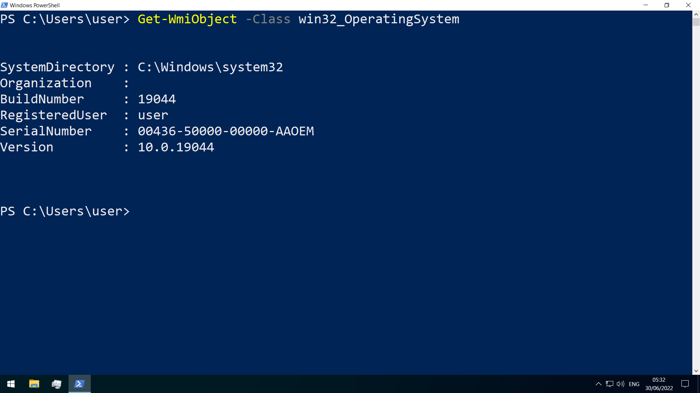
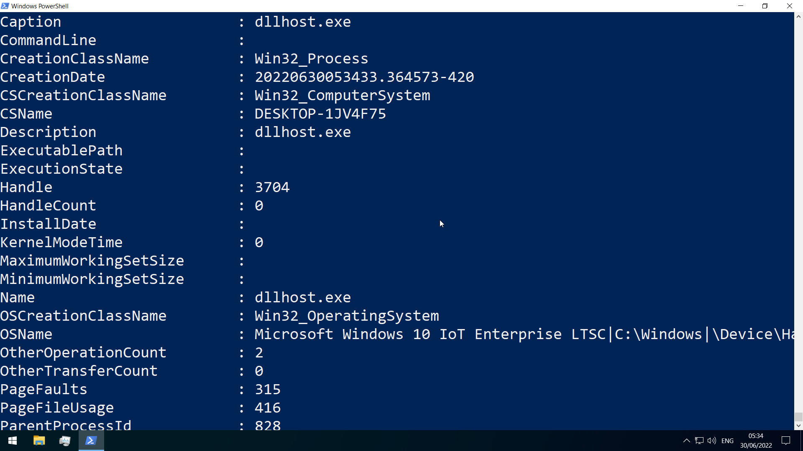
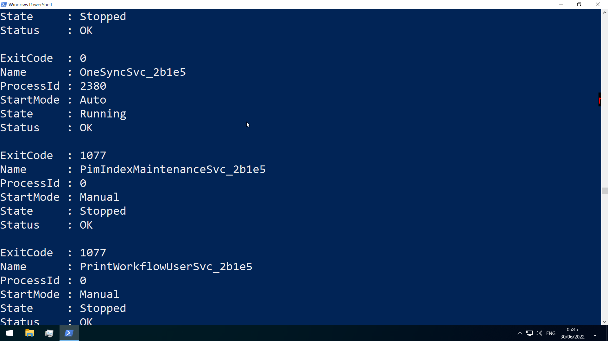
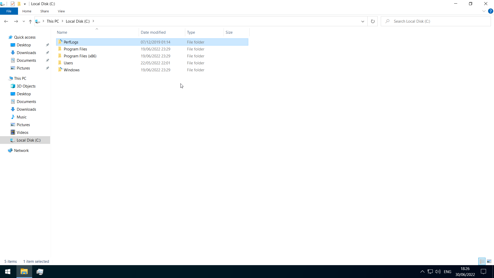
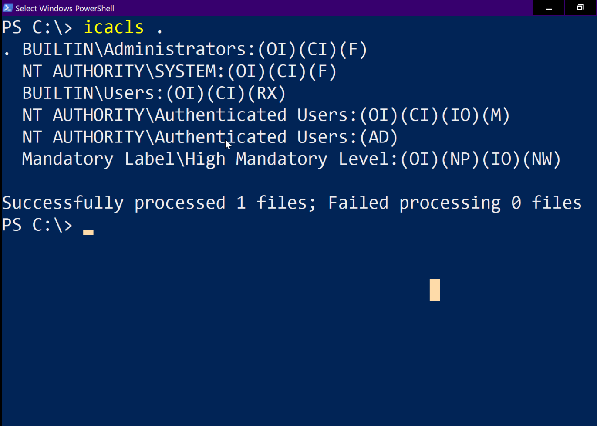
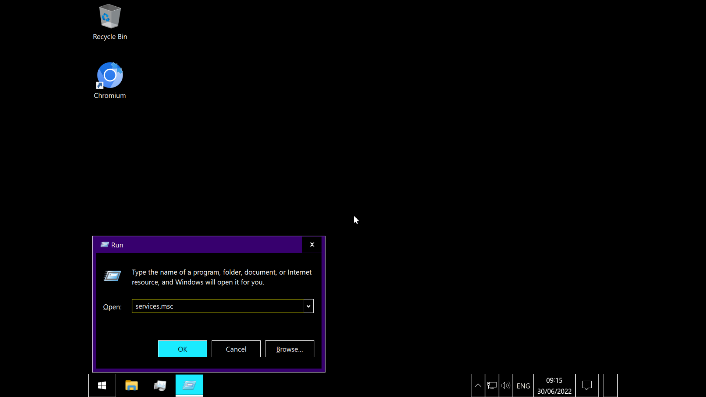
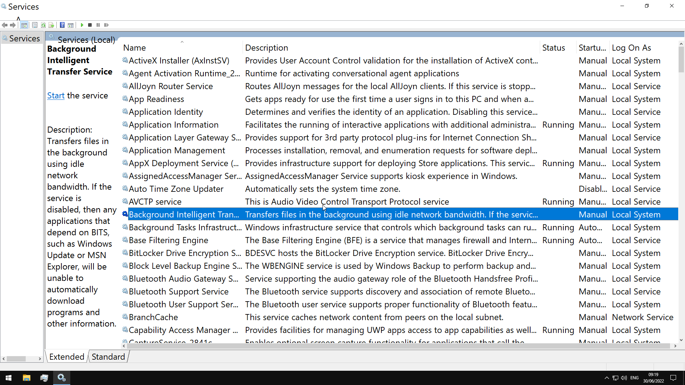
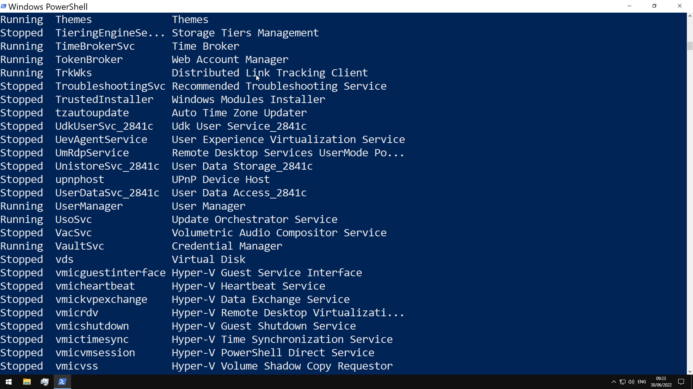

# Microsoft Windows Operating System and Windows Security

In any organization, non-technical employees are likely using Microsoft Windows. In fact, the overwhelming majority of desktop and laptop systems run Windows.

Because of this, it becomes a prime target for malware

## General Boot Drive Structure

use the `Get-WmiObject` cmdlet to get general information

`-Class win32_OperatingSystem`

`Win32_Process`

`Win32_Service`

`Win32_BIOS`

The boot drive(C) is divided into the following on a bare Windows install

- PerfLogs-empty by default, can hold performance logs
- Program Files-64bit programs are installed here
- Program Files(x86)-32bit programs for a 64bit edition would be installed here
- ProgramData-hidden folder that contains...program data
- Users-contains user profiles, with the following within-

  - Default-default profile template
  - Public-files accessible to all users
  - AppData- for a particular user, can be accessed with %appdata% in the Windows Explorer address bar
    contains per user application data and settings

    

    1. Local- specific to the computer, never shared across network
    2. LocalLow- like Local, but lower data integrity level
    3. Roaming-data that follows the user's profile

- Windows-operating system files
  - System,System32-contains DLL files Windows and the Windows API requires
  - WinSxS-the Component Store contains a copy of all windows components, service packs,and updates

## NTFS Permissions

key permission types for NTFS-

- full control
- modify
- list folder contents
- read+exec
- write
- read
- traverse folder

list permissions for a directory by using `icacls`

- (CI)- container inherit
- (OI)- object inherit
- (IO)- inherit only
- (NP)- do not propagate inherit
- (I)- permission inherited from parent container

## Share Permissions

- full control
- change
- read

## Windows Defender

## Services

Windows services can be started automatically at system boot without user intervention, and can continue to run in the background even after user log-out

managed via the Service Control Manager (SCM) system, accessible via the `services.msc` MMC add-in.

_OR_

using `Get-Service`

## Processes

Can be viewed in Task Manager or in Powershell with `ps`(`Get-Process`)

### Task Manager

can be opened with `taskmgr` from cmd/powershell, or with a Ctrl+Shift+Esc sequence

- Processes-list of running applications and background processes
- Performance- shows resource utilization graphs
- App History-resource usage for user for each applicatino
- Startup- startup applications
- Users- logged in users, and their resource usage
- Details- shows detailed information for running applications
- Services- details on services
